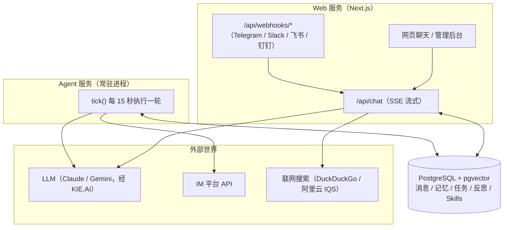
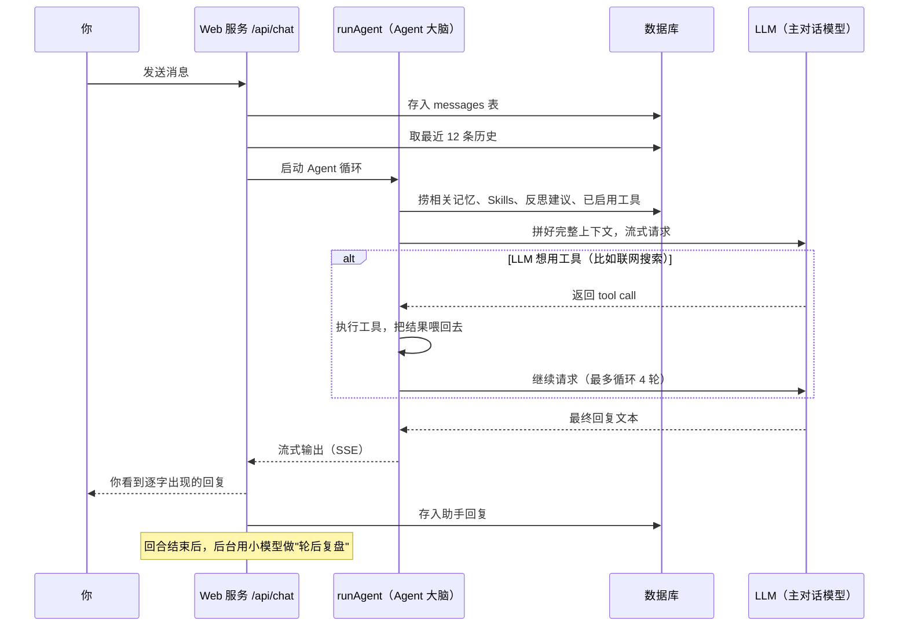
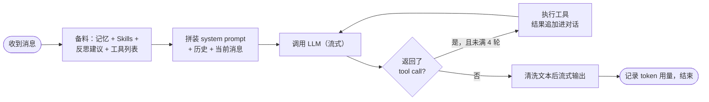
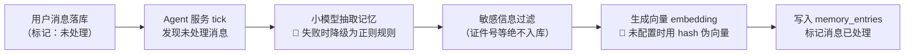
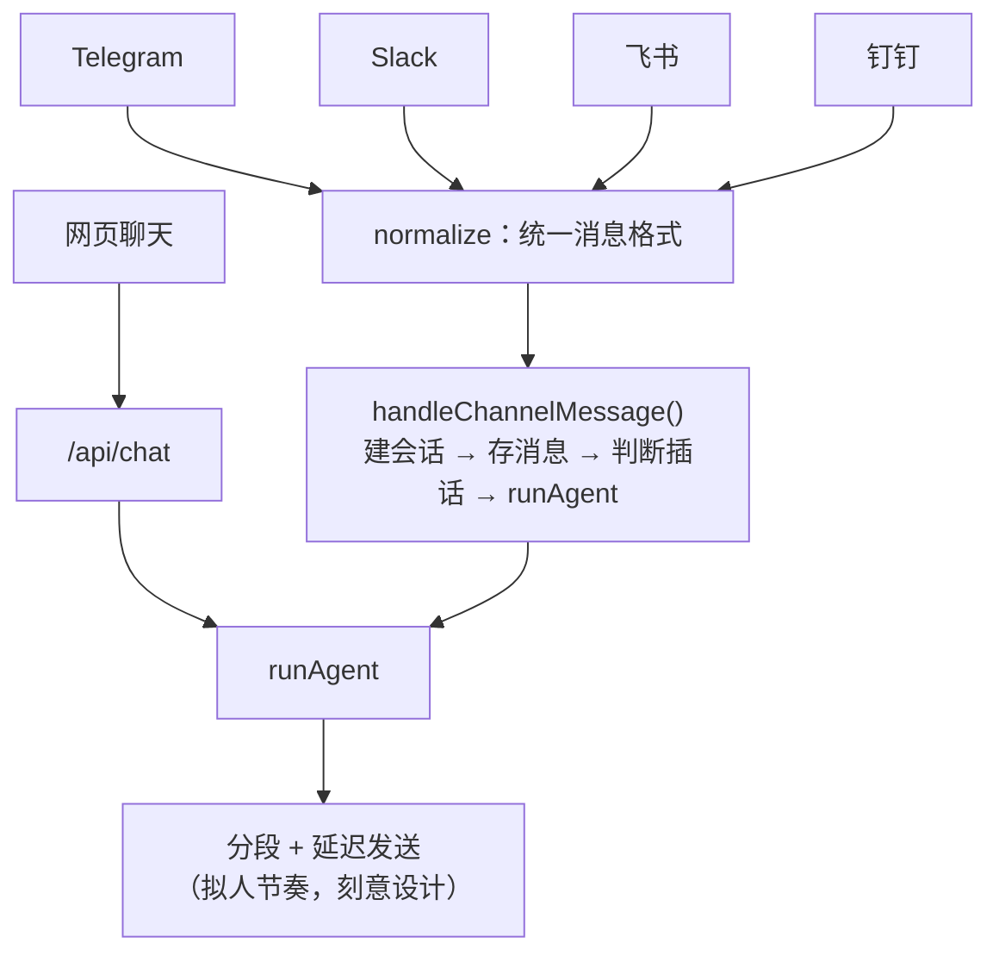
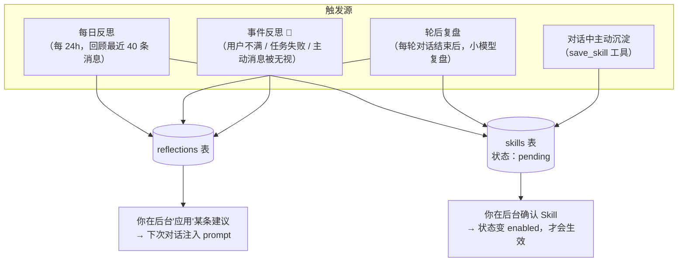
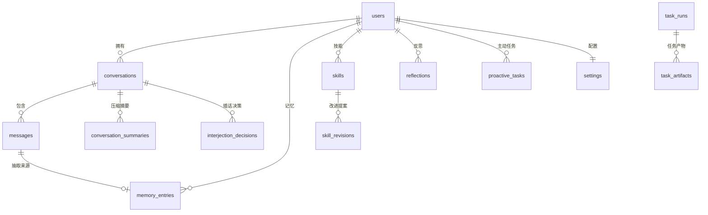

# DigitalMate Agent 架构通俗介绍

> 本文用大白话讲清楚 DigitalMate 的 Agent 是怎么搭起来的：消息进来后经过哪些环节、"大脑"怎么思考、记忆存在哪里、它又是怎么自我进化的。文中的 mermaid 图在 Cursor / GitHub 里可以直接渲染成图形。
>
> ⚠️ 阅读前提醒：部分"智能"环节目前还是**占位实现**（用规则/模板顶着，还没换成真 LLM），文中会用 🔧 标出来。

---

## 1. 一分钟看懂全局

整个系统就三个"角色"，跑在 Docker Compose 里：

| 角色 | 是什么 | 干什么 |
|------|--------|--------|
| **Web 服务**（Next.js） | 前台接待 | 网页聊天界面、管理后台、接收各 IM 平台的 webhook |
| **Agent 服务**（常驻 Node 进程） | 后台管家 | 每 15 秒醒一次，处理主动消息、记忆抽取、每日反思等"不着急但重要"的事 |
| **PostgreSQL**（带 pgvector） | 共享大脑存储 | 所有会话、记忆、任务、反思都存这里 |

一个关键设计：**Web 服务和 Agent 服务之间不直接通信**（没有 HTTP 调用、没有消息队列），全靠读写同一个数据库来协作。Web 把"待办"写进表里，Agent 服务轮询发现后处理掉。



---

## 2. 一条消息的旅程

以你在网页上发一句话为例，完整流程是这样的：



如果消息来自 Telegram / 飞书等 IM，入口换成 `/api/webhooks/*`：webhook 先立即 ACK（IM 平台有回调超时限制），然后异步走同样的 `runAgent` 流程，最后把回复**分段、带延迟**地发回去——这是刻意设计的拟人节奏。

---

## 3. Agent 大脑：自研 Harness

核心文件是 `src/server/agent/run-agent.ts`。它不依赖任何现成 Agent 框架，就是一个"循环式 tool call"：

1. **备料**：并行从数据库捞出人设、相关记忆、匹配的 Skills、已应用的反思建议、已启用的工具。
2. **拼装上下文**：把上面这些全部拼进一条 system prompt，再接上最近 12 条对话历史和当前消息。
3. **循环**（最多 4 轮）：调 LLM → 如果它返回工具调用，就执行工具、把结果追加进对话、再调一次；如果返回纯文本，就清洗后输出，结束。



### system prompt 里都装了什么

按顺序拼进去的内容（都来自数据库，动态变化）：

1. **人设**（`persona.ts`）——决定它"是谁"、说话风格
2. **工具使用规则**——什么时候该搜索、该存 Skill
3. **会话摘要**——超长会话被压缩后的摘要 🔧（目前是规则截断，不是 LLM 总结）
4. **相关长期记忆**——向量 + 关键词混合检索出的 top 8 条
5. **匹配的 Skills 全文**——已启用且和当前话题相关的技能
6. **已应用的反思建议**——它从过去的反思中学到的改进
7. **已确认工具的描述**——你在后台批准过的自定义工具

### 内置工具

| 工具 | 作用 |
|------|------|
| `web_search` | 联网搜索（DuckDuckGo / 阿里云 IQS），始终可用 |
| `save_skill` | 对话中沉淀经验为 Skill 草稿（需你后台确认才生效） |
| `install_skill` | 从 GitHub 安装 Skill（先过安全扫描） |
| 自定义工具 | 你在后台注册并启用的脚本 / MCP 工具 |

---

## 4. 记忆系统：它怎么"记住你"

### 4.1 记忆分三层

存在 `memory_entries` 表里，按 `kind` 区分：

| 类型 | 存什么 | 限制 |
|------|--------|------|
| `profile` | 你的偏好、身份、人际关系（稳定信息） | 最多 40 条，超了自动合并 |
| `agent_self` | 它对自己的认知（"用户喜欢我简短回复"） | 最多 24 条 |
| `episodic` | 有时效的事件、计划（"下周三要出差"） | 180 天后过期 |

短期记忆则是 `messages` 表里的最近 12 条对话，加上超长会话的压缩摘要。

### 4.2 记忆怎么写进去（后台异步）

你聊天时 Agent **不会**当场写记忆——那会拖慢回复。写记忆是 Agent 服务每 15 秒的后台活：



群聊消息不参与长期记忆抽取（写入时直接标记已处理）。

### 4.3 记忆怎么被想起来

每次对话前，`findRelevant()` 做混合检索：

- **语义检索**：pgvector 余弦相似度，取 top 12
- **关键词检索**：最近 80 条活跃记忆做词面匹配
- **融合排序**：语义 70% + 词面 30%，最终取 top 8 塞进 prompt

### 4.4 记忆满了怎么办

`profile` / `agent_self` 超容量时，后台用小模型把相近的条目**合并**成更精炼的记忆；LLM 失败就降级为淘汰最旧的低置信条目。

---

## 5. LLM 适配层：模型是可换的

所有模型调用走统一接口（`src/server/llm/router.ts`），按用途分两条路由，**配置存在数据库里，不硬编码**：

| 路由 | 默认模型 | 用在哪 |
|------|----------|--------|
| `main`（能力优先） | claude-opus-4-8 | 主对话 Agent 循环 |
| `light`（成本优先） | gemini-3-5-flash | 记忆抽取、每日反思、轮后复盘、Skill 扫描、会话标题等高频小活 |

客户端按模型名自动选择：名字含 `claude` 走 Anthropic 格式，其他走 OpenAI 兼容格式。没配 API Key 时用 Mock 客户端 🔧（返回假回复，仅供开发）。

---

## 6. 渠道层：一个身份，多个入口

五个渠道共享同一套会话、记忆和人设：



每个 IM 平台的 webhook 先做签名校验，再把五花八门的消息格式**标准化**成统一结构，之后的处理逻辑完全一样。

### 群聊插话：话痨还是高冷，全看闸门

Agent 在群里不是每条都回，`shouldInterject()` 设了六道闸门，**全部通过才开口**：

1. 确实是群聊
2. 不在静默时段（可配置）
3. 距上次插话 ≥ 30 分钟（可配置）
4. 没超过每小时 / 每天的次数上限
5. 群里近 2 分钟消息 < 6 条（大家聊得火热时不打断）
6. 话题和它相关 🔧（目前是 n-gram 词面重叠打分，待换成 LLM 判断）

每次决策（无论插不插）都记录在 `interjection_decisions` 表里，后台可查。

---

## 7. 进化模块：它怎么越用越懂你

这是 DigitalMate 区别于普通 chatbot 的部分，有四条进化路径：



几个要点：

- **反思不外露**：所有反思、复盘只写数据库、只在管理后台可见，绝不出现在对话里（产品红线）。
- **进化需确认**：Skill 草稿、Skill 改进提案（`skill_revisions`）都停在 `pending`，你在后台点确认才生效。
- **事件反思目前是模板** 🔧：比如"用户不满"靠正则检测，反思内容是固定模板生成，还没换 LLM。

### Agent 服务的完整后台任务清单

每 15 秒的 `tick()` 依次跑这些活：

| 任务 | 说明 |
|------|------|
| 主动消息投递 | 到点的提醒 / 跟进 / 分享，发到你最近用的私聊渠道 |
| 记忆抽取 | 见第 4 节 |
| 记忆容量整理 | 超容量时合并 |
| 会话压缩 | 超 40 条的会话生成摘要 🔧（规则截断） |
| 每日反思 | 每 24 小时一次 |
| Skill 自我改进 | 每天最多一次，扫描低效 Skill 提改进案 |
| 主动分享 | 生成想跟你聊的话题（受频率上限约束） |

---

## 8. 任务能力（P2，当前冻结）

做 PPT、处理表格这类"干活"能力已有雏形，但**按项目决策暂时冻结**，不再扩展：

- **代码沙箱**（`tasks/sandbox.ts`）：Docker 容器执行脚本，断网、限内存 256MB、危险命令拦截
- **CSV/表格**（`tasks/csv.ts`）：汇总统计 + Markdown 报告 + SVG 图表
- **PPT**（`tasks/presentation.ts`）：大纲 → pptxgenjs 生成 PPTX

注意：这些任务目前**只能从管理后台触发**，还没接进 Agent 的工具循环（也就是说聊天时说"帮我做个 PPT"它还做不到）。任务完成后会自动沉淀一份 Skill 草稿。

---

## 9. 数据库：所有状态的家

主要表和关系（`src/server/db/schema.sql`）：



| 表 | 一句话说明 |
|----|-----------|
| `messages` | 全渠道统一消息流，`memory_processed` 字段驱动记忆抽取 |
| `memory_entries` | 三层记忆，带 1536 维向量列 |
| `proactive_tasks` | 提醒 / 跟进 / 主动分享的排期 |
| `reflections` | 各类反思，状态：已记录 → 已应用 / 已忽略 |
| `skills` + `skill_revisions` | Skill 生命周期，改动都要你确认 |
| `settings` | 人设、主动性参数、模型路由、拟人节奏——全部可配 |
| `llm_usage_logs` | 每次 LLM 调用的 token 账本 |
| `tool_call_logs` | 工具调用留痕（只在后台可见） |

所有业务表都带 `user_id`——当前只服务你一个人，但为将来产品化预留。

---

## 10. 哪些还是"假"的：占位实现清单

这是当前主线工作的靶子——把下面这些规则/模板换成真 LLM 实现：

| 环节 | 现状 | 应有形态 |
|------|------|----------|
| 记忆抽取降级路径 | 正则规则 | （主路径已是 LLM，降级路径保留即可） |
| 向量 embedding | 未配置时 hash 伪向量 | 接真实 embedding API |
| 群聊插话相关度 | n-gram 词面重叠 | 小模型判断 |
| Skill 匹配 | 字符串包含打分 | 语义检索 |
| 会话压缩摘要 | 规则截断 | LLM 总结 |
| 事件反思内容 | 固定模板 | LLM 生成 |
| 用户不满检测 | 正则 | 小模型判断 |
| 提醒/跟进解析 | 正则 | LLM 结构化抽取 |

**已经换真的部分**：Agent tool-calling 循环（原生 tool call，不再解析 JSON 文本）、LLM 记忆抽取、每日反思、轮后复盘、记忆合并、混合向量检索（配置 embedding 后）、联网搜索、MCP 工具调用、Docker 沙箱。

---

## 11. 关键文件速查

想深入某个模块时，从这里出发：

```
src/server/agent/run-agent.ts        # Agent 大脑（核心循环）
src/server/agent/persona.ts          # 人设 prompt
src/server/agent/memory*.ts          # 记忆抽取 / 过滤
src/server/channels/handler.ts       # IM 消息统一处理
src/server/channels/interjection.ts  # 群聊插话决策
src/server/llm/router.ts             # 模型路由
src/server/evolution/                # 反思 / Skill 进化
src/server/tasks/                    # P2 任务能力（冻结）
src/server/db/schema.sql             # 数据库全貌
src/server/db/repositories.ts        # 数据访问层
src/agent-service/index.ts           # 后台常驻服务
src/app/api/chat/route.ts            # Web 对话入口
```
