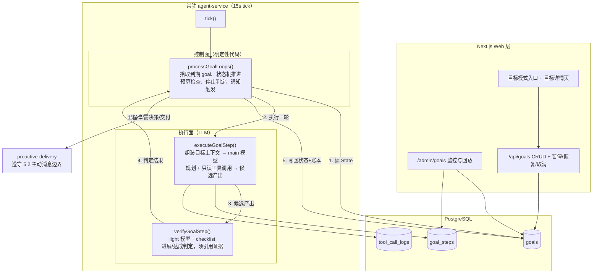
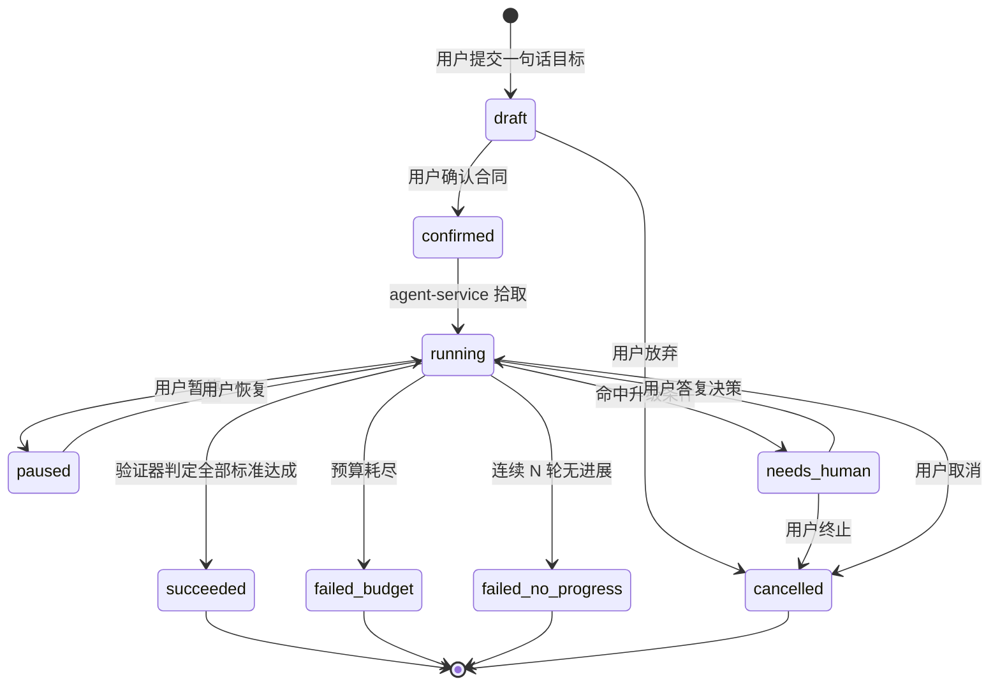

# 目标模式（Loop Engineering）架构设计

- 版本：v0.1
- 日期：2026-07-09
- 状态：设计稿（对应 PRD v0.5 第 4.4 节，P3-1..P3-6）
- 参考资料：`docs/ref/` 下三篇 Loop Engineering 文章与《Loop 的六个部件》图示；论文 [From Agent Loops to Structured Graphs (arXiv:2604.11378)](https://arxiv.org/abs/2604.11378)

---

## 1. 概念与定位

### 1.1 一句话定义

目标模式 = 用户显式开启的**长时自主循环**：提交一个目标，Agent 在常驻服务中 7×24 持续推进——搜集、整理、验证、迭代——直到目标达成或触碰停止条件，全程留下可回放的证据账本。

### 1.2 与普通聊天的关系

| 维度 | 普通聊天 | 目标模式 |
|---|---|---|
| 触发 | 用户每条消息 | 用户确认目标合同后，系统自驱动 |
| 生命周期 | 单次 HTTP 请求（SSE 流结束即止） | 跨 tick、跨进程重启，数天至数周 |
| 循环深度 | `runAgent` 内最多 4 轮 tool call | 外层无限轮（受预算约束），每轮内部仍复用短循环 |
| 状态存放 | 会话上下文 + 消息历史 | `goals` / `goal_steps` 表（状态账本），不依赖聊天上下文 |
| 结果判定 | 模型输出即结果 | 独立验证器判定，达成须引用证据 |
| 对用户可见性 | 全程可见 | 过程仅在目标详情页/后台；仅三类事件主动通知 |

两者**相对独立**：独立入口（Web 端"目标模式"开关）、独立状态机、独立留痕；但共享同一套基础设施——`runAgent` 的上下文组装与工具执行、`proactive-delivery` 的消息推送、`llm/router` 的模型路由、分层记忆。

### 1.3 设计原则（来自 Loop Engineering 工程共识）

1. **Loop 不是让 Agent 原地转圈，而是让它在反馈里前进，并且知道什么时候该停。** 生产级 Loop 的六个硬边界——验证、停止、状态、恢复、隔离、观测——全部落到系统层，不靠模型自觉。
2. **控制面与执行面分离。** 模型负责理解、规划、生成候选；状态推进、预算、停止条件、提交由确定性状态机兜住。全局停止条件绝不交给 LLM 判断。
3. **状态不能只活在上下文里。** 上下文会压缩、会被误读；每轮的目标、证据、动作、验证结论、下一步计划写入数据库，下一轮能读，人也能接手。
4. **执行者不给自己盖章。** 每轮产出由独立验证调用判定，达成判定必须引用外部证据。
5. **副作用收口。** 第一期工具白名单限只读；未来产出型目标的副作用动作走"候选 → 验证 → 受控提交"路径。

### 1.4 非目标（第一期明确不做）

- **产出型目标**（写文件、跑沙箱代码、操作外部系统）——待 P2 沙箱解冻后按 P3-6 另行设计。
- **多目标并行编排 / 子 Agent 派生**——第一期单用户同时最多 1-2 个活跃目标，串行推进即可（YAGNI）。
- **完整 cron 定时任务引擎（P1-10）**——目标模式用 goal 内嵌的 `next_run_at` 实现节奏控制，不为此先建通用调度器。
- **显式 DAG 执行图**——参考论文提出的 Structured Graph Harness 是方向性提醒，第一期用线性状态机 + 证据账本已够；若未来目标复杂到出现明显的步骤依赖问题，再考虑升级（见第 10 节）。

---

## 2. 目标合同（Goal Contract）

目标启动前，Agent 通过对话把用户的一句话目标澄清为结构化合同，**用户确认后才启动**（守"能力扩展需确认"红线）。合同是循环的运行协议，也是验证器的判定依据。

### 2.1 合同 Schema（存 `goals.contract` jsonb）

```typescript
type GoalContract = {
  // 目标本体
  objective: string;              // 澄清后的目标描述
  successCriteria: Array<{        // 可验证的完成标准 checklist
    id: string;
    description: string;          // 如"覆盖 A 子方向，至少 5 个可靠来源"
    verification: string;         // 怎么验：来源计数 / 事实核对 / 覆盖度检查
  }>;

  // 节奏
  cadence: {
    mode: "continuous" | "interval";  // 持续推进 / 每 N 分钟一轮
    intervalMinutes?: number;         // interval 模式的间隔
  };

  // 范围与工具（第一期只读白名单）
  scope: {
    allowedTools: string[];       // 第一期: ["web_search", "memory_search"]
    forbidden: string[];          // 明确禁止的动作，写给执行面的提示
  };

  // 预算（硬边界，控制面强制执行）
  budget: {
    maxRounds: number;            // 最大循环轮数
    maxTokens: number;            // 累计 token 上限
    maxCostUsd?: number;          // 费用上限（可选，依赖用量统计）
    deadlineAt?: string;          // 时间上限（ISO 8601）
  };

  // 停止与升级
  stopConditions: {
    maxNoProgressRounds: number;  // 连续 N 轮无进展即停（默认 3）
    escalation: string[];         // 哪些情况转 needs_human，如"关键子方向找不到可靠来源"
  };

  // 产出
  deliverable: {
    format: "report";             // 第一期只有带来源引用的结构化报告
    milestones?: string[];        // 可选：达到即主动通知的中间里程碑
  };
};
```

### 2.2 合同澄清流程

1. 用户在 Web 端开启目标模式，输入一句话目标，`POST /api/goals` 创建 `status = draft` 的 goal。
2. Agent 用 main 模型基于模板生成合同草案（补全完成标准、建议预算、识别歧义点），有歧义则在目标创建对话中追问。
3. 用户在确认页看到结构化合同（可编辑预算与节奏），点击确认 → `status = confirmed`，写入 `next_run_at = now()`。
4. agent-service 下一个 tick 拾取，进入 `running`。

合同澄清对话复用现有会话基建（新建一个 `conversations` 记录并以 `goals.conversation_id` 关联），但打上目标模式标记，不与日常闲聊混流。

---

## 3. 运行时架构：六部件 + 控制面/执行面

### 3.1 六部件在本系统中的落点

参照《Loop 的六个部件》（State / Intent / Action / Verify / Commit / Trace）：

| 部件 | 职责 | 落点 |
|---|---|---|
| State | 任务事实：当前阶段、已获证据、剩余预算、阻塞点 | `goals` 行 + 最近 `goal_steps`（不是聊天上下文） |
| Intent | 本轮做什么：由执行面基于 State 生成候选计划 | `goal_steps.intent`（LLM 产出，落库留痕） |
| Action | 工具动作：白名单内的只读工具调用 | 复用 `runAgent` 工具执行链，写 `tool_call_logs` |
| Verify | 独立验证：进展判定 + 达成判定 | `verifyGoalStep()`，light 模型 + 合同 checklist |
| Commit | 受控提交：进度摘要更新、报告成稿、通知发送 | 控制面代码执行，LLM 只产出候选 |
| Trace | 过程记录：每轮为什么启动/继续/停止 | `goal_steps` 全量留痕，`/admin/goals` 可回放 |

### 3.2 整体架构图



### 3.3 单轮循环时序

每个 tick 中，`processGoalLoops()` 对每个到期（`next_run_at <= now` 且 `status = running`）的 goal 执行**一轮**：

1. **预算前置检查**（控制面）：轮数、token、费用、deadline 任一超限 → 终态 `failed_budget`，触发交付"未完成 + 已有成果"通知。
2. **组装步骤上下文**（控制面）：合同 + 进度摘要 + 最近 K 轮 step 的证据摘要 + 已失败路径清单。**不携带全量历史**——状态外置的意义就是每轮只带必要信息。
3. **执行**（执行面，main 模型）：生成本轮 intent → 调用白名单工具（复用 `runAgent` 的工具执行与 `tool_call_logs` 留痕，单轮内部仍受 `maxToolIterations` 约束）→ 产出候选（新增证据、更新的报告草稿段落）。
4. **验证**（执行面，light 模型）：对照 checklist 判定——本轮有无实质进展（新增了什么证据）、哪些标准已满足、是否全部达成。达成判定必须引用具体证据（URL、事实条目），"我认为完成了"不算数。
5. **提交与推进**（控制面）：写 `goal_steps` 账本 → 更新 `goals.progress_summary`、`budget_used` → 状态机决策：
   - 全部标准达成 → `succeeded`，成稿交付；
   - 有进展 → 按 cadence 计算 `next_run_at`，继续；
   - 无进展 → `no_progress_rounds += 1`，达阈值 → `failed_no_progress`；
   - 命中升级条件 → `needs_human`，推送决策请求。

单个 tick 内每个 goal 只跑一轮，一轮耗时预计几十秒到几分钟（工具调用为主），不会阻塞 tick 中的其他后台任务（实现时用与现有 memory/reflection job 相同的防重入措施；tick 间隔 15s，goal 一轮执行中标记 `running_step` 防止并发重复拾取）。

---

## 4. 状态机

### 4.1 Goal 状态机



状态转移全部由控制面代码执行；LLM 的判定结果（如"达成"）只是转移的**输入**之一，且达成转移额外要求验证器输出的证据引用非空。

### 4.2 步骤内 phase（`goal_steps.phase`）

```
collecting → drafting → verifying → committed
                          ↓ 验证不过
                       retrying（≤2 次）→ 仍不过则本轮记为 no_progress
```

### 4.3 恢复协议（防"原地转圈"）

| 情形 | 协议 |
|---|---|
| 同一 intent 验证失败 | 本轮内最多重试 2 次，且第二次必须换路径（失败原因回填给执行面） |
| 工具调用失败 | 单轮内换替代查询词/来源；连续 2 轮工具全失败 → 指数退避（`next_run_at` 推迟 30min/2h/8h），3 次退避后转 `needs_human` |
| 已失败路径 | 写入步骤上下文的"已失败路径清单"，禁止原参数重跑（Firecrawl 的 no-progress check 思路） |
| 进程重启 | 状态全在 DB，重启后 tick 自然恢复；`running_step` 标记超过 30 分钟视为中断，该轮作废重跑 |
| 无进展判定 | 相邻轮次产出 diff 为空或验证器评定"无新增证据"→ 计一次无进展；连续达 `maxNoProgressRounds` 停止 |

### 4.4 needs_human 交互

转入 `needs_human` 时通过 `proactive-delivery` 向用户推送一条决策请求（自然语言描述阻塞点 + 候选选项），用户在目标详情页或直接回复该消息做出决策；决策文本写回 goal 上下文，状态转回 `running`。此类消息属于"需要用户决策"类通知，计入主动消息上限但优先级高于分享类消息。

---

## 5. 独立验证设计

- **验证器与执行器分离**：不同的调用、不同的 prompt、默认不同的模型档位（执行 main / 验证 light），验证 prompt 只给合同 checklist + 本轮候选产出 + 累计证据索引，不给执行面的推理过程——避免被"看起来很努力"的叙述带偏。
- **两级判定**：
  1. **进展判定**（每轮）：本轮新增了哪些证据？对照 checklist 推进了哪几项？输出结构化结果 `{ progressed: boolean, newEvidence: [...], criteriaStatus: [...] }`。
  2. **达成判定**（进展判定显示全部标准满足时追加）：逐项核对 checklist，每项必须附证据引用；任一项证据缺失即判未达成并说明缺口。
- **验证结果落库**：`goal_steps.verify_result` jsonb，后台逐轮可查"验证器为什么放行/拦下"。
- **可靠性兜底**：验证器误判率是开放问题（PRD 10.11）；第一期先跑 light 模型，若试运行误判明显，升级为 main 模型验证或双验证器交叉，成本换可靠性。

---

## 6. 数据模型（DDL 草案）

新增两张表，不复用 `proactive_tasks`（那是"到点发一句话"）也不复用 `task_runs`（那是一次性沙箱任务），语义都不匹配。

```sql
CREATE TABLE goals (
  id               UUID PRIMARY KEY DEFAULT gen_random_uuid(),
  user_id          UUID NOT NULL REFERENCES users(id),
  title            TEXT NOT NULL,
  contract         JSONB NOT NULL,           -- GoalContract（见 2.1）
  status           TEXT NOT NULL DEFAULT 'draft',
    -- draft | confirmed | running | paused | needs_human
    -- | succeeded | failed_budget | failed_no_progress | cancelled
  progress_summary TEXT NOT NULL DEFAULT '', -- 面向用户的当前进度摘要（每轮更新）
  report_draft     TEXT NOT NULL DEFAULT '', -- 累积中的报告草稿（信息型目标的产出载体）
  budget_used      JSONB NOT NULL DEFAULT '{"rounds":0,"tokens":0,"costUsd":0}',
  no_progress_rounds INT NOT NULL DEFAULT 0, -- 连续无进展计数
  running_step     UUID,                     -- 正在执行的 step id（防并发重复拾取）
  needs_human_prompt TEXT,                   -- needs_human 时给用户的决策请求
  conversation_id  UUID REFERENCES conversations(id), -- 合同澄清对话
  next_run_at      TIMESTAMPTZ,              -- 下一轮拾取时间（cadence 驱动）
  finished_at      TIMESTAMPTZ,
  created_at       TIMESTAMPTZ NOT NULL DEFAULT now(),
  updated_at       TIMESTAMPTZ NOT NULL DEFAULT now()
);

CREATE INDEX idx_goals_due ON goals (next_run_at)
  WHERE status = 'running';

CREATE TABLE goal_steps (
  id             UUID PRIMARY KEY DEFAULT gen_random_uuid(),
  goal_id        UUID NOT NULL REFERENCES goals(id) ON DELETE CASCADE,
  round          INT NOT NULL,               -- 第几轮
  phase          TEXT NOT NULL,              -- collecting | drafting | verifying | committed | failed
  intent         TEXT NOT NULL DEFAULT '',   -- 本轮计划（执行面产出）
  evidence       JSONB NOT NULL DEFAULT '[]',-- 本轮新增证据 [{source, url, summary}]
  candidate      TEXT NOT NULL DEFAULT '',   -- 本轮候选产出（报告增量等）
  verify_result  JSONB,                      -- 验证器结构化判定（见第 5 节）
  failed_paths   JSONB NOT NULL DEFAULT '[]',-- 本轮记录的失败路径（供后续轮避开）
  tokens_used    INT NOT NULL DEFAULT 0,
  duration_ms    INT,
  error          TEXT,
  created_at     TIMESTAMPTZ NOT NULL DEFAULT now()
);

CREATE INDEX idx_goal_steps_goal ON goal_steps (goal_id, round);
```

配套改动：

- `tool_call_logs` 增加可空列 `goal_id UUID REFERENCES goals(id)`，目标模式的工具调用可按目标聚合查询。
- `llm_usage_logs` 的用量统计带上 goal 维度（实现时按现有 metadata 惯例扩展），支撑费用预算。

---

## 7. 代码结构与挂接点

### 7.1 新模块 `src/server/goals/`

```
src/server/goals/
├── contract.ts        # GoalContract 类型 + 合同草案生成（draftGoalContract，main 模型）
├── orchestrator.ts    # processGoalLoops()：拾取、预算检查、状态机推进、通知触发（控制面）
├── executor.ts        # executeGoalStep()：步骤上下文组装 + main 模型规划 + 只读工具执行（执行面）
├── verifier.ts        # verifyGoalStep()：light 模型 + checklist 两级判定（执行面）
├── state-machine.ts   # 状态与事件定义、reduce(state, event) 纯函数转移（唯一状态推进入口）
└── notifications.ts   # 里程碑/决策/交付三类通知的组装，走 proactive-delivery
```

### 7.2 挂接现有系统

| 挂接点 | 方式 |
|---|---|
| `src/agent-service/index.ts` | `tick()` 中新增 `processGoalLoops(deps)`，与记忆抽取、每日反思、proactive 交付并列；沿用 `AGENT_ONCE=1` 单步调试约定 |
| `src/server/agent/run-agent.ts` | executor 复用其工具执行与消息组装的内部能力；实现时优先抽出可复用的 `executeToolCall` / 上下文构建函数供 goals 模块调用，而非在 HTTP 语义下整体调用 `runAgent()` |
| `src/server/agent/proactive-delivery.ts` | 三类通知复用其频率/静默检查（`canSendProactiveMessage`）与渠道分发（`sendChannelMessage`） |
| `src/server/llm/router.ts` | 执行面 `getLlmClient("main")`，验证面 `getLlmClient("light")`；不新增 purpose，路由配置照旧走 settings |
| `src/server/db/repositories.ts` | 新增 `goals` / `goalSteps` repository，模式与现有 repository 一致 |
| `src/server/db/schema.sql` + migrate | 第 6 节 DDL 落入 schema 与迁移 |

### 7.3 API 与 UI

**API（Next.js 路由）**

| 路由 | 用途 |
|---|---|
| `POST /api/goals` | 创建 draft goal（一句话目标） |
| `POST /api/goals/[id]/contract` | 生成/更新合同草案；确认（→ confirmed） |
| `GET /api/goals` / `GET /api/goals/[id]` | 列表 / 详情（含进度摘要、预算消耗、报告草稿） |
| `POST /api/goals/[id]/action` | pause / resume / cancel / 答复 needs_human 决策 |
| `GET /api/admin/goals/[id]/steps` | 后台逐轮账本回放 |

**用户面 UI（Web）**

- 聊天侧栏新增"目标模式"入口（与会话列表并列，体现"相对独立的功能"）；开启后进入目标创建流（输入目标 → 合同确认页）。
- 目标详情页：状态、进度摘要、预算消耗进度条、报告草稿预览、暂停/恢复/取消按钮、needs_human 决策卡片。
- 遵守 `DESIGN.md` 设计系统（构建 UI 前必读）。

**管理后台**

- `/admin/goals`：目标列表（状态、轮数、预算消耗）+ 详情回放——每轮的 intent、工具调用（关联 `tool_call_logs`）、证据、验证结论、状态转移原因。对应产品红线：过程不进对话，只在后台留痕。

---

## 8. 预算与安全边界

- **预算是硬边界**：轮数/token/费用/deadline 由控制面在每轮前置检查，模型无法越过；预算耗尽不是失败的尴尬，而是设计好的停止方式——交付"未完成但已有的成果 + 缺口说明"。
- **工具白名单**：第一期只读（`web_search`、记忆检索）；executor 的工具表由合同 `scope.allowedTools` 过滤生成，不暴露注册工具与沙箱。
- **主动性边界（守 5.2）**：所有目标模式通知计入主动消息总量上限；静默时段（默认 23:00–8:00）循环照常推进但不发通知，事件挂起到静默结束后合并发送。
- **真人感**：通知文案过人设与拟人化输出层，不暴露内部状态机词汇（用户看到的是"我把 A 方向整理完了"而不是"round 12 verify passed"）。
- **数据自控**：证据与报告全部落自有 PostgreSQL；记忆写入沿用现有安全扫描路径，目标模式不新增记忆写入通道。
- **成本可观测**：目标维度的 token/费用消耗在详情页与 `/admin/usage` 可见。

---

## 9. 分期落地路线

### 第一期：信息型目标（对应 P3-1..P3-5）

1. **M-A 骨架**：DDL + repositories + 状态机（`state-machine.ts` 纯函数，先补单测）+ `processGoalLoops` 空转拾取。
2. **M-B 闭环**：executor（web_search + 记忆检索）+ verifier 两级判定 + 报告草稿累积；`AGENT_ONCE=1` 下能端到端跑通一个小目标（如"整理某主题 10 个可靠来源"）。
3. **M-C 产品化**：合同澄清对话 + Web 入口与详情页 + `/admin/goals` 回放 + 三类通知接 proactive-delivery。
4. **M-D 韧性**：退避、needs_human 交互、无进展判定调优、重启恢复验证、预算默认值标定（PRD 开放问题 10.9/10.10）。

第一期验收（建议并入 PRD 里程碑）：

- 提交一个调研类目标，确认合同后关闭页面，24 小时后能在目标详情页看到多轮推进的进度与带来源的报告草稿。
- 后台能逐轮回放证据账本，每轮能回答"为什么继续/为什么停"。
- 人为设置极小预算，目标能按 `failed_budget` 停止并交付已有成果。
- 静默时段不收到任何目标模式通知。

### 第二期：产出型目标（P3-6，待 P2 解冻）

- 接入沙箱执行，副作用动作引入受控提交点（候选产物 → 独立验证 → 用户可配的提交确认）。
- 工具白名单扩展至写类工具，逐个过"能力扩展需确认"门。
- 视复杂度评估是否需要步骤级依赖图（见第 10 节）。

---

## 10. 与参考资料的设计对照

| 参考观点 | 本设计的采纳方式 |
|---|---|
| 生产级 Loop 六个硬边界（验证/停止/状态/恢复/隔离/观测） | 第 3–5 节逐一落地；隔离在第一期靠只读白名单天然成立，产出型目标时升级为沙箱隔离 |
| Loop 合同（名称/触发/目标/范围/验证/停止/升级/状态/清理） | 结构化为 `GoalContract`（第 2 节），用户确认后成为运行协议 |
| 六个部件：模型参与理解和生成，系统负责状态、边界、验证和记录 | 控制面/执行面分离（3.1/3.2）；状态转移收敛到 `reduce()` 纯函数（借鉴 ref 文档的 CI 分流 demo 结构） |
| 第一条 Loop 要"读多、改少、证据清楚、失败可接手" | 第一期限定信息型目标，正是这一类 |
| token-poor loop：状态外置，每轮只带必要信息 | 步骤上下文只含合同 + 进度摘要 + 最近 K 轮证据摘要 + 失败路径清单（3.3） |
| 恢复无边界是普通 Agent Loop 的结构性缺陷（arXiv:2604.11378） | 恢复协议显式化（4.3）：重试上限、换路径强制、指数退避、升级给人 |
| Structured Graph：控制流从隐含上下文提升为显式结构 | 采纳其"方向"（状态机 + 显式转移 + 不可变账本），暂不采纳完整 DAG（1.4 非目标）；若第二期出现明显步骤依赖需求再演进 |
| 执行者自评偏乐观，要拆开执行与评估 | 独立验证器：不同调用、不同 prompt、不同模型档位（第 5 节） |
| Loop 不替代人：取舍类判断交还给人 | needs_human 状态 + 决策请求推送（4.4）；删除/对外承诺类动作永远不进白名单 |
