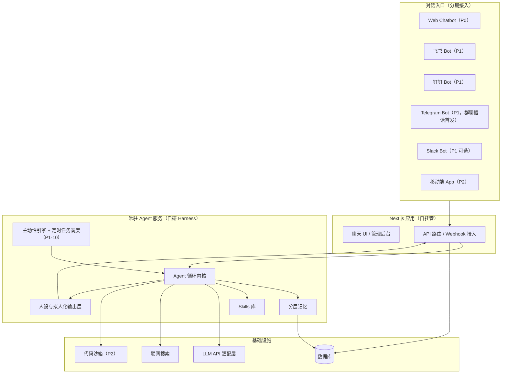

# DigitalMate 数字伙伴 PRD

- 版本：v0.2
- 日期：2026-07-08
- 状态：待评审

> 修订记录
>
> - v0.2（2026-07-08）：研读 [QwenPaw](https://github.com/agentscope-ai/QwenPaw) 与 [hermes-agent](https://github.com/nousresearch/hermes-agent) 后更新——细化分层记忆（新增原始会话档案层、混合检索、容量上限与自整理）、自我反思（轮后轻量复盘 + 每日深度整理）、Skills 沉淀（触发条件、自我改进、写入审批、兼容 agentskills.io 标准）；新增定时任务需求（P1-10）；补充记忆注入安全扫描与第三方 Skill 安全边界。
> - v0.1（2026-07-04）：初稿。

---

## 1. 产品概述

### 1.1 一句话定位

一个有稳定人设、能自我进化的私人数字伙伴：平时像朋友一样陪你聊天、答疑，逐步成长为能替你完成实际任务（做 PPT、处理表格等）的数字员工。

### 1.2 目标用户

- **当前阶段**：仅服务本人（单用户），由本人自行部署和管理。
- **产品化预留**：账号体系、数据模型均按多用户设计（所有数据带 `user_id` 维度），将来可开放给他人使用，但短期内不做注册、计费、多租户隔离等产品化功能。

### 1.3 核心价值主张

1. **有趣**：有名字、有性格、有语气，说话像真人而不是客服模板；在群聊里像一个真实成员。
2. **有用**：能回答日常疑问（联网搜索）、提醒跟进事项，后续能执行画 PPT、处理表格等实际任务。
3. **越用越懂你**：具备长期记忆和自我进化能力，记住你的偏好和习惯，能沉淀新技能，随时间越来越贴合你的需要。

### 1.4 与现有产品的差异

| 对比对象 | 差异点 |
|---|---|
| 通用 Chatbot（ChatGPT/豆包等） | 无跨端统一的长期记忆和人设，不会主动找你，不能进你的群聊 |
| IM 平台机器人 | 通常需要 @ 触发、回复模板化，缺少真人感与记忆 |
| Claude Code 等编码 Agent | 面向开发任务，不面向日常生活陪伴与 IM 场景 |
| 开源个人助手（QwenPaw、Hermes Agent 等） | 定位是"个人工作站/工具型助手"，交互以指令和 slash command 为主；无稳定人设与拟人节奏，不做群聊插话。其记忆、Skills、定时任务、安全等**机制**是本产品的重要参考（见第 6 节），但产品体感取向不同 |

DigitalMate 的核心差异是：**一个身份、一份记忆，出现在你所有的对话入口里，并保持真人感**。

---

## 2. 产品原则

1. **真人感优先**：任何功能设计如果会破坏"像真人"的体感（如暴露系统提示、输出思考过程、回复机械化），优先牺牲功能而非体感。
2. **不暴露思考过程**：Agent 内部的推理、工具调用、反思等过程对对话对象不可见，只输出最终结果。调试与审计信息仅在管理后台可查。
3. **个人数据自控**：部署在自己的 VPS/容器上，对话与记忆数据存储在自己掌控的数据库中，不依赖第三方托管对话数据。
4. **YAGNI 分期**：每一期只做该期验收所需的最小能力集，不为远期功能提前实现（但数据模型可预留字段）。
5. **模型无关**：不绑定单一 LLM 供应商，通过统一适配层接入，可按任务类型切换或混用模型。

---

## 3. 用户场景与故事

### 3.1 日常问答（P0）

> "帮我查一下明天北京的天气，顺便说说要不要带伞。"

用户在 Web chatbot 里随口提问，DigitalMate 联网搜索后用自己的语气给出答案，而不是罗列搜索结果。

### 3.2 有记忆的陪伴闲聊（P0）

> 上周聊过"最近在准备一个演讲"，这周主动问："演讲练得怎么样了？"

DigitalMate 记住对话中的关键事实（事件、偏好、关系），在后续对话中自然引用，并可主动跟进。

### 3.3 提醒与跟进（P0 基础版 / P1 增强）

> "提醒我周五之前把报销交了。" 周五早上 DigitalMate 主动发消息提醒。

P0 支持基于对话内容的简单提醒（Web 端消息）；P1 扩展到 IM 渠道推送。

### 3.4 多端同一身份（P1）

> 在飞书上聊了一半，晚上打开 Web 端继续聊，上下文和记忆无缝衔接。

所有渠道共享同一份会话历史与记忆，云端同步。

### 3.5 群聊参与（P1）

> 在群里大家讨论周末去哪玩，没人 @ 它，DigitalMate 判断话题相关且时机合适，插一句"上次你说想去爬山，XX山这周末天气不错"。

无需 @ 也能择机插话，但受频率与边界策略约束（见第 5.2 节），不刷屏、不抢话。插话能力优先在 Telegram（备选 Slack）验证——这两个平台的 Bot 可直接获取群内全量消息；飞书/钉钉受平台权限限制，待验证通过后跟进。

### 3.6 任务执行（P2）

> "把这份销售数据表按区域汇总，做成 5 页的汇报 PPT。"

用户上传文件，DigitalMate 在代码执行沙箱中处理数据、生成 PPT 文件并交付，过程中只汇报进度和结果，不暴露执行细节。

---

## 4. 功能需求（按优先级分期）

### 4.1 P0 —— MVP：好聊、有记忆、能搜索

| 编号 | 功能 | 说明 |
|---|---|---|
| P0-1 | Web Chatbot | Next.js 实现的聊天界面，支持手机浏览器访问；登录鉴权（单用户，简单口令/OAuth 均可） |
| P0-2 | 流式对话 | 回复流式输出；支持多轮上下文 |
| P0-3 | 长期记忆 | 自动从对话中抽取并存储关键事实（偏好、事件、人物关系），后续对话自动召回；用户可在后台查看/删除记忆条目 |
| P0-4 | 联网搜索 | Agent 可调用搜索工具获取实时信息，答案融入人设语气输出 |
| P0-5 | 稳定人设 | 有名字、性格、语气风格（具体设定见开放问题 10.1）；全渠道一致 |
| P0-6 | 拟人节奏 | 回复可分段发送、可带表情；避免"秒回长文"的机器感（具体参数见 5.3） |
| P0-7 | 基础主动消息 | 支持对话中约定的提醒（"周五提醒我…"）；支持简单的主动跟进（如隔天追问未完成事项），频率受限 |
| P0-8 | 管理后台（最简版） | 查看对话日志、工具调用记录、记忆条目；人设与主动性参数配置 |

### 4.2 P1 —— 多渠道与自进化

| 编号 | 功能 | 说明 |
|---|---|---|
| P1-1 | 飞书 Bot 接入 | 单聊 + 群聊；事件订阅 webhook 接入 Agent 服务 |
| P1-2 | 钉钉 Bot 接入 | 单聊 + 群聊；机器人回调/Stream 模式接入 Agent 服务 |
| P1-3 | Telegram Bot 接入 | 单聊 + 群聊；Bot API 接入；**群聊插话优先在此渠道验证**（Bot API 可获取群内全量消息，无权限障碍） |
| P1-4 | Slack Bot 接入（可选） | 单聊 + 群聊；Events API 接入，同样可获取群内全量消息，作为群聊插话验证的备选渠道 |
| P1-5 | 多端会话云端同步 | 所有渠道共享同一身份、记忆与会话历史；跨端续聊 |
| P1-6 | 群聊插话 | 无需 @ 的主动插话，含相关度判断、频率上限、静默时段等策略（见 5.2）；先在 Telegram/Slack 验证体验，飞书/钉钉待权限验证通过后跟进 |
| P1-7 | 自我反思 | 两级机制（详见 6.2）：对话轮后的轻量后台复盘（用低成本模型，产出记忆/Skill 更新建议）+ 每日一次深度反思与记忆整理（合并去重、结晶入画像层，整理前自动备份）；反思记录与行为修正在后台可审查 |
| P1-8 | Skills 沉淀 | 完成一类新任务后，可将做法沉淀为结构化 Skill（SKILL.md 格式，兼容 agentskills.io 开放标准），下次同类任务直接复用；沉淀触发条件、使用中自我改进与写入审批见 6.3；P1 阶段的 Skill 面向不依赖沙箱的对话型/流程型任务，代码类任务的 Skill 随 P2 沙箱一起落地；Skill 库在后台可管理 |
| P1-9 | 主动对话增强 | 主动分享它认为用户会感兴趣的内容（基于记忆中的兴趣画像 + 联网信息），频率严格受限 |
| P1-10 | 定时任务 | 通过自然语言创建一次性或循环任务（"每天早上 9 点给我发一份 AI 新闻摘要"），由常驻 Agent 服务内置调度器执行，结果投递到指定渠道（Web/IM）；任务可暂停、编辑、手动触发、删除，全部持久化；与 P0-7 的提醒共用同一调度器；定时任务产生的消息计入 5.2 的主动消息总量上限 |

### 4.3 P2 —— 任务能力与产品化

| 编号 | 功能 | 说明 |
|---|---|---|
| P2-1 | 代码执行沙箱 | 隔离环境（容器级）中执行 Agent 生成的代码，有资源与网络限制 |
| P2-2 | 表格处理 | 上传 Excel/CSV，完成清洗、汇总、图表生成等任务，输出文件 |
| P2-3 | PPT 生成 | 根据素材/数据生成 PPT 文件（技术路线在实现阶段调研：HTML 转 PPT / python-pptx 等） |
| P2-4 | 工具自扩展 | Agent 可接入新的 MCP Server，或在沙箱内自写工具脚本并注册使用（需用户在后台确认后启用） |
| P2-5 | 移动端 App | 独立移动端 chatbot App（优先考虑将 Web 封装，其次原生/跨端框架） |
| P2-6 | 多用户产品化 | 注册、账号体系、租户隔离、用量控制（本期仅立项占位，具体需求届时另立 PRD） |
| P2-7 | 社区 Skill 导入 | 因 SKILL.md 兼容 agentskills.io 标准（P1-8），可从社区源（GitHub 仓库、skills.sh 等）导入现成 Skill；导入前必须经过安全扫描（检测提示注入、数据外传、危险命令）+ 用户在后台确认，危险判定不可强制覆盖 |

---

## 5. 真人感规格

### 5.1 人设

- 有固定的名字、性别倾向、性格特征、说话风格（口头禅、幽默感程度、表情使用习惯），具体设定作为配置存储，可在后台调整。
- 人设在所有渠道保持一致；同一个"人"出现在 Web、飞书、钉钉、Telegram（以及可选的 Slack）。
- 人设知道自己的边界：被直接问"你是 AI 吗"时不撒谎，但日常对话不主动强调自己是 AI。

### 5.2 主动性行为边界

| 维度 | 规则 |
|---|---|
| 群聊插话触发 | 满足全部条件才插话：话题与用户或自己的知识/记忆强相关；当前无他人正在密集对话；距上次自己发言超过最小间隔 |
| 频率上限 | 单个群聊内主动插话默认不超过 N 次/小时、M 次/天（参数可配，默认值在实现时调优） |
| 静默时段 | 默认深夜时段（如 23:00–8:00）不主动发消息，紧急提醒除外；时段可配 |
| 主动消息 | 主动发起的对话（提醒、跟进、分享）每天有总量上限；用户可一键降低"主动程度"档位 |
| 退避机制 | 主动消息若连续未获回应，自动降低主动频率 |

### 5.3 拟人节奏

- **分段发送**：长回复拆成多条消息发送，模拟真人打字节奏；消息间有短暂延迟。
- **响应延迟**：非即时秒回，根据回复长度加入自然延迟（上限受体验约束，Web 端流式输出可豁免）。
- **表情与语气词**：按人设配置的习惯使用 emoji/表情包/语气词，频率适中。
- **不暴露思考**：工具调用、推理过程一律不出现在对话中；执行较长任务时只发一句自然的"稍等我看看"类过渡语。
- **语音消息**（P2 可选）：偶尔以语音回复，增强真人感；依赖 TTS，列为可选项。

---

## 6. 自进化机制设计要点

参考 [claude-code-analysis](https://github.com/liuup/claude-code-analysis) 中 Claude Code 的分层 Memory 与 Skills 机制，以及 [QwenPaw](https://github.com/agentscope-ai/QwenPaw)（三层记忆 + Auto-Dream 记忆整理 + 混合检索）和 [hermes-agent](https://github.com/nousresearch/hermes-agent)（闭环学习：精选有界记忆 + 历史会话检索 + Skill 自动沉淀与自我改进 + 写入审批门）的机制，结合本产品需要设计：

### 6.1 分层记忆

| 层级 | 内容 | 生命周期 | 容量策略 |
|---|---|---|---|
| 会话上下文 | 当前对话窗口内的消息 | 会话内；超长时压缩（session compaction），压缩时关键信息进长期记忆 | 受模型上下文窗口约束 |
| 原始会话档案 | 全量对话逐字存档（所有渠道），支持全文 + 语义检索 | 永久，只增不删（用户主动删除除外） | 无上限；不占常驻上下文，按需检索 |
| 情景记忆 | 从对话中抽取的事实/事件（"用户下周五要交报销"） | 长期，带时效衰减与去重 | 按相关度检索注入，不常驻 |
| 用户画像 | 稳定偏好、习惯、关系（"喜欢爬山""在准备演讲"） | 长期，缓慢更新 | 有条目/长度上限，常驻系统提示 |
| Agent 自我记忆 | 反思记录、行为修正、Skill 索引 | 长期 | 有上限，常驻系统提示 |

设计要点（借鉴两个参考项目验证过的做法）：

- **"永不遗忘"分工**：常驻上下文只放精炼后的画像与自我记忆（有严格容量上限，控制每轮 token 成本）；完整历史进原始会话档案，靠检索按需召回——关键事实"永远在场"，陈年细节"随叫随到"，两者不混淆。
- **容量上限与自整理**：画像/自我记忆超过上限时不静默丢弃，由 Agent 在写入时自行合并、压缩或淘汰旧条目后再写入（Hermes 的 memory 工具模式），保证记忆始终是"精选"而非流水账。
- **混合检索**：记忆与会话档案的召回采用向量语义检索 + 全文检索（PostgreSQL tsvector/pgvector）加权融合（QwenPaw 验证的模式：语义查询靠向量，函数名/错误码等精确 token 靠全文，互补盲区）。
- **异步写入**：记忆抽取由 Agent 在对话后异步进行，避免拖慢回复；抽取用低成本模型（对应 7.3 模型路由）。
- **写入安全扫描**：记忆条目会被注入系统提示，写入前须扫描提示注入、凭据外传等威胁模式（Hermes 的做法），防止通过对话内容污染 Agent 行为。
- **写入审批（可配）**：默认自由写入；后台提供开关，开启后记忆写入先进待审队列，用户批准后生效——应对"它记错了我的偏好"场景。
- **隐私自控**：用户可在后台查看、编辑、删除任何记忆条目；敏感信息（证件号等）抽取时不落库（见第 8 节）。

### 6.2 自我反思

采用"轻量高频 + 深度低频"两级机制：

- **轮后轻量复盘**（借鉴 Hermes 的 background review）：每轮对话结束后，后台用低成本模型复盘本轮——是否有值得记的事实、是否踩坑后找到了正确做法、用户是否纠正过它——产出记忆写入或 Skill 更新建议。异步执行，不影响回复速度。
- **每日深度反思**（借鉴 QwenPaw 的 Auto-Dream）：每日定时（默认深夜）回顾当天对话与任务表现，做两件事：① 生成结构化反思记录（做得好/不好、原因、行为修正建议）；② 整理记忆库——合并冗余情景记忆、将反复出现的模式结晶入用户画像。整理前自动备份，可回滚。
- **事件触发**：任务失败、用户明显不满、主动消息连续被无视时，追加触发反思。
- **生效方式**：修正建议以"行为倾向"形式注入后续系统提示；重大修正（如人设调整）需用户在后台确认。
- **留痕**：所有反思记录、记忆整理 diff 在后台可查（对应产品红线：过程不进对话，只在后台留痕）。

### 6.3 Skills 沉淀

- **格式**：Skill 为结构化 Markdown 文档（SKILL.md：名称、描述、适用场景、步骤、注意事项），兼容 [agentskills.io](https://agentskills.io) 开放标准的 frontmatter，便于与社区生态互通（P2-7 导入的前提）。
- **按需加载（渐进式披露）**：常驻上下文只保留 Skill 索引（名称 + 一句话描述）；命中时才加载全文，控制 token 成本。
- **沉淀触发条件**（借鉴 Hermes 验证的判据）：首次成功完成一类复杂任务；踩坑/走弯路后找到了可行路径；被用户纠正过做法。满足其一即评估是否值得沉淀。
- **沉淀路径**：Agent 生成 Skill 草稿 → 用户在后台确认后入库（P1 阶段一律人工确认，避免沉淀错误做法；对应产品红线"能力扩展需确认"）。
- **使用路径**：接到任务时先检索 Skill 库，命中则按 Skill 执行。
- **使用中自我改进**：按 Skill 执行时若发现步骤过时或有更优做法，Agent 可提出增量修订（patch 而非重写）；修订同样经用户确认后生效，后台可查看修订 diff。

### 6.4 工具自扩展（P2）

- 两条路径：接入现成 MCP Server；在沙箱内自写工具脚本并注册。
- **安全边界**：新工具默认在沙箱内运行；涉及外部副作用（发消息给他人、写外部系统）的工具必须经用户确认后才启用；所有工具调用留审计日志。

---

## 7. 技术方向

### 7.1 系统形态

Next.js 做 Web/API 层 + 独立常驻 Agent 服务，部署在 VPS/容器：

- **Next.js 应用**：聊天 UI、管理后台、API 路由；IM 渠道的 webhook 也从这里接入后转发给 Agent 服务。
- **常驻 Agent 服务**：独立 Node 进程，承载自研 harness；支持长任务、定时反思、主动消息调度——这些是 serverless 模式做不好的事，故选择常驻服务。
- **通信**：Next.js 与 Agent 服务之间通过内部 API/队列通信（实现阶段定），回复经 SSE/WebSocket 推给 Web 端、经渠道 API 推给 IM。

### 7.2 自研 Harness（参考 Claude Code / QwenPaw / Hermes 的机制点）

从 claude-code-analysis 中重点借鉴以下机制，做轻量化实现：

1. **循环式执行内核**：`query loop`——LLM 输出 → 解析 tool call → 执行工具 → 结果回填 → 继续循环，直到产出最终回复。
2. **分层 Memory 与 Session 压缩**：长会话自动摘要压缩，关键信息进长期记忆（对应 6.1）。
3. **Skills 机制**：按需加载的结构化能力文档（对应 6.3）。
4. **MCP 集成**：工具扩展的标准协议（对应 6.4）。
5. **工具权限控制**：每个工具有权限级别，敏感操作需确认；工具调用全量留痕。
6. **Sandbox 隔离**：P2 的代码执行采用容器级隔离，限制文件系统与网络访问。

从 QwenPaw / hermes-agent 中补充借鉴：

7. **内置任务调度器**：常驻进程内的 cron 式调度，任务持久化；P0-7 提醒、P1-10 定时任务与每日定时反思（6.2）共用同一调度器。
8. **常驻上下文的快照注入**：画像/自我记忆等常驻内容在会话开始时一次性注入并在会话内保持不变（利于 prompt cache），会话中的记忆更新落库即时生效、下一会话可见。
9. **后台复盘旁路**：轮后复盘走独立的低成本模型调用（对应 6.2、7.3），与主对话解耦。

不照搬的部分：TUI 组件体系、本地文件系统为中心的设计（本产品以云端对话与记忆为中心，记忆存 PostgreSQL 而非 Markdown 文件）；多 Agent/子 Agent 编排（当前无此需求，YAGNI）。

### 7.3 模型适配层

- 统一的 LLM API 适配层（OpenAI 兼容格式为主），供应商可配置、可按用途路由：
  - 主对话/复杂任务：能力优先的模型；
  - 群聊插话判断、记忆抽取等高频轻量调用：便宜快速的模型。
- 路由策略作为配置，不硬编码。

### 7.4 数据模型要点

- 所有业务表带 `user_id`（当前恒为本人，为多用户预留）。
- 核心实体：`user`、`conversation`（含渠道标识）、`message`、`memory_entry`（分层级）、`skill`、`reflection`、`tool_call_log`、`scheduled_task`（提醒/跟进/定时任务统一调度，见 P0-7、P1-10）。
- 会话与记忆云端统一存储，是多端同步（P1-5）的基础。

### 7.5 技术选型倾向（实现阶段可调整）

- 前端/Web 层：Next.js（App Router）+ TypeScript。
- Agent 服务：Node.js + TypeScript（与 Web 层同栈，便于共享类型与代码）。
- 数据库：PostgreSQL（含 pgvector 做记忆向量检索）。
- 部署：Docker Compose 于 VPS。

---

## 8. 非功能需求

| 类别 | 要求 |
|---|---|
| 成本控制 | 按用途路由模型（见 7.3）；高频轻量调用（插话判断、记忆抽取）必须用低成本模型；后台可查看 token 用量统计 |
| 隐私与数据安全 | 对话与记忆数据仅存于自有数据库；LLM API 调用不可避免地将上下文发给模型供应商，敏感内容（如证件号）在记忆抽取时不落库；记忆条目与 Skill 内容在写入/导入前经安全扫描（提示注入、凭据外传、危险命令，见 6.1/P2-7）；后台支持一键导出/清空个人数据 |
| 可观测性 | 全量对话日志、工具调用日志、主动消息决策日志（为什么插话/为什么没插话）、反思与记忆整理记录可在后台查询 |
| 可靠性 | Agent 服务崩溃自动重启；提醒与定时任务持久化存储，重启不丢失、到期照常执行；每日记忆整理前自动备份，可回滚 |
| 响应性能 | Web 端首 token 延迟目标 < 3s（不含拟人化故意延迟）；IM 渠道回复在渠道超时限制内完成 |

---

## 9. 里程碑与验收标准

### M1（P0，MVP）

- 可通过 Web（含手机浏览器）与 DigitalMate 对话，回复流式、分段、带人设语气。
- 连续对话 3 天后，能在新对话中正确引用之前提到的至少一类个人事实。
- 能回答需要实时信息的问题（联网搜索），答案融入人设语气。
- 能执行"周五提醒我 X"类提醒并按时送达。
- 后台可查看对话、记忆、工具调用日志。

### M2（P1）

- 飞书、钉钉与 Telegram 单聊可用（Slack 可选），各端共享记忆与会话历史。
- 在 Telegram（或 Slack）测试群中能实现无 @ 插话，且插话频率不超过配置上限、静默时段不发言。
- 每日反思与记忆整理正常运行，后台可查看反思记录、行为修正及整理前后的记忆变化。
- 至少完成一次 Skill 沉淀并在后续同类任务中被复用。
- 能用自然语言创建一个循环定时任务（如每日摘要），按时执行并投递到指定渠道；可在后台暂停/编辑该任务。

### M3（P2）

- 能完成一次端到端的表格处理任务和一次 PPT 生成任务，交付可用文件。
- 能通过后台确认流程接入一个新 MCP 工具并在对话中使用。
- 移动端 App 可安装使用（封装方案即可）。

---

## 10. 开放问题

1. **人设具体设定**：名字、性格、语气风格待与用户共创后写入配置（不阻塞架构与 P0 开发，可先用占位人设开发）。
2. **群聊插话策略参数**：相关度阈值、频率上限 N/M 的默认值需在 P1 上线后根据实际群聊体验调优。
3. **PPT 生成技术路线**：HTML 转 PPT、python-pptx、还是模板填充，P2 启动前调研决定。
4. **移动端封装方案**：PWA、Capacitor 还是原生壳，P2 启动前决定。
5. **飞书/钉钉群聊消息权限**：飞书 Bot 读取群内非 @ 消息需要特定权限配置，钉钉机器人默认同样只能收到 @ 消息（需要企业内部应用 + 相应权限才能监听群消息），P1 启动前分别验证可行性。已决策：群聊插话优先在 Telegram 验证（Slack 备选），飞书/钉钉的插话能力待权限验证通过后跟进，其单聊能力不受影响。
6. **语音能力**：TTS/语音消息是否纳入 P2，视 P1 后的体验需求决定。
7. **社区 Skill 导入范围（P2-7）**：兼容 agentskills.io 后，从哪些社区源（GitHub 仓库、skills.sh 等）导入、信任级别如何分档，P2 启动前决定；安全扫描 + 用户确认是不可放宽的底线。
8. **记忆容量参数**：画像/自我记忆的条目与长度上限（Hermes 用约 1300 token 总量作为常驻记忆预算，可作起点）、每日整理的合并策略，P0/P1 实现时调优。
