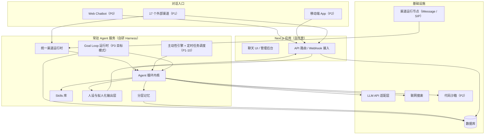

# DigitalMate 数字伙伴 PRD

- 版本：v0.20
- 日期：2026-07-29
- 状态：已确认

> 修订记录
>
> - v0.20（2026-07-29）：收紧 **Skill 自动匹配的可维护性与命中率闭环**（6.3 / 10.12）——① 参与自动匹配的已启用 Skill 上限与其他 Skill 查询统一为 100 且只定义一处，超限时按最近使用排序、被排除的一定是最不常用的，消除"已启用却永不参与自动匹配"的静默空洞；明确在目录规模显著超限前不引入向量检索或独立重排模型，两阶段召回的前提是先配好真实 embedding 供应商；② 修订被批准时必须把 frontmatter 的 `description` 回写到适用场景列，否则改描述改不动命中率；名称不随修订变更，因为它同时是 `/skill-name` 的身份；③ 新增误匹配闭环：用户纠正做法且本会话刚自动命中过某个 Skill 时，产出只收紧适用场景、正文步骤原样保留的待确认修订草稿，理由带上当初的匹配依据；草稿仍需管理员确认，因此销售的纠正也可作为信号，但其纠正继续不写全局反思。
> - v0.19（2026-07-28）：修订 **IM 渠道的 Skill 使用路径与创建入口**（P1-11 / P1-12 / 6.3）——① IM 渠道打不出 `/` 索引面板，自动匹配在这些渠道从兜底升为主路径，渠道对话与 Web 一样按从严规则加载已启用 Skill；同时把自动匹配从"名称/触发词整串包含打分"换成低成本模型意图路由：只看 Skill 索引、最多选一个、拿不准选"都不贴合"、命中后才加载全文、任何失败降级为不加载，匹配依据落库供事后复盘；显式 `/skill-name` 命中时仍跳过自动匹配，附件在场仍全程关闭 Skill；② `/create-skill` 只负责触发引导流程，Skill 创建工具的挂载条件改为只看管理员门（钉钉私聊且发送者在 `admin_from`），管理员用自然语言也可发起创建，销售与群聊两种方式都不可用；③ 被权限拦下的能力请求必须给出中立说明，不得静默失败；Agent 不得向用户描述或猜测自身实现、接入方式、通道状态与工具挂载情况。
> - v0.18（2026-07-28）：细化 **P0-6 拟人节奏**中的消息表态（第 5.3 节）——受理后立刻贴"思考中"，第一条回复送达后撤掉并换成低成本模型判定的表态。表态意图（收到/好问题/赞同/已完成/不贴）与渠道表示解耦，钉钉映射为四字文字表情，飞书待接入后映射为其表情类型。判定与主回复并行，任何失败降级为不贴。
> - v0.17（2026-07-28）：记录**管理员名单独立管理入口**为待办（第 10 节第 13 条）。管理员仍由钉钉连接配置 `admin_from` 指定，后续把它从渠道表单提为独立名单页，数据不迁移、权限项不扩展；细粒度权限、跨渠道统一身份与 Console 账号角色不在范围内。接入第二个渠道后再启动设计。
> - v0.16（2026-07-28）：细化 **P1-14 后台智能体作用域**——管理后台第一步开放选中非默认智能体、查看与编辑其人设与主动性设置，所有 Console 页面跟随选中作用域；可用写操作由后端 `capabilities` 字段统一上报，前端不再硬编码门控。任意智能体新建、删除、克隆、导入、启用停用、置顶、排序继续关闭；Alvin 实例由幂等运维脚本创建，Web 前台聊天继续固定默认智能体。
> - v0.15（2026-07-27）：新增 **P1-14 独立专业智能体 Alvin MVP**——Alvin 固定为“MaaS 售前解决方案架构师”，与 DigitalMate 不存在身份、记忆、Skill 或角色继承关系。首期只开放幂等创建 Alvin、选择非默认智能体、独立人设与资源、一个固定绑定 Alvin 的钉钉连接；允许管理员和一位受邀销售私聊及共同群聊。管理员私聊、销售私聊分别保存独立上下文与记忆；群聊只使用该群历史及管理员已批准的 Alvin Skill，不读取任何成员私聊记忆。只有配置名单内的管理员私聊可以创建全局 Skill，群聊和销售无权修改全局资产。克隆、导入、删除、多人管理、客户空间、自动报价及多智能体协作继续关闭；多智能体备份恢复仍拒绝执行，待稳定后另行补齐。
> - v0.14（2026-07-27）：细化 **QwenPaw Console 备份恢复与插件边界**——Backups 使用独立 `BACKUP_ENCRYPTION_KEY` 对完整灾难恢复包做 AES-256-GCM 外层认证加密，密钥不得缺省回退或复用 `APP_SECRET`/`CHANNEL_SECRETS_KEY`；包内只允许版本化 manifest、白名单业务表、渠道凭据的既有密文行、私有附件和 Matrix crypto store，禁止凭据明文、临时 Token/URL、供应商原始载荷、模型载荷和运行命令。普通个人数据导出继续排除密文、nonce、auth tag、存储键和 Matrix 状态。恢复先验证外层认证、checksum、`user_id + agent_id`、渠道密钥 fingerprint 与附件类型，再在独占用户数据锁内事务恢复；本期默认只允许原分身完整恢复，检测到任何第二分身（含归档）即拒绝，恢复后的全部渠道保持禁用。Plugin Manager 只读列出 17 个内置渠道及当前分身获授权的 Tool/Skill 状态；远程市场、上传、安装、卸载和热启用继续返回明确的 501 冻结状态，不访问外部 marketplace。
> - v0.13（2026-07-27）：细化 **QwenPaw Console 模型与运维边界**——Models 读取现有模型目录及主对话/轻量任务用途路由，按全局或当前分身 revision 写回，供应商凭据只展示“已配置/缺失”状态，密钥、Base URL、自定义供应商和本地模型写入保持禁用。Stats/Usage 按用户时区、当前 `user_id + agent_id`、用途、模型和日期聚合，同时提供用户级总览；Environment 仅展示 Web、Agent 与渠道节点健康/版本，不读取或返回环境变量值，写入与删除保持禁用。Security 只投影渠道访问规则数量、分身资源授权、工具确认策略、脱敏审计、节点证书状态和 Skill 扫描结论；Debug 只保留近 30 日的状态码事件，不返回消息正文、提示、载荷、审计摘要或存储路径。Voice/SIP 继续复用渠道连接的 revision 配置与健康状态，凭据只返回字段配置状态；聊天音频上传/转写不扩大 P0-10 附件白名单并保持禁用。
> - v0.12（2026-07-27）：细化 **QwenPaw Console 数据边界**——Workspace 固定投影为 `/AGENT.md`、`/PROACTIVITY.md`、`/CHANNELS.md`、`/RUNTIME.json`，内容即时来自 PostgreSQL，不建立第二套磁盘配置或 Markdown 记忆；前两项以 revision 写回人设/主动性，后两项只读，任意文件上传、代码工作区和 Git 操作保持禁用。Skills/Tools/MCP 只展示当前分身获授权的真实资源，Skill 创建、启用和修订继续经过确认/待审批链路，动态工具/MCP 扩展仍属冻结 P2。Memory 编辑/删除及 Reflection 应用/忽略均按 `user_id + agent_id` 隔离并写安全审计；应用反思时只合并用户明确勾选的建议。
> - v0.11（2026-07-27）：细化 **P1-13 SIP 媒体节点边界**——① Dev SIP 使用 UDP SIP/RTP、G.711 µ-law 与有界原子端口租约，零配置 registrar 只能绑定回环地址；②生产模式强制使用 LiveKit `wss://` 与随机后缀的 individual dispatch rule，实现独立 room/call 映射；SIP、DashScope、LiveKit 凭据仅驻留节点私有 `0600` 配置和内存，中心拒绝接收；③ DashScope STT 只把 `sentence_end=true` 的最终转写送往中心，TTS 固定按墙钟输出 20 ms 音频帧，barge-in 只中断当前语音播放；④每通电话默认 120 秒、每连接默认最多 5 路并发，第 6 路返回 busy；⑤原始音频、部分转写、供应商帧与 base64 永不进入中心消息、附件或持久队列。
> - v0.10（2026-07-26）：细化 **P1-13 渠道运行节点与 iMessage 数据边界**——① 中心出站 Delivery 先持久化节点 outbox，在线推送与重连补发共用同一记录，`send_result` 原子回写原 Delivery，不重复运行 Agent；② 每次注册按最新绑定集合启动新增连接并停止已解绑连接；③ iMessage 附件固定为 4 个/单文件 10 MiB/单消息 20 MiB，通过 mTLS 以不超过 512 KiB 分块传输，中心完成统一白名单、真实内容校验和私有存储后才 ACK，Mac 临时副本随后删除；④ 单行坏附件写入不含正文的私有拒绝记录、清理临时文件并推进游标，避免阻塞后续消息；⑤ iMessage 群聊按持久化 `chatType` 显式拒绝，不得退化为对群成员私聊。
> - v0.9（2026-07-21）：确认 **QwenPaw Console 与全渠道迁移**——① `/admin` 以 QwenPaw `v2.0.0.post3` 为固定基线，保留其导航、页面、组件和交互，聊天仍位于 DigitalMate 首页；② 可见品牌与 Logo 替换为 DigitalMate，布局沿用 QwenPaw，主题沿用现有暖白与珊瑚色；③ 一次性覆盖上游 17 个外部渠道，全部渠道共享唯一 DigitalMate Agent、身份、权限和 PostgreSQL 数据，不引入 QwenPaw Python Runner；④ iMessage 与 SIP 通过无模型、无记忆的渠道运行节点适配专用环境；⑤ 本期只运行一个默认数字分身与一套记忆，但保留 Console 的 Agent 数据通路，并以 `agent_id` 隔离分身级数据，为未来第二分身预留能力；⑥ P2 冻结页面只读或明确禁用。详细规格见 [QwenPaw Console 与全渠道迁移设计](superpowers/specs/2026-07-21-qwenpaw-console-and-channels-design.md)。
> - v0.8（2026-07-14）：新增**稳定阅读与聊天附件**（P0-10）——① 输入框按实际高度为消息区预留空间，不得遮挡消息；② 用户阅读历史时不强制滚到最新位置，以新消息按钮提示；③ 输入框「+」第一期支持 JPEG/PNG/WebP 与 PDF/TXT/MD/JSON/CSV，附件保存在自有私有存储并真正进入主模型；④ 附件上传不构成联网授权，携带附件的上下文禁止工具与 Skill 注入、联网和执行；⑤ CSV 仅作为对话文本上下文，不解冻 P2 表格任务；⑥ 对话轮次在执行 Agent 前持久化受理标记，进程重启后同一来源不得再次执行 Agent、搜索或工具，客户端在已受理断流后仅用原请求体和原来源 ID 做一次有界恢复；⑦ 一键清空与附件上传按用户串行，物理文件删除成功后才清数据库引用，确保失败可重试。同步补充模型图片能力风险与供应商载荷合同边界。
> - v0.7（2026-07-13）：根据主动消息事故收紧**显式联网与可见消息唯一性**——① P0-4 改为逐轮显式授权：输入框地球按钮默认关闭，点亮后仅授权当前消息，发送后自动复位；文字明确要求搜索仍视为显式授权，除此之外一律不得联网；② 冻结 P1-9 基于任意记忆自动搜索并分享的占位实现，后台联网只允许用户明确创建的主题订阅或定时摘要（P3 目标合同按其独立确认门执行）；③ 搜索原始标题、摘要、链接及工具过程禁止直接进入对话；④ 主动任务以来源任务 ID 幂等写入，单一触发源不得产生重复可见消息。详见 5.2、5.4。
> - v0.6（2026-07-09）：根据实际使用反馈修订——① 新增 **Skill 显式调用**（P1-11）：对话输入框支持 `/` 索引 Skill 并生成卡片显式指定，显式指定无条件生效；同时收紧意图识别自动匹配（高置信才加载、宁可不用不可误用，见 6.3）；② 新增**对话内创建 Skill**（P1-12，`/create-skill`，参照 Claude Code）；③ 新增**联网搜索触发纪律**（5.4）：白名单触发 + 独立硬门控 + 积极度档位，遏制无关场景乱搜（P0-4 交叉引用），新增开放问题 10.12。
> - v0.5（2026-07-09）：新增**目标模式（Loop Engineering）**——用户显式开启后，Agent 在常驻服务中 7×24 自主循环推进长期目标，直到达成或触发停止条件。新增场景 3.7、功能分期 4.4（P3-1..P3-6）、架构图与数据模型补充（7.1/7.4）、开放问题（10.9–10.11）。详细架构设计见 [docs/goal-mode-design.md](goal-mode-design.md)。第一期仅支持信息型（读多写少）目标，不解冻 P2 沙箱。
> - v0.4（2026-07-08）：Skills 能力扩展——P1-8 补充对话内主动沉淀（save_skill 工具）与使用统计；新增基于使用频率的自动修订机制（高频 Skill 由后台结合实际使用提出增量修订草稿，确认门保留，diff 后台可查，见 6.3）；P2-7 的 GitHub 导入核心能力（链接发现 SKILL.md + 安全扫描 + 后台确认）提前至当前阶段落地。
> - v0.3（2026-07-08）：新增会话与项目管理需求（P0-9：会话增删改查、置顶、项目分组，界面参考 ChatGPT 桌面端）；管理后台明确要求模型可视化选择（并入 P0-8，界面参考 QwenPaw Console 的 Models 页）；后台整体布局参考 QwenPaw Console（分组侧栏导航）。
> - v0.2（2026-07-08）：研读 [QwenPaw](https://github.com/agentscope-ai/QwenPaw) 与 [hermes-agent](https://github.com/nousresearch/hermes-agent) 后更新——细化分层记忆（新增原始会话档案层、混合检索、容量上限与自整理）、自我反思（轮后轻量复盘 + 每日深度整理）、Skills 沉淀（触发条件、自我改进、写入审批、兼容 agentskills.io 标准）；新增定时任务需求（P1-10）；补充记忆注入安全扫描与第三方 Skill 安全边界。
> - v0.1（2026-07-04）：初稿。

---

## 1. 产品概述

### 1.1 一句话定位

一个有稳定人设、能自我进化的私人数字伙伴：平时像朋友一样陪你聊天、答疑，逐步成长为能替你完成实际任务（做 PPT、处理表格等）的数字员工。

### 1.2 目标用户

- **当前阶段**：仅服务本人（单用户），由本人自行部署和管理。
- **产品化预留**：账号体系、数据模型均按多用户设计（所有数据带 `user_id` 维度），将来可开放给他人使用，但短期内不做注册、计费、多租户隔离等产品化功能。

### 1.3 核心价值主张

1. **有趣**：有名字、有性格、有语气，说话像真人而不是客服模板；在群聊里像一个真实成员。
2. **有用**：能回答日常疑问（联网搜索）、提醒跟进事项，后续能执行画 PPT、处理表格等实际任务。
3. **越用越懂你**：具备长期记忆和自我进化能力，记住你的偏好和习惯，能沉淀新技能，随时间越来越贴合你的需要。

### 1.4 与现有产品的差异

| 对比对象 | 差异点 |
|---|---|
| 通用 Chatbot（ChatGPT/豆包等） | 无跨端统一的长期记忆和人设，不会主动找你，不能进你的群聊 |
| IM 平台机器人 | 通常需要 @ 触发、回复模板化，缺少真人感与记忆 |
| Claude Code 等编码 Agent | 面向开发任务，不面向日常生活陪伴与 IM 场景 |
| 开源个人助手（QwenPaw、Hermes Agent 等） | 定位是"个人工作站/工具型助手"，交互以指令和 slash command 为主；无稳定人设与拟人节奏，不做群聊插话。其记忆、Skills、定时任务、安全等**机制**是本产品的重要参考（见第 6 节），但产品体感取向不同 |

DigitalMate 仍是默认私人数字伙伴；P1-14 另行开放一个固定用途、非默认的专业智能体 Alvin。两者只共享宿主基础设施，不共享身份、记忆或 Skill，也不支持协作与角色切换。

---

## 2. 产品原则

1. **真人感优先**：任何功能设计如果会破坏"像真人"的体感（如暴露系统提示、输出思考过程、回复机械化），优先牺牲功能而非体感。
2. **不暴露思考过程**：Agent 内部的推理、工具调用、反思等过程对对话对象不可见，只输出最终结果。调试与审计信息仅在管理后台可查。
3. **个人数据自控**：部署在自己的 VPS/容器上，对话与记忆数据存储在自己掌控的数据库中，不依赖第三方托管对话数据。
4. **YAGNI 分期**：每一期只做该期验收所需的最小能力集，不为远期功能提前实现（但数据模型可预留字段）。
5. **模型无关**：不绑定单一 LLM 供应商，通过统一适配层接入，可按任务类型切换或混用模型。
6. **显式联网、单源单消息**：联网能力默认关闭，由用户逐轮或逐任务授权；任何用户输入、提醒或后台任务都是一个独立响应事务，同一触发源最多写入一次可见结果，内部重试不得变成重复消息。

---

## 3. 用户场景与故事

### 3.1 日常问答（P0）

> "帮我查一下明天北京的天气，顺便说说要不要带伞。"

用户在 Web chatbot 里随口提问，DigitalMate 联网搜索后用自己的语气给出答案，而不是罗列搜索结果。

### 3.2 有记忆的陪伴闲聊（P0）

> 上周聊过"最近在准备一个演讲"，这周主动问："演讲练得怎么样了？"

DigitalMate 记住对话中的关键事实（事件、偏好、关系），在后续对话中自然引用，并可主动跟进。

### 3.3 提醒与跟进（P0 基础版 / P1 增强）

> "提醒我周五之前把报销交了。" 周五早上 DigitalMate 主动发消息提醒。

P0 支持基于对话内容的简单提醒（Web 端消息）；P1 扩展到 IM 渠道推送。

### 3.4 多端同一身份（P1）

> 在飞书上聊了一半，晚上打开 Web 端继续聊，上下文和记忆无缝衔接。

所有渠道共享同一份会话历史与记忆，云端同步。

### 3.5 群聊参与（P1）

> 在群里大家讨论周末去哪玩，没人 @ 它，DigitalMate 判断话题相关且时机合适，插一句"上次你说想去爬山，XX山这周末天气不错"。

无需 @ 也能择机插话，但受频率与边界策略约束（见第 5.2 节），不刷屏、不抢话。插话能力优先在 Telegram（备选 Slack）验证——这两个平台的 Bot 可直接获取群内全量消息；飞书/钉钉受平台权限限制，待验证通过后跟进。

### 3.6 任务执行（P2）

> "把这份销售数据表按区域汇总，做成 5 页的汇报 PPT。"

用户上传文件，DigitalMate 在代码执行沙箱中处理数据、生成 PPT 文件并交付，过程中只汇报进度和结果，不暴露执行细节。

### 3.7 目标模式：挂机干活直到达成（P3）

> "帮我持续跟进 XX 领域的最新进展，整理成一份带来源的调研报告，覆盖 A/B/C 三个子方向，每个方向至少 5 个可靠来源。"

用户在 Web 端点击开启**目标模式**，提交一句话目标。DigitalMate 先通过对话把目标澄清为一份可验证的"目标合同"（完成标准、范围、预算、节奏），用户确认后启动。此后 Agent 在后台 7×24 自主循环推进——搜集、整理、验证、迭代——用户可以关掉页面去干别的。过程进度只在目标详情页可见；只有里程碑达成、需要用户决策、最终交付三类情况会主动通知。目标达成（通过独立验证）或触碰停止条件（预算耗尽、连续无进展）时自动停止。

---

## 4. 功能需求（按优先级分期）

### 4.1 P0 —— MVP：好聊、有记忆、能搜索

| 编号 | 功能 | 说明 |
|---|---|---|
| P0-1 | Web Chatbot | Next.js 实现的聊天界面，支持手机浏览器访问；登录鉴权（单用户，简单口令/OAuth 均可） |
| P0-2 | 流式对话 | 回复流式输出；支持多轮上下文；单次用户输入只创建一个 Agent 响应事务，拟人分段属于同一事务，不得重复整段回复或混入无关后台消息；执行前须持久化受理标记，断线、并发或进程重启后同一来源 ID 不得再次执行 Agent、搜索或工具；客户端已收到受理事件但未收到完成事件时，只可复用原请求体与原来源 ID 恢复一次 |
| P0-3 | 长期记忆 | 自动从对话中抽取并存储关键事实（偏好、事件、人物关系），后续对话自动召回；用户可在后台查看/删除记忆条目 |
| P0-4 | 联网搜索 | Agent 可调用搜索工具获取网页信息，答案融入人设语气输出；**触发受严格纪律约束（见 5.4）：默认关闭，仅当用户点亮输入框联网按钮或在文字中明确要求搜索时，才授权当前消息联网；实时性本身不构成授权** |
| P0-5 | 稳定人设 | 有名字、性格、语气风格（具体设定见开放问题 10.1）；全渠道一致 |
| P0-6 | 拟人节奏 | 回复可分段发送、可带表情；避免"秒回长文"的机器感（具体参数见 5.3） |
| P0-7 | 基础主动消息 | 支持对话中约定的提醒（"周五提醒我…"）；支持简单的主动跟进（如隔天追问未完成事项），频率受限 |
| P0-8 | 管理后台 | `/admin` 以 QwenPaw `v2.0.0.post3` Console 为固定基线，保留其导航、页面、组件和交互；聊天入口跳转 DigitalMate 首页。可见品牌替换为 DigitalMate，布局沿用上游，主题沿用暖白与珊瑚色；对话、记忆、反思、插话、目标、人设、Workspace、Skills、Tools/MCP、模型、渠道、安全、用量和完整灾难恢复接入 DigitalMate 真实数据。Workspace 是四个数据库虚拟文件的即时投影，不建立第二套文件真相；Plugin Manager 只读展示内置渠道和已授权资源，远程扩展与 P2 冻结能力明确禁用 |
| P0-9 | 会话与项目管理 | Web 端支持多会话：新建、重命名、删除、置顶、搜索；支持项目（文件夹）管理——创建/重命名/删除项目、会话移入移出项目；会话标题在首轮对话后由轻量模型自动生成；界面参考 ChatGPT 桌面端侧栏（项目/置顶/最近分区） |
| P0-10 | 稳定阅读与聊天附件 | 输入框增高不得遮挡消息；阅读历史时新内容不得强制滚到底部，以新消息按钮提示。输入框「+」支持 JPEG/PNG/WebP 与 PDF/TXT/MD/JSON/CSV，附件保存在自有私有存储并真正进入主模型；上传不等于联网授权。携带附件的当前或历史上下文禁止注入或执行联网、Skill 与其他工具。CSV 在本功能中只作为文本上下文，不触发 P2 表格处理。 |

### 4.2 P1 —— 多渠道与自进化

| 编号 | 功能 | 说明 |
|---|---|---|
| P1-1 | 飞书 Bot 接入 | 单聊 + 群聊；WebSocket 长连接接收事件，OpenAPI 发送消息 |
| P1-2 | 钉钉 Bot 接入 | 单聊 + 群聊；Stream 模式接收事件并接入统一渠道运行时 |
| P1-3 | Telegram Bot 接入 | 单聊 + 群聊；Bot API 长轮询接入；**群聊插话优先在此渠道验证**（Bot API 可获取群内全量消息，无权限障碍） |
| P1-4 | Slack Bot 接入 | 单聊 + 群聊；Socket Mode 接入，同样可获取群内全量消息，作为群聊插话验证的备选渠道 |
| P1-5 | 多端会话云端同步 | 所有渠道共享默认数字分身、记忆与会话历史；跨端续聊 |
| P1-6 | 群聊插话 | 无需 @ 的主动插话，含相关度判断、频率上限、静默时段等策略（见 5.2）；先在 Telegram/Slack 验证体验，飞书/钉钉待权限验证通过后跟进 |
| P1-7 | 自我反思 | 两级机制（详见 6.2）：对话轮后的轻量后台复盘（用低成本模型，产出记忆/Skill 更新建议）+ 每日一次深度反思与记忆整理（合并去重、结晶入画像层，整理前自动备份）；反思记录与行为修正在后台可审查 |
| P1-8 | Skills 沉淀 | 完成一类新任务后，可将做法沉淀为结构化 Skill（SKILL.md 格式，兼容 agentskills.io 开放标准），下次同类任务直接复用；沉淀入口包括：轮后复盘自动提议、每日反思提议、对话内 save_skill 工具（用户要求"记住这套做法"时由 Agent 主动沉淀）、后台手工创建；每个 Skill 记录来源、版本与使用次数，高频使用的 Skill 由后台自动提出增量修订草稿（见 6.3）；沉淀触发条件、使用中自我改进与写入审批见 6.3；P1 阶段的 Skill 面向不依赖沙箱的对话型/流程型任务，代码类任务的 Skill 随 P2 沙箱一起落地；Skill 库在后台可管理 |
| P1-9 | 主动对话增强 | 默认关闭。只有用户明确创建并启用某个**主题订阅**后，才可按订阅范围主动分享；不得从普通记忆、一次性操作、历史搜索或模型猜测中自动生成订阅。原“任取一条记忆 → 自动联网 → 每 24 小时分享”的占位实现冻结并禁止运行 |
| P1-10 | 定时任务 | 通过自然语言创建一次性或循环任务（"每天早上 9 点给我发一份 AI 新闻摘要"），由常驻 Agent 服务内置调度器执行，结果投递到指定渠道（Web/IM）；任务可暂停、编辑、手动触发、删除，全部持久化；与 P0-7 的提醒共用同一调度器；定时任务产生的消息计入 5.2 的主动消息总量上限 |
| P1-11 | Skill 显式调用（v0.6） | Web 端对话输入框输入 `/` 弹出 Skill 索引面板（支持继续输入模糊过滤名称与描述），选中后在输入框内生成该 Skill 的**卡片**（可删除），随消息一起提交；显式指定的 Skill **无条件加载执行**，跳过意图识别。显式指定是 Skill 使用的**首选路径**；意图识别自动匹配仅作兜底且从严（规则见 6.3"使用路径"）。IM 渠道无法渲染卡片，退化为消息前缀 `/skill-name` 文本指令；IM 渠道同时没有 `/` 索引面板可供浏览，用户很难记住 Skill 名称，因此**自动匹配在 IM 渠道是主路径**（阈值与从严原则不变，见 6.3） |
| P1-12 | 对话内创建 Skill（v0.6） | 参照 Claude Code 的 `/create-skill`：用户在对话框输入 `/create-skill` 后，Agent 以多轮对话引导用户描述要沉淀的做法（名称、适用场景、步骤、注意事项），生成符合 SKILL.md 标准（同 P1-8）的草稿并在对话中给用户预览；用户在对话内确认后入库并启用（对话内确认即视为满足"能力扩展需确认"红线，后台仍可查看与管理）。与 P1-8 的自动沉淀提议互补：P1-12 是用户主导的显式创建入口。`/create-skill` 只是引导流程的触发词，不是能力开关：**Skill 创建工具的挂载条件只看管理员身份**（Web 为本人；IM 渠道为私聊且发送者在连接配置的 `admin_from` 内），因此管理员用自然语言表达"让你学会一套做法"同样可以发起创建，非管理员两种方式都不可用。无论哪种入口，都必须先在对话中给出草稿预览并获得明确确认才可入库 |
| P1-13 | QwenPaw 全渠道迁移 | 一次性覆盖 iMessage、Discord、钉钉、飞书、QQ、Telegram、Mattermost、MQTT、Matrix、Slack、Voice、SIP、企业微信、小艺、腾讯元宝、微信 iLink、OneBot v11。协议适配使用 TypeScript 并接入渠道连接明确绑定的 Agent；iMessage、SIP 等专用环境通过无模型、无记忆的渠道运行节点连接。节点出站采用持久化 outbox 与幂等结果回写，重连按中心最新绑定集合增删同步；iMessage 附件按固定 4 个/10 MiB/20 MiB 上限经 mTLS 分块送往中心统一校验和私有落盘，中心完成持久化后才 ACK 并清理节点临时副本，坏附件不得阻塞后续消息；群聊必须按 `chatType` 显式拒绝。SIP Dev 使用 UDP SIP/RTP 与 G.711 µ-law，零配置 registrar 只允许回环绑定；生产使用 LiveKit 独立 room/call 映射。STT 只上送最终转写，中心文字回复经 TTS 转为固定 20 ms 帧；barge-in 只终止当前 TTS，原始音频、部分转写和供应商帧不持久化。每通电话默认 120 秒、默认最多 5 路并发。所有渠道必须具备配置、健康、访问控制、去重、重连、收发、测试和文档；Matrix 端到端加密设备库按 `user_id + agent_id + connection_id` 独立加密落盘，不进入普通个人数据导出，一键清空时先物理删除再清数据库；缺少平台账号、接入资格或运行环境时准确标记为待外部验收 |
| P1-14 | 独立专业智能体 Alvin MVP | 固定幂等创建一个 `slug=alvin`、非默认且不继承用户资源的“MaaS 售前解决方案架构师”。开放非默认智能体选择、独立人设、六项首版售前 Skill 与一个专属钉钉连接。钉钉允许管理员和一位销售私聊及共同群聊：私聊按连接和发送者隔离会话/长期记忆；群聊按连接和群 ID 隔离，只使用该群历史且不召回私聊长期记忆。管理员名单由连接配置 `admin_from` 明确指定，只有管理员私聊可创建/安装全局 Skill；销售和群聊只可使用已批准且仅授权 Alvin 的 Skill。Alvin 与 DigitalMate 的数据、Skill 和运行选择必须双向隔离。首期分两步开放后台能力：第一步开放选中非默认智能体、查看与编辑其人设，Alvin 实例由幂等运维脚本创建；第二步再评估任意智能体新建与删除。克隆、导入、删除、启用停用、置顶、排序、协作、客户空间、自动报价与多智能体备份恢复继续关闭，后台按后端上报的能力字段禁用对应控件 |

### 4.3 P2 —— 任务能力与产品化

| 编号 | 功能 | 说明 |
|---|---|---|
| P2-1 | 代码执行沙箱 | 隔离环境（容器级）中执行 Agent 生成的代码，有资源与网络限制 |
| P2-2 | 表格处理 | 上传 Excel/CSV，完成清洗、汇总、图表生成等任务，输出文件。P0-10 对 CSV 的支持仅限提取文本并交给主模型理解；清洗、计算、汇总、制图和产出文件仍属于冻结的 P2，本期不得借附件入口提前启用 |
| P2-3 | PPT 生成 | 根据素材/数据生成 PPT 文件（技术路线在实现阶段调研：HTML 转 PPT / python-pptx 等） |
| P2-4 | 工具自扩展 | Agent 可接入新的 MCP Server，或在沙箱内自写工具脚本并注册使用（需用户在后台确认后启用） |
| P2-5 | 移动端 App | 独立移动端 chatbot App（优先考虑将 Web 封装，其次原生/跨端框架） |
| P2-6 | 多用户产品化 | 注册、账号体系、租户隔离、用量控制（本期仅立项占位，具体需求届时另立 PRD） |
| P2-7 | 社区 Skill 导入 | 因 SKILL.md 兼容 agentskills.io 标准（P1-8），可从社区源（GitHub 仓库、skills.sh 等）导入现成 Skill；导入前必须经过安全扫描（检测提示注入、数据外传、危险命令）+ 用户确认，危险判定不可强制覆盖。**GitHub 导入核心能力已提前落地（v0.4）**，两条入口：① 后台导入页粘贴仓库/目录/SKILL.md 链接，自动发现并勾选安装，安装后为待确认状态，须启用后生效；② 对话内 install_skill 工具——用户在聊天中明确给出链接要求安装即视为用户确认，扫描 safe 的 Skill 直接启用并立即可用，warning 装入待确认队列须后台确认，danger 一律拦截且不可绕过；仓库根 Skill 优先安装，深层示例 Skill 列出供用户点名再装 |

### 4.4 P3 —— 目标模式（Loop Engineering）

> 定位：与日常聊天相对独立的能力入口，用户显式开启才进入；Agent 从"一问一答"升级为"围绕目标持续循环执行的数字员工"。设计原则遵循 Loop Engineering 工程共识：**可验证、可停止、可接手、可观测**，而不是"让 Agent 一直跑"。完整架构设计见 [docs/goal-mode-design.md](goal-mode-design.md)。

| 编号 | 功能 | 说明 |
|---|---|---|
| P3-1 | 目标创建与合同确认 | Web 端目标模式入口；用户提交一句话目标后，Agent 通过对话澄清为结构化**目标合同**（完成标准 checklist、工具范围、预算上限、触发节奏、停止/升级条件），用户确认后才启动（对应产品红线"能力扩展需确认"） |
| P3-2 | Goal Loop 运行时 | 常驻 Agent 服务内的目标循环运行时：控制面（确定性状态机，管状态推进/预算/停止）与执行面（LLM 规划与工具调用）分离；跨 tick 持续推进，进程重启后从持久化状态恢复；每轮留下证据账本（goal_steps） |
| P3-3 | 独立验证与停止条件 | 执行者不给自己盖章：每轮产出由独立验证调用（低成本模型 + 合同 checklist）判定进展与达成，达成判定须引用证据；硬停止条件：目标达成 / 预算耗尽（轮数、token/费用、时间）/ 连续 N 轮无进展 / 需人工决策（needs_human） |
| P3-4 | 目标进度页与后台监控 | Web 端目标详情页展示当前状态、进度摘要、已消耗预算；管理后台 /admin/goals 可回放每轮证据账本（做了什么、验证结论、为什么继续或停止），支持暂停/恢复/取消 |
| P3-5 | 结果交付与主动通知 | 循环过程不进对话流；仅"里程碑达成、需要用户决策、最终交付"三类事件主动通知（计入 5.2 主动消息总量上限，遵守静默时段——静默时段只推进不打扰）；最终产出以结构化报告（带来源引用）交付 |
| P3-6 | 产出型目标（后期） | 接入 P2 沙箱后支持写文件、处理数据等有副作用的目标，副作用动作走受控提交点（候选 → 验证 → 提交）；本期不做，待 P2 解冻后另行设计 |

**第一期范围**：仅支持**信息型目标**（调研报告、持续监控、信息整理等读多写少任务），工具白名单限只读（联网搜索、记忆检索）；P3-6 产出型目标明确不在第一期。

---

## 5. 真人感规格

### 5.1 人设

- 有固定的名字、性别倾向、性格特征、说话风格（口头禅、幽默感程度、表情使用习惯），具体设定作为配置存储，可在后台调整。
- 人设在所有渠道保持一致；同一个"人"出现在 Web、飞书、钉钉、Telegram（以及可选的 Slack）。
- 人设知道自己的边界：被直接问"你是 AI 吗"时不撒谎，但日常对话不主动强调自己是 AI。

### 5.2 主动性行为边界

| 维度 | 规则 |
|---|---|
| 群聊插话触发 | 满足全部条件才插话：话题与用户或自己的知识/记忆强相关；当前无他人正在密集对话；距上次自己发言超过最小间隔 |
| 频率上限 | 单个群聊内主动插话默认不超过 N 次/小时、M 次/天（参数可配，默认值在实现时调优） |
| 静默时段 | 默认深夜时段（如 23:00–8:00）不主动发消息，紧急提醒除外；时段可配 |
| 主动消息 | 主动发起的对话（提醒、跟进、分享）每天有总量上限；用户可一键降低"主动程度"档位 |
| 退避机制 | 主动消息若连续未获回应，自动降低主动频率 |
| 后台联网授权 | 仅用户明确启用的主题订阅或定时摘要可以后台联网；任务必须持久化授权来源。普通记忆和聊天内容不能隐式创建联网任务；P3 目标模式仅按已确认目标合同中的工具范围执行 |
| 消息幂等 | 主动任务以任务 ID 作为可见消息唯一来源；调度轮询、进程重启或并发执行不得让同一任务重复写入或重复推送 |

### 5.3 拟人节奏

- **分段发送**：长回复拆成多条消息发送，模拟真人打字节奏；消息间有短暂延迟。
- **响应延迟**：非即时秒回，根据回复长度加入自然延迟（上限受体验约束，Web 端流式输出可豁免）。
- **表情与语气词**：按人设配置的习惯使用 emoji/表情包/语气词，频率适中。
- **消息表态**（v0.18）：在支持表情回应的渠道（钉钉、飞书）上，受理用户消息后立刻在该消息上贴"思考中"，第一条回复送达后撤掉它，并换成由低成本模型判定的一个表态（收到/好问题/赞同/已完成，判不准则不贴）。表态意图与渠道表示解耦，各渠道自行映射；判定与主回复并行执行，失败一律降级为不贴，绝不阻塞或延后回复。这是"正在处理"的体感反馈，不是思考过程外露。
- **不暴露思考**：工具调用、推理过程一律不出现在对话中；执行较长任务时只发一句自然的"稍等我看看"类过渡语。
- **语音消息**（P2 可选）：偶尔以语音回复，增强真人感；依赖 TTS，列为可选项。

### 5.4 联网搜索触发纪律（v0.7）

> 背景：实际使用中曾出现后台从一条普通记忆自行联网，把未经整理的搜索结果写进会话，并在随后两天重复发送。仅靠模型判断“是否需要实时信息”和普通频率上限无法阻止这类事故，联网权限必须来自用户的显式动作，并在服务端确定性校验。

**原则：默认断网。搜索是逐轮或逐任务授权的能力，不是模型可以自行决定的习惯；宁可提示用户开启搜索，也不可擅自联网。**

| 层 | 机制 | 说明 |
|---|---|---|
| 输入框显式授权 | 输入框提供地球按钮；默认只显示关闭态图标。点亮后显示“搜索”状态，并将当前消息标记为允许联网 | 授权仅对当前一次发送生效，发送完成或切换会话后自动复位；不能保留为全局常开状态 |
| 文字显式授权 | 用户明确说“搜一下”“联网查”等 | 与点击按钮等价，可直接放行当前消息；“明天天气怎么样”“最近有什么新闻”等仅描述实时问题但未明确要求联网，不构成授权 |
| 确定性硬门控 | 每次执行 `web_search` 前检查当前响应事务的结构化授权标记或明确搜索措辞 | 未授权直接拦截，不再调用另一个模型猜测是否应放行；门控决定在后台留痕，但不得在对话中提及 |
| 后台任务授权 | 仅主题订阅、定时摘要或已确认目标合同可以携带后台联网权限 | 必须记录授权类型与来源 ID；基于记忆自动搜索、服务启动即搜索、无来源的遗留分享任务一律取消 |
| 输出收敛 | 搜索结果只作为内部证据，必须经过主回复整理后输出 | 原始结果列表、网页标题、摘要、链接堆、工具提示和检索过程禁止直接成为用户可见消息；需要引用时只保留与结论直接相关的少量来源 |

验收口径：① “你好”等普通消息只产生一个正常响应事务，搜索调用数为 0，且没有后台附加消息；② 未点亮按钮、未明确要求联网时，天气/新闻等问题的搜索调用数也为 0；③ 点亮按钮或明确要求搜索时允许调用；④ 同一主动任务重复轮询只产生一条可见消息；⑤ 无授权来源的后台分享任务被取消，搜索原始结果永不直接进入对话。

---

## 6. 自进化机制设计要点

参考 [claude-code-analysis](https://github.com/liuup/claude-code-analysis) 中 Claude Code 的分层 Memory 与 Skills 机制，以及 [QwenPaw](https://github.com/agentscope-ai/QwenPaw)（三层记忆 + Auto-Dream 记忆整理 + 混合检索）和 [hermes-agent](https://github.com/nousresearch/hermes-agent)（闭环学习：精选有界记忆 + 历史会话检索 + Skill 自动沉淀与自我改进 + 写入审批门）的机制，结合本产品需要设计：

### 6.1 分层记忆

| 层级 | 内容 | 生命周期 | 容量策略 |
|---|---|---|---|
| 会话上下文 | 当前对话窗口内的消息 | 会话内；超长时压缩（session compaction），压缩时关键信息进长期记忆 | 受模型上下文窗口约束 |
| 原始会话档案 | 全量对话逐字存档（所有渠道），支持全文 + 语义检索 | 永久，只增不删（用户主动删除除外） | 无上限；不占常驻上下文，按需检索 |
| 情景记忆 | 从对话中抽取的事实/事件（"用户下周五要交报销"） | 长期，带时效衰减与去重 | 按相关度检索注入，不常驻 |
| 用户画像 | 稳定偏好、习惯、关系（"喜欢爬山""在准备演讲"） | 长期，缓慢更新 | 有条目/长度上限，常驻系统提示 |
| Agent 自我记忆 | 反思记录、行为修正、Skill 索引 | 长期 | 有上限，常驻系统提示 |

设计要点（借鉴两个参考项目验证过的做法）：

- **"永不遗忘"分工**：常驻上下文只放精炼后的画像与自我记忆（有严格容量上限，控制每轮 token 成本）；完整历史进原始会话档案，靠检索按需召回——关键事实"永远在场"，陈年细节"随叫随到"，两者不混淆。
- **容量上限与自整理**：画像/自我记忆超过上限时不静默丢弃，由 Agent 在写入时自行合并、压缩或淘汰旧条目后再写入（Hermes 的 memory 工具模式），保证记忆始终是"精选"而非流水账。
- **混合检索**：记忆与会话档案的召回采用向量语义检索 + 全文检索（PostgreSQL tsvector/pgvector）加权融合（QwenPaw 验证的模式：语义查询靠向量，函数名/错误码等精确 token 靠全文，互补盲区）。
- **异步写入**：记忆抽取由 Agent 在对话后异步进行，避免拖慢回复；抽取用低成本模型（对应 7.3 模型路由）。
- **写入安全扫描**：记忆条目会被注入系统提示，写入前须扫描提示注入、凭据外传等威胁模式（Hermes 的做法），防止通过对话内容污染 Agent 行为。
- **写入审批（可配）**：默认自由写入；后台提供开关，开启后记忆写入先进待审队列，用户批准后生效——应对"它记错了我的偏好"场景。
- **隐私自控**：用户可在后台查看、编辑、删除任何记忆条目；敏感信息（证件号等）抽取时不落库（见第 8 节）。

### 6.2 自我反思

采用"轻量高频 + 深度低频"两级机制：

- **轮后轻量复盘**（借鉴 Hermes 的 background review）：每轮对话结束后，后台用低成本模型复盘本轮——是否有值得记的事实、是否踩坑后找到了正确做法、用户是否纠正过它——产出记忆写入或 Skill 更新建议。异步执行，不影响回复速度。
- **每日深度反思**（借鉴 QwenPaw 的 Auto-Dream）：每日定时（默认深夜）回顾当天对话与任务表现，做两件事：① 生成结构化反思记录（做得好/不好、原因、行为修正建议）；② 整理记忆库——合并冗余情景记忆、将反复出现的模式结晶入用户画像。整理前自动备份，可回滚。
- **事件触发**：任务失败、用户明显不满、主动消息连续被无视时，追加触发反思。
- **生效方式**：修正建议以"行为倾向"形式注入后续系统提示；重大修正（如人设调整）需用户在后台确认。
- **留痕**：所有反思记录、记忆整理 diff 在后台可查（对应产品红线：过程不进对话，只在后台留痕）。

### 6.3 Skills 沉淀

- **格式**：Skill 为结构化 Markdown 文档（SKILL.md：名称、描述、适用场景、步骤、注意事项），兼容 [agentskills.io](https://agentskills.io) 开放标准的 frontmatter，便于与社区生态互通（P2-7 导入的前提）。
- **按需加载（渐进式披露）**：常驻上下文只保留 Skill 索引（名称 + 一句话描述）；命中时才加载全文，控制 token 成本。
- **沉淀触发条件**（借鉴 Hermes 验证的判据）：首次成功完成一类复杂任务；踩坑/走弯路后找到了可行路径；被用户纠正过做法。满足其一即评估是否值得沉淀。
- **沉淀路径**：Agent 生成 Skill 草稿 → 用户在后台确认后入库（P1 阶段一律人工确认，避免沉淀错误做法；对应产品红线"能力扩展需确认"）。草稿来源有五类（除两类例外——对话内明确要求安装且扫描 safe 的 GitHub 导入、`/create-skill` 引导创建并经用户对话内确认——其余均入库为待确认状态）：① 对话内 save_skill 工具（用户明确要求记住某套做法时由主模型直接沉淀）；② 对话内 `/create-skill` 引导创建（P1-12，用户主导、对话内预览确认后直接启用）；③ 轮后轻量复盘提议（6.2）；④ 每日深度反思提议（当天反复出现且无对应 Skill 的任务模式）；⑤ 后台手工创建 / GitHub 导入（含对话内 install_skill，见 P2-7）。
- **使用路径（v0.6 修订）**：分两条，显式优先——
  - **显式指定（首选）**：用户通过 `/` 索引选中 Skill 卡片（P1-11）或 `/skill-name` 前缀指定，无条件加载该 Skill 全文执行，不做二次判断。实际使用证明纯意图识别容易把任务误匹配到相近 Skill，显式指定是最可靠的路径，产品交互上应引导用户优先使用。
  - **意图识别自动匹配（从严）**：未显式指定时才走自动匹配，且遵循"宁可不用，不可误用"：仅当任务与某个 Skill 的名称/描述**高置信匹配**时才加载（多个候选相似度接近时视为不确定，一律不加载）；自动匹配加载 Skill 时在后台留痕匹配依据；误匹配被用户纠正的记录进入轮后复盘（6.2），作为收紧该 Skill 描述或调整阈值的依据。
  - **误匹配闭环（v0.20）**：识别到用户在纠正做法、且本会话此前刚自动命中过某个 Skill 时，用低成本模型判断这是不是"适用场景写得太宽导致误用"，若是则产出一份**只收紧 frontmatter 适用场景、正文步骤原样保留**的修订草稿进入待确认队列，草稿理由同时带上当初的匹配依据便于核对。该草稿改动全局资产，因此仍需管理员在后台确认才生效；正因为确认门在，销售等无全局资产管理权的发送者的纠正也可作为信号（他们的纠正不写全局反思，这条边界不变）。同一 Skill 同时只保留一条待确认修订，同一条纠正在重放、断线重连下只产出一份草稿。用户纠正的是措辞、长度、语气，或本会话没有自动命中记录时，一律不产出草稿。
  - **匹配实现（v0.19）**：由低成本模型（`light` 档）做意图路由——只把 Skill 索引（名称 + 适用场景）交给它，要求最多选一个或明确选"都不贴合"，并给一句匹配依据；候选相近、闲聊寒暄、拿不准一律不选。命中后才按 id 加载 Skill 全文（对应上文"按需加载"），全文不进入路由判断。路由输出不可用、编号越界、模型不可用或索引查询失败都降级为本轮不加载 Skill，绝不因为自动匹配失败而影响回复本身。匹配依据随使用日志落库（`skill_usage_logs.match_reason`），显式调用不写该字段。
  - **目录规模与检索（v0.20）**：单个智能体参与自动匹配的已启用 Skill 上限与其他 Skill 查询一致（100 条），上限只在一处定义，供索引查询与路由共用，不存在"Skill 已启用但永远不被自动匹配"的静默空洞；超过上限时按最近使用时间排序，被排除的一定是最不常用的那些。一次性把整份目录交给低成本模型判断本身就是候选之间可互相比较的强重排，先向量召回再重排只会降低召回上限，因此在目录规模显著超过上限前不引入向量检索或独立重排模型；真要做两阶段召回，前提是先配好真实 embedding 供应商（`EMBEDDING_BASE_URL` / `EMBEDDING_MODEL`），否则本地 hash 伪向量召回接近随机，会把正确候选挡在模型之前，命中率反而下降。
  - **渠道差异（v0.19）**：Web 端有 `/` 索引面板可浏览，显式指定是首选、自动匹配是兜底；IM 渠道（钉钉、飞书等）既渲染不了卡片、也没有可浏览的索引，用户无从得知有哪些 Skill 可用，因此**自动匹配在 IM 渠道是主路径**。从严阈值和"宁可不用不可误用"原则对两类渠道一致，不为提高 IM 命中率放宽阈值——命中率靠 Skill 名称与描述写得更贴近真实说法来提升。
  - 无论哪条路径，每次命中记录使用日志（使用次数、触发方式（显式/自动）、关联会话），作为后续自动修订的依据。
  - **附件在场时全程关闭**：当前轮或近期上下文携带附件时，显式与自动两条路径都不加载 Skill（红线"附件不是联网授权"）。
  - **无权限时不得静默失败**：Skill 创建/安装等能力被权限拦下时，必须给用户一句中立说明（谁可以做、可以走什么替代路径），不得沉默、也不得让模型自行编造原因；同时 Agent 不得向用户描述或猜测自身实现、接入方式、通道状态与工具挂载情况（红线"不暴露思考过程"）。
- **使用中自我改进**：按 Skill 执行时若发现步骤过时或有更优做法，Agent 可提出增量修订（patch 而非重写）；修订同样经用户确认后生效，后台可查看修订 diff。
- **基于使用频率的自动修订（v0.4）**：使用次数达到阈值（默认 5 次，自上次修订起计）的已启用 Skill，由后台任务（每日最多一次，用低成本模型）结合最近实际使用的对话片段判断是否需要更新，产出增量修订草稿 + 修订理由，写入待确认队列（同一 Skill 同时只保留一条待确认修订）；用户在后台查看逐行 diff 后确认应用（版本号 +1）或拒绝，确认门不可绕过。
- **修订必须同步路由字段（v0.20）**：自动匹配只看 Skill 的名称与适用场景两列，所以修订被批准时必须把 SKILL.md frontmatter 的 `description` 回写到适用场景列，否则改了描述也改不动命中率。名称不随修订变更——它同时是 `/skill-name` 的身份，改名只能由用户显式操作（后台改名当前明确拒绝）；内容无法解析时保留原值而不是清空。

### 6.4 工具自扩展（P2）

- 两条路径：接入现成 MCP Server；在沙箱内自写工具脚本并注册。
- **安全边界**：新工具默认在沙箱内运行；涉及外部副作用（发消息给他人、写外部系统）的工具必须经用户确认后才启用；所有工具调用留审计日志。

---

## 7. 技术方向

### 7.1 系统形态

Next.js 做 Web/API 层 + 独立常驻 Agent 服务，部署在 VPS/容器：

```mermaid
flowchart TB
    subgraph clients [对话入口]
        webApp["Web Chatbot（P0）"]
        channels["17 个外部渠道（P1）"]
        mobile["移动端 App（P2）"]
    end

    subgraph nextjs [Next.js 应用（自托管）]
        ui[聊天 UI / 管理后台]
        api[API 路由 / Webhook 接入]
    end

    subgraph agentSvc [常驻 Agent 服务（自研 Harness）]
        channelRuntime[统一渠道运行时]
        loop[Agent 循环内核]
        goalLoop["Goal Loop 运行时（P3 目标模式）"]
        memory[分层记忆]
        skills[Skills 库]
        proactive["主动性引擎 + 定时任务调度（P1-10）"]
        persona[人设与拟人化输出层]
    end

    subgraph infra [基础设施]
        db[(数据库)]
        llm[LLM API 适配层]
        search[联网搜索]
        channelNodes["渠道运行节点（iMessage / SIP）"]
        sandbox["代码沙箱（P2）"]
    end

    webApp --> api
    mobile --> api
    channels --> api
    channels --> channelRuntime
    channelNodes --> channelRuntime
    api --> loop
    channelRuntime --> loop
    loop --> memory
    loop --> skills
    loop --> llm
    loop --> search
    loop --> sandbox
    proactive --> loop
    goalLoop --> loop
    goalLoop --> db
    loop --> persona
    persona --> api
    memory --> db
    api --> db
```

- **Next.js 应用**：聊天 UI、QwenPaw Console 兼容后台、API 路由；需要 HTTP 回调的渠道从这里接入后进入统一渠道运行时。
- **常驻 Agent 服务**：独立 Node 进程，承载自研 harness、长连接渠道、长任务、定时反思与主动消息调度——这些是 serverless 模式做不好的事，故选择常驻服务。
- **渠道运行节点**：只处理 iMessage、SIP 等专用系统或媒体环境，通过 mTLS 连接使用中心渠道运行时；不运行模型、记忆、工具或自主调度。节点入站先经中心统一访问控制和事件去重；出站先持久化中心 outbox，再向在线节点推送并以同一记录支持重连补发。附件不传本地路径，而是有界分块上传，中心完成内容校验、私有落盘和消息绑定后才确认。
- **通信**：Next.js 与 Agent 服务之间通过内部 API/队列通信（实现阶段定），回复经 SSE/WebSocket 推给 Web 端、经渠道 API 推给 IM。

### 7.2 自研 Harness（参考 Claude Code / QwenPaw / Hermes 的机制点）

从 claude-code-analysis 中重点借鉴以下机制，做轻量化实现：

1. **循环式执行内核**：`query loop`——LLM 输出 → 解析 tool call → 执行工具 → 结果回填 → 继续循环，直到产出最终回复。
2. **分层 Memory 与 Session 压缩**：长会话自动摘要压缩，关键信息进长期记忆（对应 6.1）。
3. **Skills 机制**：按需加载的结构化能力文档（对应 6.3）。
4. **MCP 集成**：工具扩展的标准协议（对应 6.4）。
5. **工具权限控制**：每个工具有权限级别，敏感操作需确认；工具调用全量留痕。
6. **Sandbox 隔离**：P2 的代码执行采用容器级隔离，限制文件系统与网络访问。

从 QwenPaw / hermes-agent 中补充借鉴：

7. **内置任务调度器**：常驻进程内的 cron 式调度，任务持久化；P0-7 提醒、P1-10 定时任务与每日定时反思（6.2）共用同一调度器。
8. **常驻上下文的快照注入**：画像/自我记忆等常驻内容在会话开始时一次性注入并在会话内保持不变（利于 prompt cache），会话中的记忆更新落库即时生效、下一会话可见。
9. **后台复盘旁路**：轮后复盘走独立的低成本模型调用（对应 6.2、7.3），与主对话解耦。

不照搬的部分：TUI 组件体系、本地文件系统为中心的设计（本产品以云端对话与记忆为中心，记忆存 PostgreSQL 而非 Markdown 文件）；QwenPaw Python Runner 与多 Agent/子 Agent 编排。本期运行默认 DigitalMate 和固定用途 Alvin 两个彼此隔离的智能体，不开放任意多智能体或子 Agent 编排。

### 7.3 模型适配层

- 统一的 LLM API 适配层（OpenAI 兼容格式为主），供应商可配置、可按用途路由：
  - 主对话/复杂任务：能力优先的模型；
  - 群聊插话判断、记忆抽取等高频轻量调用：便宜快速的模型。
- 路由策略作为配置，不硬编码。

### 7.4 数据模型要点

- 所有业务表带 `user_id`（当前恒为本人，为多用户预留）；分身级业务数据同时带非空 `agent_id`，现有数据归入唯一默认数字分身。
- 核心实体：`user`、`conversation`（含渠道标识）、`message`（主动消息带唯一 `source_task_id`）、`memory_entry`（分层级）、`skill`（内容版本 + 管理 revision）、`skill_revision`（待审批修订）、`reflection`、`tool_registration`、`tool_call_log`、`scheduled_jobs` + `scheduled_job_runs`（提醒/跟进/定时任务的定义与幂等执行账本，见 P0-7、P1-10）。Heartbeat 配置保存在当前分身的 `agent_settings`，默认关闭。
- 目标模式（P3）新增：`goal`（目标合同 + 状态机 + 预算消耗 + 下次运行时间 + revision）、`goal_step`（每轮循环的证据账本：意图、动作、证据、验证结论、token 消耗），工具调用继续写 `tool_call_log` 并关联 goal，详见 [docs/goal-mode-design.md](goal-mode-design.md)。目标状态独立于定时任务——前者是"直到达成"的循环，后者是"到点执行"的一次性/周期动作。目标确认时才可把与该目标 ID 绑定的 `goal_contract` 联网授权写入合同；执行器在工具展示和实际调用两层都校验该授权。
- 会话与记忆云端统一存储，是多端同步（P1-5）的基础。
- 人设、会话、消息、记忆、反思、目标、定时任务、渠道连接和工具审计按 `user_id + agent_id` 隔离；模型目录、工具定义与 Skill 库为用户级资源，未来可通过授权关系分配给不同数字分身。
- 灾难恢复使用 `backup_jobs` 保存当前 `user_id + agent_id` 的任务状态、opaque 存储键、checksum、大小和保留期；API 不返回私有目录。完整恢复包与普通个人数据导出是两条独立链路，前者使用独立备份密钥并可包含渠道密文、附件和 Matrix 状态，后者始终不包含这些恢复材料。

### 7.5 技术选型倾向（实现阶段可调整）

- 前端/Web 层：Next.js（App Router）+ TypeScript。
- 管理后台：固定版本 QwenPaw Console 作为独立 React 18/Vite SPA 构建并同源挂载到 `/admin`，通过兼容 API 使用 DigitalMate 领域服务。
- Agent 服务：Node.js + TypeScript（与 Web 层同栈，便于共享类型与代码）。
- 数据库：PostgreSQL（含 pgvector 做记忆向量检索）。
- 部署：Docker Compose 于 VPS。

---

## 8. 非功能需求

| 类别 | 要求 |
|---|---|
| 成本控制 | 按用途路由模型（见 7.3）；高频轻量调用（插话判断、记忆抽取）必须用低成本模型；后台可查看 token 用量统计 |
| 隐私与数据安全 | 对话与记忆数据仅存于自有数据库；聊天附件使用自有私有存储，客户端和公开接口不得获得存储路径、提取文本或模型载荷；仅将当前模型理解所需的附件内容发送给模型供应商。LLM API 调用不可避免地将上下文发给模型供应商，敏感内容（如证件号）在记忆抽取时不落库；记忆条目与 Skill 内容在写入/导入前经安全扫描（提示注入、凭据外传、危险命令，见 6.1/P2-7）；后台支持一键导出/清空个人数据与独立密钥保护的完整灾难恢复，普通导出不得携带可恢复凭据、私有存储键或 Matrix crypto store |
| 可观测性 | 全量对话日志、工具调用日志、主动消息决策日志（为什么插话/为什么没插话）、反思与记忆整理记录可在后台查询 |
| 可靠性 | Agent 服务崩溃自动重启；提醒与定时任务持久化存储，重启不丢失、到期照常执行；对话轮次在执行前持久化受理标记，同一来源在轮询/重试/重启/并发下不得重复执行 Agent、搜索或工具；主动任务投递以来源任务 ID 幂等，不得重复写入；每日记忆整理前自动备份，可回滚 |
| 响应性能 | Web 端首 token 延迟目标 < 3s（不含拟人化故意延迟）；IM 渠道回复在渠道超时限制内完成 |

---

## 9. 里程碑与验收标准

### M1（P0，MVP）

- 可通过 Web（含手机浏览器）与 DigitalMate 对话，回复流式、分段、带人设语气。
- 连续对话 3 天后，能在新对话中正确引用之前提到的至少一类个人事实。
- 点亮输入框联网按钮或在文字中明确要求搜索后，能回答需要网页信息的问题；未授权时不联网，答案不得暴露原始搜索结果或工具过程。
- 输入框增高后最后一条消息仍完整可见；阅读历史时新消息不改变当前位置，点击提示按钮后才滚到最新消息。
- 能通过「+」上传 JPEG/PNG/WebP 与 PDF/TXT/MD/JSON/CSV，纯附件可发送，刷新后附件卡片仍可访问；附件上传本身不会触发联网或其他工具，CSV 不执行 P2 表格任务。
- 能执行"周五提醒我 X"类提醒并按时送达。
- 后台可查看对话、记忆、工具调用日志。

### M2（P1）

- QwenPaw 固定版本的 17 个外部渠道全部完成适配器、配置、健康状态、访问控制、事件去重、重连、收发、自动化测试和操作文档；具备用户账号、凭据与运行环境的渠道完成真实平台验收，各端共享默认数字分身、记忆与会话历史。
- 在 Telegram（或 Slack）测试群中能实现无 @ 插话，且插话频率不超过配置上限、静默时段不发言。
- 每日反思与记忆整理正常运行，后台可查看反思记录、行为修正及整理前后的记忆变化。
- 至少完成一次 Skill 沉淀并在后续同类任务中被复用。
- 能用自然语言创建一个循环定时任务（如每日摘要），按时执行并投递到指定渠道；可在后台暂停/编辑该任务。

### M3（P2）

- 能完成一次端到端的表格处理任务和一次 PPT 生成任务，交付可用文件。
- 能通过后台确认流程接入一个新 MCP 工具并在对话中使用。
- 移动端 App 可安装使用（封装方案即可）。

---

## 10. 开放问题

1. **人设具体设定**：名字、性格、语气风格待与用户共创后写入配置（不阻塞架构与 P0 开发，可先用占位人设开发）。
2. **群聊插话策略参数**：相关度阈值、频率上限 N/M 的默认值需在 P1 上线后根据实际群聊体验调优。
3. **PPT 生成技术路线**：HTML 转 PPT、python-pptx、还是模板填充，P2 启动前调研决定。
4. **移动端封装方案**：PWA、Capacitor 还是原生壳，P2 启动前决定。
5. **飞书/钉钉群聊消息权限**：飞书 Bot 读取群内非 @ 消息需要特定权限配置，钉钉机器人默认同样只能收到 @ 消息（需要企业内部应用 + 相应权限才能监听群消息），P1 启动前分别验证可行性。已决策：群聊插话优先在 Telegram 验证（Slack 备选），飞书/钉钉的插话能力待权限验证通过后跟进，其单聊能力不受影响。
6. **语音能力边界（已决策）**：P1-13 包含 Voice 与 SIP 的实时 STT/TTS 通话链路；原始音频只在渠道传输层处理，进入 Agent 的是转写文本。其他渠道的语音消息不扩大 P0-10 附件白名单，也不因此获得联网、Skill 或工具授权。
7. **社区 Skill 导入范围（P2-7）**：兼容 agentskills.io 后，从哪些社区源（GitHub 仓库、skills.sh 等）导入、信任级别如何分档，P2 启动前决定；安全扫描 + 用户确认是不可放宽的底线。
8. **记忆容量参数**：画像/自我记忆的条目与长度上限（Hermes 用约 1300 token 总量作为常驻记忆预算，可作起点）、每日整理的合并策略，P0/P1 实现时调优。
9. **目标模式无进展判定（P3）**：连续无进展的判定方式（相邻轮次产出 diff 对比 + 验证器评分）与阈值 N 的默认值，需在实际运行中调优；判定过松会烧预算，过严会误杀慢热型目标。
10. **目标模式预算默认值（P3）**：单目标的默认轮数上限、token/费用上限、时间上限，以及是否允许用户在合同确认时上调，实现阶段结合真实成本数据定。
11. **信息型目标验证器可靠性（P3）**：用低成本模型 + checklist 判定"是否达成"的准确率待验证；若误判率高，考虑升级为主模型验证或引入双验证器交叉判定，成本与可靠性权衡在第一期试运行后决定。
12. **主题订阅的创建与管理（v0.7）**：P1-9 的订阅入口、主题范围、发送频率和退订交互需单独设计；在该设计和用户确认门完成前，主动联网分享保持关闭。Skill 意图识别自动匹配已在 v0.19 换成低成本模型意图路由（见 6.3），原先"按名称/触发词整串包含打分"的占位算法不再用于自动匹配。剩余待办有三项：① 路由准确率（该命中却选 0、以及误选）需要用真实钉钉对话实测，命中率低时优先改写 Skill 的名称与适用场景描述，其次再调路由提示，不放宽"宁可不用不可误用"；② 匹配依据已可被误匹配闭环消费（v0.20，见 6.3），但 Console 仍没有页面直接展示某次命中的依据，人工核对还得查库；③ 路由给每轮无显式指定的对话增加一次 `light` 调用，需要观察实际成本，必要时对明显不需要 Skill 的短消息加前置跳过条件（v0.20 评估结论：目录 100 条时每轮约 4.5k 输入 token，成本不构成引入检索优化的理由，前置跳过条件仍是更划算的省钱手段）。另新增一项：④ 后台 Skill 编辑表单只有名称与正文两个字段，适用场景藏在正文 frontmatter 里，界面没有提示这句话就是自动匹配的判断依据；补这句提示需要在 QwenPaw 固定快照上新增一个补丁（`patches/qwenpaw-console/`），维护成本与收益待权衡，暂不改。
13. **管理员名单的独立管理入口（P0-8 / P1-14）**：当前管理员由钉钉连接配置的 `admin_from` 列表指定，已可在后台渠道表单中白屏增删，但它在语义上属于渠道配置项，接入第二个渠道后需要在每个连接里重复维护同一批人。后续计划在后台提供独立的管理员名单页：跨渠道汇总展示并增删，数据仍写回各连接的 `admin_from`，不新建权限存储；尤其不得把权限来源迁到 `channel_identities` 等会被一键清空的用户数据表，避免清理数据顺带清掉管理员权限。权限项保持现状的单一项（管理员私聊可提交全局 Skill，群聊不生效），不做细粒度权限项与跨渠道统一身份；Console 登录账号与角色管理不在范围内，与"个人优先、不做注册/计费/多租户"的定位冲突。排期条件：Alvin 钉钉链路稳定运行且确实接入第二个渠道后再启动设计。
14. **图片模型与供应商载荷合同（P0-10）**：只有模型目录明确声明且供应商文档已确认支持图片输入时才可发送图片；默认模型或自定义模型能力未知时必须在绑定附件前提示用户切换，不得误称可用。供应商未明确确认 OpenAI 兼容接口支持 Data URI 的模型，也不得仅凭接口形状推断可用；需完成真实凭据验收后再开放对应能力。
