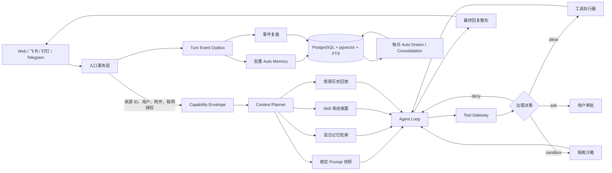

# Hermes Agent 与 QwenPaw 融合研究

- 调研日期：2026-07-21
- 面向项目：DigitalMate
- Hermes Agent 源码快照：[`477c08b`](https://github.com/NousResearch/hermes-agent/tree/477c08b44766ace8b890faa72bf82ecbcf2b3ba8)
- QwenPaw 源码快照：[`e650f49`](https://github.com/agentscope-ai/QwenPaw/tree/e650f49bd7677870c007fa0737e66e4e0de09396)
- 许可证：Hermes Agent 为 MIT；QwenPaw 为 Apache-2.0。若未来移植源码而不只是借鉴机制，必须保留对应版权与许可证声明。
- 结论性质：基于官方文档、固定提交源码与 DigitalMate 当前实现的架构研究；不是跨项目实测 Benchmark

## 1. 结论先行

对 DigitalMate 而言，最优方案不是把 Hermes Agent 和 QwenPaw 两套运行时串联，也不是选其中一个替换现有系统，而是采用「机制融合、单一主脑」：

- DigitalMate 继续作为唯一产品与控制面，保留 TypeScript、PostgreSQL、统一身份、权限合同、幂等消息和真人感交互。
- 执行内核主要吸收 Hermes：原生 Tool Calling、稳定 Prompt 前缀、并行安全工具、上下文压缩、渐进式 Skill、辅助模型路由和失败恢复。
- 记忆与运行治理主要吸收 QwenPaw：工作记忆/情景记忆/语义记忆分离、Scroll 式原文回放、BM25 + 向量混合检索、Auto Memory + Auto Dream、Gate 式循环控制、统一 Console。
- 不照搬两者的危险默认值：QwenPaw 主动模式和 Mission Worker 的安全绕过不可采用；Hermes 默认关闭记忆/Skill 写入审批、宿主 Terminal 可绕过文件守卫的做法也不可采用。
- P0/P1 阶段只移植机制，不引入第二个 Python 常驻 Agent。P2 解冻后，可把 Hermes 作为隔离的任务执行器，通过受控 RPC 接入，但它不能拥有对话、记忆、主动消息或权限的最终决定权。

一句话概括：**QwenPaw 提供「Agent OS」思路，Hermes 提供高效执行引擎，DigitalMate 负责身份、边界和人味。**

## 2. 为什么不能直接把两套系统叠起来

Hermes 和 QwenPaw 都是完整 Agent 产品，不是单一组件。直接串联会同时出现：

1. 两个 ReAct/Tool Loop，增加至少一层模型调用和失败恢复。
2. 两套会话与上下文压缩，容易重复摘要、丢失 Tool Call 对齐关系。
3. 两套记忆抽取和检索，产生重复、冲突和不同步的用户画像。
4. 两套 Skill 目录、安装扫描与启用状态，用户无法判断哪一套真正生效。
5. 两套权限与审批语义，最危险的情况是外层拒绝、内层绕过。
6. Python 与 TypeScript 之间增加 IPC、序列化、部署、监控和升级成本。
7. 两个项目都在快速迭代。DigitalMate 若同时追踪二者内部 API，会承担很高的版本漂移成本。

因此，组合的单位应该是「机制与接口」，不是「两个完整进程」。

## 3. Hermes Agent 完整拆解

官方定位是会持续学习的自治 Agent。当前版本的核心是同步 `AIAgent` 循环、工具注册表、SQLite 会话、消息网关和可选沙箱。官方架构文档见 [Architecture](https://hermes-agent.nousresearch.com/docs/developer-guide/architecture) 与 [Agent Loop Internals](https://hermes-agent.nousresearch.com/docs/developer-guide/agent-loop/)。

### 3.1 强项

#### Agent 执行循环

- 内部统一使用 OpenAI 风格消息，再适配 Chat Completions、OpenAI Responses 和 Anthropic Messages。
- Tool Call 使用供应商原生结构，不依赖从整段文本里解析 JSON。
- 多个 Tool Call 可在线程池中并发执行；交互型或有冲突的工具保持串行，结果按模型原始顺序写回。
- 支持中断、Steer、Queue、模型故障转移、迭代预算和 Tool Call/Tool Result 配对修复。
- 默认最多 90 次迭代，适合自治任务，但对日常聊天过高。

#### Programmatic Tool Calling

Hermes 的 `execute_code` 允许模型生成 Python，通过 RPC 批量调用多个白名单工具。中间结果不进入模型上下文，只返回脚本最终输出，因此可以减少多轮模型往返和 Token。详见 [Code Execution](https://hermes-agent.nousresearch.com/docs/user-guide/features/code-execution/)。

它适合「3 次以上工具调用 + 循环/过滤/分支」的任务，但会扩大模型生成代码的执行面。DigitalMate 只能在 P2 沙箱中使用，不能进入当前 P0/P1 聊天链路。

#### Prompt 缓存与上下文

Hermes 把 Prompt 分为稳定、项目上下文、易变信息三层；会话内冻结 Memory Snapshot，避免每次写记忆都破坏前缀缓存。详见 [Prompt Assembly](https://hermes-agent.nousresearch.com/docs/developer-guide/prompt-assembly) 和 [Context Compression and Caching](https://hermes-agent.nousresearch.com/docs/developer-guide/context-compression-and-caching/)。

上下文管理有两层防线：

- Agent 内部约在上下文使用率 50% 时压缩。
- Gateway 约在 85% 时执行会话卫生兜底。
- 压缩前保存记忆，保留最近消息，并维持 Tool Call/Tool Result 配对。
- SQLite 保留全量会话，FTS5 支持跨会话 `session_search`。

#### 有界记忆

内置记忆分为 `MEMORY.md` 和 `USER.md`：

- 默认字符上限分别为 2200 和 1375，约合 800 + 500 Token。
- 会话开始时注入冻结快照；会话中写入立即落盘，下个会话生效。
- 写入前扫描提示注入、凭据外传和隐藏 Unicode。
- 容量不足时要求 Agent 合并、压缩或替换，不静默丢弃。
- 完整历史仍在 SQLite，可用 FTS5 找回原文。

Hermes 也支持 Honcho、Mem0、Hindsight 等外部记忆 Provider，但会增加外部依赖和数据边界，不适合直接作为 DigitalMate 的主存储。详见 [Persistent Memory](https://hermes-agent.nousresearch.com/docs/user-guide/features/memory/) 与 [Memory Providers](https://hermes-agent.nousresearch.com/docs/user-guide/features/memory-providers/)。

#### Skill 与自我改进

- Skill 兼容 agentskills.io，并采用三级渐进披露：列表、完整 `SKILL.md`、引用文件。
- Agent 可创建、修订 Skill；Curator 根据使用记录标记 stale、archive 或合并重叠 Skill。
- 后台复盘会继承主模型缓存，或路由到便宜模型并只重放摘要。
- 最新默认并非「每轮都复盘」：记忆复盘约每 10 个用户轮次触发，Skill 复盘约每 10 次工具迭代触发。默认值可在固定快照的 [`agent_init.py`](https://github.com/NousResearch/hermes-agent/blob/477c08b44766ace8b890faa72bf82ecbcf2b3ba8/agent/agent_init.py) 中核验。

详见 [Skills System](https://hermes-agent.nousresearch.com/docs/user-guide/features/skills/) 与 [Curator](https://hermes-agent.nousresearch.com/docs/user-guide/features/curator)。

#### Gateway 与任务

- 单个 Gateway 支持 20 多个消息平台、Typing Indicator、流式输出、中断/排队/Steer。
- Cron 在隔离会话中执行，并用跨进程文件锁避免同一批任务被重复领取。
- 默认 Gateway 拒绝未配对、未进白名单的用户。

详见 [Messaging Gateway](https://hermes-agent.nousresearch.com/docs/user-guide/messaging/) 和 [Scheduled Tasks](https://hermes-agent.nousresearch.com/docs/user-guide/features/cron)。

### 3.2 局限与风险

- `AIAgent` 职责很重，执行、压缩、持久化、重试和回调耦合在一个大型同步内核中。
- SQLite + 文件式记忆适合个人单机，但不适合 DigitalMate 已确定的 PostgreSQL、多入口一致性和事务幂等模型。
- 内置记忆主要是精选小文件 + FTS5 历史，不是开箱即用的高质量语义记忆。
- 记忆和 Skill 的 `write_approval` 默认是关闭的；DigitalMate 的 Skill 确认门不能采用此默认值。
- 文件守卫只保护 `write_file`/`patch`，宿主 Terminal 仍可能绕过；官方也明确它不是对恶意 Agent 的硬安全边界。详见 [Security](https://hermes-agent.nousresearch.com/docs/user-guide/security/)。
- 90 次默认迭代、丰富 Toolset 和自动 Skill 改写不适合真人聊天默认路径。

### 3.3 最值得移植的机制

1. 原生 Tool Calling 与 Provider 统一消息模型。
2. 安全工具并行执行并按原顺序回填。
3. 稳定 Prompt 前缀、会话冻结记忆快照和辅助模型路由。
4. Tool Result 卸载、上下文压缩与跨会话原文检索。
5. Skill 渐进披露、使用记录和 Curator。
6. 中断、Queue、Steer 和 Typing Indicator。
7. P2 之后的沙箱化 Programmatic Tool Calling。

## 4. QwenPaw 完整拆解

QwenPaw 当前把自己定义为「Agent OS」：AgentScope 提供 Agent Loop、事件流和工具层，QwenPaw 负责工作区、运行时组装、渠道、记忆、Skills、治理和 Console。官方入口见 [项目介绍](https://qwenpaw.agentscope.io/docs/intro/) 与 [GitHub](https://github.com/agentscope-ai/QwenPaw)。

### 4.1 强项

#### 工作区与运行时组装

- 每个 Agent 有独立工作区、配置、记忆、Skill、会话和渠道。
- 每个请求只组装一次 Agent，把模型、工具、Prompt、记忆、上下文策略和治理包装在运行时外部。
- Hook、Mode、Plugin 和 Gate 都有清晰扩展点。
- Console 覆盖模型、渠道、记忆、Skills、MCP、安全、审批、定时任务、Token 用量和备份。

这套「每请求组装、策略外置」比把所有逻辑塞进 Agent Loop 更适合长期维护。

#### 三类记忆与 Scroll 上下文

QwenPaw 把三类东西明确分开：

| 类型 | 内容 | 取回方式 |
|---|---|---|
| 工作记忆 | 当前窗口、近期轮次、活动工具链 | 直接进入模型上下文 |
| 情景记忆 | 跨会话逐字历史、工具调用与结果 | `recall_history` 精确回放 |
| 语义记忆 | 提炼后的事实、偏好、方法和知识 | `memory_search` 混合检索 |

当前 Context 文档声明新配置默认使用 Scroll：先把每一轮写进 SQLite，再驱逐中间历史并留下索引；Agent 可按区间、会话、Tool Call ID 回放原文。活动轮次和最新 Tool Result 会受到保护。固定快照文档见 [`context.zh.md`](https://github.com/agentscope-ai/QwenPaw/blob/e650f49bd7677870c007fa0737e66e4e0de09396/website/public/docs/context.zh.md)。

注意：同一快照中的 Architecture 文档仍写着总结式压缩默认、Scroll 可选，和 Context 文档存在版本差异。这说明项目正在快速演进，移植时必须固定提交并以代码为准。

#### ReMe、Auto Memory 与 Auto Dream

- Auto Memory 默认每 5 个用户轮次把有价值事实写成按日 Markdown。
- Auto Dream 默认每天 23:00 扫描近期记忆，生成 `personal`、`procedure`、`wiki` 三类 Digest，并提取兴趣主题。
- 记忆保留来源会话链接，支持追溯。
- 搜索使用 BM25 + 可选向量检索，默认按 0.7/0.3 的权重做 RRF 排名融合。
- Embedding 支持缓存、批处理和多个后端。

详见 [Long-term Memory](https://qwenpaw.agentscope.io/docs/memory/) 与固定快照的 [`memory-evolving-and-proactive.zh.md`](https://github.com/agentscope-ai/QwenPaw/blob/e650f49bd7677870c007fa0737e66e4e0de09396/website/public/docs/memory-evolving-and-proactive.zh.md)。

#### Gate 式 Loop Engineering

QwenPaw 把终止/继续逻辑拆成可组合 Gate：

- 迭代上限。
- 重复工具调用检测。
- 完成度检查。
- Goal/Mission 专属 Gate。
- 插件自定义 Gate。

每个 Gate 返回 STOP、CONTINUE 或无意见，按优先级决定本轮行为。详见固定快照的 [`loop-engineering.zh.md`](https://github.com/agentscope-ai/QwenPaw/blob/e650f49bd7677870c007fa0737e66e4e0de09396/website/public/docs/loop-engineering.zh.md)。

#### 治理、Skill 与渠道

- 工具调用在执行前经过访问策略、Tool Guard、File Guard 和 Sandbox。
- 风险结果可映射为 allow、deny、ask、sandbox。
- Skill 安装前静态扫描；工作区 Skill 与共享 Skill Pool 分离。
- 渠道适配统一处理访问控制、防抖、附件和流式消息卡片。
- Cron 支持最大并发、超时、Misfire Grace、独立会话和指定投递目标。

详见固定快照的 [Security](https://github.com/agentscope-ai/QwenPaw/blob/e650f49bd7677870c007fa0737e66e4e0de09396/website/public/docs/security.zh.md)、[Skills](https://qwenpaw.agentscope.io/docs/skills/)、[Channels](https://qwenpaw.agentscope.io/docs/channels/) 与 [Console](https://qwenpaw.agentscope.io/docs/console/)。

### 4.2 局限与风险

- 当前源码版本为 `2.0.1b1`，且官方文档之间已经出现默认值不一致，版本漂移风险高。
- 完整安装依赖 AgentScope、ReMe、多个 IM SDK、Playwright、Transformers、ONNX Runtime 等，作为 DigitalMate 内嵌依赖过重。
- Auto Dream 默认使用当前 Active Model，不天然等于低成本后台模型；需要额外路由。
- Auto Memory/Search/Proactive 仍标注 Beta。
- `/proactive` 会读取近期会话，可能截图，并明确绕过标准工具保护。它和 ReMe 生成的 Interest Topic 还是两条分离链路。
- Mission Worker/Verifier 因后台无法审批而自动绕过安全护栏。
- Security 文档说明：某些无会话上下文的高风险调用可能只记日志后继续；部分 Shell 规避检查默认关闭。
- Goal 模式主要是 Self-Audit；DigitalMate P3 已采用独立 Verifier，不能倒退为执行者自证完成。
- 多 Agent 默认强调身份和记忆隔离，而 DigitalMate 的核心卖点是跨渠道同一身份、同一记忆，不能照搬「一个渠道一个 Agent」。

### 4.3 最值得移植的机制

1. 工作记忆、情景记忆、语义记忆的明确分工。
2. Scroll：先持久化，再驱逐，按需精确回放原文。
3. BM25 + 向量 + RRF 的混合检索。
4. Auto Memory + Auto Dream 的两级记忆沉淀。
5. 每请求组装 Agent、Hook/Mode/Gate 外置。
6. allow/deny/ask/sandbox 的统一治理决策。
7. Console 信息架构、审批收件箱、Cron 可视化和渠道流式适配。

## 5. 两者对比

| 维度 | Hermes Agent | QwenPaw | DigitalMate 应取 |
|---|---|---|---|
| 核心定位 | 自我改进的通用执行 Agent | 多 Agent 操作系统与个人助手平台 | 单身份数字伙伴 |
| Agent Loop | 自研、功能完整、偏同步 | AgentScope ReAct + 可插拔 Gate | TypeScript 自研 Loop + Gate |
| Tool Calling | 原生、并行、PTC | 原生、治理包装、Sandbox | Hermes 执行 + Qwen 治理 |
| Prompt 性能 | 稳定前缀、缓存意识强 | 每请求组装、上下文策略清晰 | 两者结合 |
| 短期上下文 | 双阈值摘要压缩 | Scroll 原文保留与回放 | Scroll 为主，摘要为索引 |
| 长期记忆 | 小而精选 + FTS5 历史 | Daily/Digest + 混合检索 | Qwen 分层 + Hermes 有界常驻 |
| Skill | 三级披露、自生成、自修订、Curator | Skill Pool、市场、扫描、频道范围 | Hermes 披露 + Qwen 管理面 + DigitalMate 确认门 |
| 后台学习 | 约每 10 轮/迭代复盘 | 每 5 轮 Auto Memory + 每日 Dream | 事件门控 + 批量轻复盘 + 每日 Dream |
| 多渠道 | 适配器多、Busy Input 体验成熟 | 国内 IM 和 Console 更强 | 借鉴适配层，不替换现有渠道 |
| 主动性 | Cron/自动化强 | Heartbeat/Proactive 强 | 只允许持久化授权合同 |
| 安全 | 审批、容器、路径保护 | 治理、Guard、Sandbox、Skill Scan | 采用结构，拒绝绕过默认 |
| 数据底座 | SQLite + 文件 | Workspace 文件 + SQLite/ReMe | PostgreSQL + pgvector 为唯一真相源 |
| 最适合贡献 | 高性能执行内核 | 控制面、记忆与管理体验 | 由 DigitalMate 统一收敛 |

## 6. DigitalMate 当前状态与主要差距

当前实现已经不是纯占位：主对话已使用原生 Tool Calling，记忆查询也已包含 pgvector 语义候选与词法候选。但离目标仍有明显差距。

### 6.1 已有基础

- OpenAI 兼容与 Anthropic 两套流式适配。
- 原生 Tool Call 消息结构和最多 4 轮工具循环。
- PostgreSQL + pgvector 记忆表、向量候选与词法候选融合。
- 主模型/轻量模型两级路由。
- 附件上下文禁工具、联网硬门控、同源消息幂等。
- 每轮轻复盘、每日反思、Skill 草稿与修订审批。
- P3 目标合同、证据账本和独立 Verifier。

### 6.2 性能与体验瓶颈

1. `runAgent` 先收集完整模型流，再一次性 `yield`，普通对话并未真正做到 Token 到达即显示。
2. 同一批 Tool Call 当前逐个串行执行，独立只读工具无法并发。
3. 普通每轮会触发一次轻量复盘；后台还会对每条用户消息单独做记忆抽取，平均可达到每个用户轮次 2 次辅助模型调用。
4. 记忆融合是原始相似度 + 最近 80 条词法打分，不是 BM25 + RRF；没有真正全文索引。
5. 未配置 Embedding 时退回 Hash 伪向量，会让「语义检索已启用」产生假象。
6. 会话压缩按消息数量触发，并把截断文本拼接为模板摘要，不按真实 Token，也不能精确回放已压缩片段。
7. 自动匹配 Skill 会直接把多个 Skill 正文放进 Prompt，缺少索引 → 单 Skill 全文的渐进披露。
8. Prompt 每轮重建并混入变化的记忆、Skill 和行为修正，尚未显式设计供应商缓存边界。
9. 当前只有 `main`/`light` 两类路由，压缩、抽取、验证、标题和群聊判断无法单独调优。
10. Tool Guard 以各工具内部判断为主，尚未形成统一的 Capability Envelope 与 allow/deny/ask/sandbox 决策层。

## 7. 三种组合方案

评分为架构估算，满分 5 分；不是运行 Benchmark。

| 方案 | 性能/成本 | 用户体验 | 安全 | 与现有栈适配 | 维护性 | 结论 |
|---|---:|---:|---:|---:|---:|---|
| A. Hermes 做主内核，接 QwenPaw 的 ReMe/Console | 3.5 | 3.6 | 3.3 | 2.0 | 2.5 | 功能快，但 Python 化和双数据源代价高 |
| B. QwenPaw 做主平台，接 Hermes Tool/Skill | 3.2 | 3.8 | 3.1 | 1.8 | 2.4 | Console 强，但会丢失 DigitalMate 核心架构与产品红线 |
| C. DigitalMate 单主脑，选择性移植机制 | 4.7 | 4.8 | 4.8 | 4.9 | 4.4 | 推荐 |

### 7.1 不选 A 的原因

Hermes 更像一个强执行 Agent，而不是适合承载 DigitalMate 产品规则的事务控制面。其 SQLite、文件记忆、Gateway Session 和默认自动写入机制，会与 PostgreSQL、统一身份、同源幂等和审批门发生冲突。

### 7.2 不选 B 的原因

QwenPaw 完整平台和 AgentScope/ReMe 绑定较深。直接迁移意味着 Next.js/Node 常驻服务、已有多渠道、目标模式、附件合同和数据库模型都要重写；其主动/后台安全绕过也与 DigitalMate 红线冲突。

### 7.3 推荐 C 的原因

- 只有一个 Agent Loop、一份消息历史、一份权限真相和一份长期记忆。
- 可以逐步移植，每一项都有独立 A/B 和回滚开关。
- 保留 DigitalMate 已有的强项：真人感、跨渠道同一身份、显式联网、附件隔离和单源单消息。
- P2 解冻后仍可复用 Hermes 执行能力，不阻塞当前 P0/P1 核心换真。

## 8. 推荐目标架构



### 8.1 唯一真相源

- PostgreSQL 保存消息、原始历史、记忆、Skill、授权、任务和审计。
- Markdown 只作为 Skill 导入/导出格式，不作为运行时双写真相源。
- 不引入 Hermes SQLite 或 QwenPaw Workspace Memory 作为主存储。
- 所有后台处理从 Outbox/Job 表领取，并以来源 ID 幂等提交。

### 8.2 Capability Envelope

入口在执行前生成不可由模型修改的结构化能力合同：

```text
request_id
source_type / source_id
user_id / conversation_id / channel
attachment_present
web_search: denied | turn_explicit | task_contract
allowed_toolsets
side_effect_scope
approval_policy
deadline / token_budget / tool_budget
```

Tool Gateway 每次调用都校验该 Envelope。Prompt 里的「允许联网」只用于帮助模型正确规划，不是授权依据。

### 8.3 Context Planner

把每轮上下文控制在 5 层：

1. 稳定层：Persona、产品红线、回复风格、核心工具规范。
2. 会话快照层：会话开始时冻结的用户画像与 Agent 自我记忆。
3. 当前层：最近消息、当前用户输入、附件。
4. 召回层：Top-K 情景/语义记忆和必要的历史原文。
5. 能力层：本轮授权、显式 Skill、允许的工具。

稳定层和会话快照层尽量保持字节稳定，以获得 Prompt Cache；变化信息放在当前用户消息附近。

## 9. 性能最优设计

### 9.1 模型调用预算

| 场景 | 主模型调用 | 辅助模型同步调用 | 后台调用 |
|---|---:|---:|---:|
| 普通闲聊/问答 | 1 | 0 | 进入批量队列 |
| 明确搜索 | 1 次规划 + 1 次最终回答 | 0 | 批量队列 |
| 单工具简单任务 | 1–2 | 0 | 批量队列 |
| 多只读工具 | 1 次规划 + 并行工具 + 1 次最终回答 | 0 | 批量队列 |
| 附件理解 | 1 | 0 | 不执行工具/Skill；记忆写入继续遵守附件安全策略 |

关键变化：取消「每个用户轮次固定 1 次轻复盘 + 每条消息固定 1 次记忆抽取」的双调用。

建议改为：

- 每轮只写 Turn Event，不调用后台模型。
- 明确纠正、失败、不满、首次复杂成功等事件立即进入高优先队列。
- 普通轮次累计到 5 个，合并成一次 Auto Memory/Review 调用。
- 每日 Dream 只处理自上次成功运行后的变化，不重复扫描全量历史。
- Skill 修订按使用阈值和事件触发，不按每轮触发。

这样辅助模型平均成本可从接近 2 次/用户轮次降到约 0.2–0.4 次/用户轮次，同时不增加前台延迟。

### 9.2 真正流式输出

当前完整缓存模型回复后再发送，损失了流式体验。推荐分两条路径：

#### 无工具路径

- 入站授权判断确定本轮不需要工具。
- 模型 Token 到达即推送。
- 只做增量的 Think/System 标签清洗，不等待完整回复。

#### 工具路径

- 立即发送 `accepted`，渠道显示 Typing Indicator；不展示工具名、参数或推理。
- 第一轮模型只负责原生 Tool Call，结果不对用户可见。
- 只读、无冲突工具并发执行；写操作按资源键串行。
- 最后一轮移除工具，只做回答合成，并把 Token 实时推给用户。
- 搜索证据使用内部 Source ID，最终回答只引用被选中的少量来源，原始结果永不进入 `messages`。

### 9.3 工具调度

每个工具注册以下元数据：

```text
risk: read | write | external_side_effect
parallel_safe: boolean
resource_key(args): string
idempotent: boolean
timeout_ms
max_output_bytes
requires_capability
```

调度规则：

- 全部 `read + parallel_safe`：并发执行。
- 写同一 `resource_key`：串行。
- 外部副作用：必须带幂等键和授权来源。
- 任一任务触发审批：只暂停该调用，不让无关只读调用丢失。
- Tool Result 超限：完整内容写内部 Artifact，模型只接收摘要和受控 Recall 指针。

### 9.4 检索与上下文

- 第一阶段使用 PostgreSQL `tsvector` 全文检索 + pgvector；若标注集证明排序质量不足，再引入独立 BM25 实现，不能把 `tsvector` 分数直接当成 BM25。
- 用 RRF 融合排名，不直接相加不同量纲的向量相似度和词法分数。
- 候选池建议为最终 Top-K 的 3 倍，最终默认注入 3–5 条。
- Query Embedding 使用真实模型；未配置时明确降级为全文检索，不生成 Hash 伪向量。
- Embedding 批量写入并缓存内容 Hash，避免相同文本重复请求。
- 最近消息常驻；旧消息先持久化，再按 Token 驱逐，并留下可回放索引。
- 长 Tool Result 按 Artifact 存储，Prompt 只保留摘要与精确指针。

### 9.5 Prompt Cache

- Persona、红线、基础 Tool Schema 固定顺序和稳定序列化。
- 用户画像在会话开始冻结；中途写入下次会话生效，紧急修正用短暂 Ephemeral Override。
- Tool Schema 不要每轮随机排序。
- 默认无联网时不暴露 `web_search`；显式授权轮次允许一次缓存失配，换取更少误调用和更强权限隔离。
- 动态 Skill 只加载命中项；显式选择可直接加载，自动匹配最多加载 1 个高置信 Skill。

## 10. 用户体验最佳设计

### 10.1 两种时间感

DigitalMate 必须同时有两套节奏：

- 对话节奏：快、自然、低打扰。普通聊天直接流式，不显示 Agent 工具轨迹。
- 任务节奏：可等待、可中断、可恢复。只显示「已受理、需要确认、完成/失败」等用户关心的状态。

不要把 Hermes/QwenPaw 面向开发者的 Tool Progress、Thinking、Trace 原样搬到聊天窗口；它们只进入后台。

### 10.2 忙时输入

吸收 Hermes 的 3 种 Busy Input，但做成非技术化 UI：

- 打断当前回复：用户新消息替换当前任务。
- 排在后面：当前完成后处理。
- 补充要求：注入当前任务的下一个安全边界。

默认策略：日常聊天用「打断」，长任务用「补充」，存在外部副作用时在提交点前才接受补充。

### 10.3 跨渠道同一身份

- 渠道只负责协议适配，不创建不同人格或不同长期记忆。
- 同一用户跨渠道共享画像与语义记忆。
- 会话历史按 Conversation 隔离，必要时显式跨会话召回，避免所有消息混成一条无限长上下文。
- 渠道适配 Typing Indicator、消息长度、Markdown、卡片和分段，但最终语气由同一个 Persona 决定。

### 10.4 主动消息

只采用 QwenPaw 的调度与 Inbox 体验，不采用它的 Proactive 推断权限：

- Heartbeat 默认关闭。
- 不能读取普通记忆自动派生联网任务。
- 不能因为「上次聊过」就向 Last Channel 主动投递。
- 每个主动任务必须有持久化授权类型、来源 ID、范围、频率、目标渠道和失效条件。
- 后台审批超时一律 Fail Closed，不得因没有会话上下文而绕过。

## 11. 记忆与自进化的最终组合

### 11.1 四层数据

| 层 | 存储 | 是否常驻 Prompt | 写入方式 |
|---|---|---|---|
| 原始会话档案 | `messages` + 附件引用 | 否 | 同步事务写入 |
| 情景记忆 | 可检索的历史 Chunk/事件 | 否 | 自动索引，不改写原文 |
| 语义记忆 | 事实、偏好、事件、方法 | Top-K | 批量 Auto Memory |
| 用户画像/Agent 自我记忆 | 有界精选条目 | 会话快照 | 高置信更新或审批 |

### 11.2 写入策略

- 用户明确说「记住」：立即生成候选；敏感扫描后写入或按设置待审。
- 明确纠正/强烈偏好：高优先级后台抽取。
- 普通对话：每 5 个用户轮次批量抽取。
- 事实保留来源 Message ID、置信度、有效期和冲突状态。
- 新事实与旧事实冲突时不静默覆盖；标为 superseded 或进入待确认。
- 每日 Dream 只做合并、提炼、纠错和过期，不直接触发联网或主动消息。

### 11.3 检索策略

1. 先查询有界画像，不需要 Embedding。
2. 对当前消息执行语义 + 全文混合检索。
3. 按用户、项目、会话、时间和 Memory Kind 过滤。
4. 使用 RRF 融合并做 MMR/去重。
5. 低分结果不注入；宁可少记，不要硬凑。
6. 用户明确问「之前我们聊过什么」时，允许只读 `recall_history` 精确回放。

## 12. Skill 的最终组合

- 沿用 DigitalMate 的显式 `/` 卡片作为首选路径。
- 自动匹配只返回索引候选，必须高置信且候选差距足够大才加载全文。
- 采用 Hermes 的三级披露：索引 → `SKILL.md` → references/scripts/templates。
- 采用 QwenPaw 的共享池、来源追踪和安装扫描，但运行时状态仍存 PostgreSQL。
- Agent 新建/修订 Skill 一律产生 Patch/Diff 草稿；除 `/create-skill` 对话内确认和安全导入例外，不直接启用。
- Curator 每周或累计使用阈值触发，负责去重、标记 stale 和建议归档；归档可恢复，不自动删除。
- P1 Skill 只允许对话/流程知识；可执行脚本等到 P2 沙箱解冻。

## 13. Loop 与目标模式

日常 Chat、工具任务和 Goal 必须使用不同预算：

| 模式 | 默认迭代上限 | 完成判定 | 工具范围 |
|---|---:|---|---|
| 普通聊天 | 1 | 产生最终文本 | 无工具 |
| 简单工具任务 | 4 | 最终回答或明确失败 | 当前 Envelope |
| 信息型 Goal | 合同规定，按 Tick 运行 | 独立 Verifier + 证据 | 合同只读工具 |
| P2 产出任务 | 后续单独设计 | 验证通过后受控提交 | 沙箱 + 提交点 |

吸收 QwenPaw 的 Doom Loop Gate：对 `tool_name + canonical_args` 做滑动窗口签名；轻度重复先提示换路径，严重重复停止。继续保留 DigitalMate 的独立 Verifier，不采用 QwenPaw Goal 的纯 Self-Audit。

## 14. 安全取舍

### 必须采用

- 入口授权合同和每次 Tool Call 的确定性校验。
- allow/deny/ask/sandbox 四态治理。
- Tool/Skill/Memory 三类内容安全扫描。
- Headless 任务审批超时 Fail Closed。
- 沙箱资源限制、网络默认关闭、凭据显式注入。
- 外部副作用幂等键、来源 ID 和审计日志。

### 明确拒绝

- QwenPaw Proactive 的 Tool Protection Bypass。
- QwenPaw Mission 后台 Worker 自动绕过审批。
- 无会话上下文时「只记日志后继续」。
- Hermes 宿主 Terminal 作为安全边界。
- Hermes 记忆/Skill 默认自由写入。
- 从附件文字、历史搜索或普通记忆推断联网授权。
- 让第二个 Agent 运行时直接写 DigitalMate 的 `messages`、`memories` 或主动消息表。

## 15. 模型路由建议

| 任务 | 模型策略 | 原因 |
|---|---|---|
| 用户可见主回复 | 能力优先主模型 | 人设、复杂理解和自然表达最重要 |
| Tool Planning | 同一主模型 | 避免额外 Router 调用和意图漂移 |
| 标题生成 | 最快低成本模型 | 低风险、短输出 |
| Memory Extraction | 低成本结构化模型 | 可批量、可异步 |
| Dream/Consolidation | 低成本模型，必要时升级 | 主要是归并和冲突识别 |
| Compression | 快模型、低推理强度 | 不值得消耗主模型深度推理 |
| 群聊插话判断 | 规则/Embedding 预筛 + 小模型 | 高频，需要低成本和低误触 |
| Goal Verifier | 与执行模型解耦 | 避免自证完成 |
| Embedding | 真实 Embedding，本地或受控服务 | 不能再使用 Hash 伪向量 |

路由应按 Task Slot 配置，而不是只保留 `main`/`light` 两个硬编码槽位。

## 16. 落地顺序

### 第一阶段：前台性能与真实性（P0/P1，不碰 P2）

1. 建立端到端基线指标和固定回放集。
2. 普通无工具对话改为真正流式。
3. Tool Call 批次增加安全并发调度。
4. Prompt 划分稳定/易变层并接入缓存指标。
5. Embedding 配置缺失时取消 Hash 伪向量，明确全文降级。
6. PostgreSQL 全文检索 + pgvector + RRF。

### 第二阶段：上下文与记忆换真

1. 增加基于真实 Token 的 Context Planner。
2. 原始历史 Chunk、驱逐索引和只读 Recall。
3. 将每轮 Review + 每消息 Extraction 合并为事件门控批处理。
4. Auto Dream 增量化，保留来源、冲突和回滚信息。
5. 常驻画像使用会话冻结快照和容量预算。

### 第三阶段：Skill 与治理

1. Skill 索引/全文/引用三级披露。
2. 统一 Tool Gateway 和 Capability Envelope。
3. allow/deny/ask/sandbox 决策与 Inbox 审批。
4. Curator 去重、stale、archive 和修订 Diff。
5. Busy Input、Typing、渠道流式卡片统一体验。

### 第四阶段：P2 解冻后

1. 评估 Hermes 作为隔离 Task Worker，而不是主 Agent。
2. Programmatic Tool Calling 只运行在无宿主凭据的沙箱。
3. RPC 工具白名单、输出上限、网络合同和资源预算。
4. 候选产物先验证，用户/控制面确认后再提交。

## 17. 验收指标

下面是建议目标，先测基线再确定最终阈值。

### 性能

| 指标 | 建议目标 |
|---|---:|
| `accepted` 事件 P95 | ≤ 200 ms |
| 无工具对话首个可见 Token P50 / P95 | ≤ 1.2 s / 2.5 s（不含极慢供应商异常） |
| 本地记忆检索 P95 | ≤ 120 ms |
| 同批独立只读工具总耗时 | 接近最慢单工具，而非耗时求和 |
| 普通轮次同步辅助模型调用 | 0 |
| 后台辅助调用均摊 | ≤ 0.4 次/用户轮次 |
| Prompt Cache 命中率 | 按供应商单独观测，稳定会话持续提升 |

### 质量

| 指标 | 建议目标 |
|---|---:|
| 记忆 Recall@5 | ≥ 90%（固定标注集） |
| 错误记忆写入率 | ≤ 1% |
| 自动 Skill 误匹配率 | ≤ 0.5% |
| Tool Task 成功率 | 按任务类型建立基线，持续提升 |
| Goal 虚假完成率 | 0 |

### 安全与可靠性

| 指标 | 目标 |
|---|---:|
| 未授权搜索调用 | 0 |
| 附件上下文工具调用 | 0 |
| 无来源后台联网任务 | 0 |
| 同一来源重复可见消息 | 0 |
| Headless 审批绕过 | 0 |
| 搜索原始结果直接进入消息 | 0 |

### 体验

- 普通聊天不出现 Tool 名、参数、原始结果或内部推理。
- 长任务 1 秒内出现 Typing/受理反馈，不用模板化技术提示轰炸用户。
- 用户打断后旧回复不继续混入新会话。
- 跨渠道人设、画像和表达风格一致。
- 主动消息可解释来源、可关闭、不会重复。

## 18. 需要修正的既有认知

1. 「Hermes 每轮做后台复盘」不准确。最新版默认是约每 10 个用户轮次/工具迭代触发；DigitalMate 当前才是真正每轮 Review。
2. 「QwenPaw 默认一定是 Scroll」需要固定版本说明；当前 Context 文档如此描述，但 Architecture 文档仍有旧表述。
3. 「混合检索已经完成」需要区分：DigitalMate 有向量 + 词法候选，但仍缺真正全文索引、RRF 和可靠 Embedding 降级。
4. 「安全扫描等于安全边界」不成立。Hermes 和 QwenPaw 都明确存在需要沙箱或 Fail Closed 才能兜住的路径。
5. 「多 Agent 越多性能越好」不成立。日常聊天应保持单主脑；只有可独立、可并行、能聚合验证的任务才值得委派。

## 19. 最终决策建议

建议正式采纳以下架构原则：

> DigitalMate 不内嵌 Hermes Agent 或 QwenPaw 作为第二主脑。DigitalMate 保持单一 TypeScript Harness 与 PostgreSQL 真相源；吸收 Hermes 的执行效率机制、QwenPaw 的记忆与治理机制，并用 DigitalMate 的显式授权、幂等事务和真人感体验覆盖二者默认行为。

落地优先级不是「继续增加能力」，而是：

1. 真流式。
2. 真检索。
3. 真 Tool Calling 调度。
4. 真上下文回放。
5. 低成本、可追溯的自进化。
6. 最后才是沙箱执行与工具自扩展。

这条路线同时满足当前 PRD 的 P0/P1 主线和 P2 冻结约束，也保留了未来把 Hermes 作为专业执行 Worker 的空间。

## 20. 主要资料

### Hermes Agent

- [官方文档首页](https://hermes-agent.nousresearch.com/docs/)
- [架构](https://hermes-agent.nousresearch.com/docs/developer-guide/architecture)
- [Agent Loop](https://hermes-agent.nousresearch.com/docs/developer-guide/agent-loop/)
- [Prompt Assembly](https://hermes-agent.nousresearch.com/docs/developer-guide/prompt-assembly)
- [Context Compression and Caching](https://hermes-agent.nousresearch.com/docs/developer-guide/context-compression-and-caching/)
- [Memory](https://hermes-agent.nousresearch.com/docs/user-guide/features/memory/)
- [Skills](https://hermes-agent.nousresearch.com/docs/user-guide/features/skills/)
- [Code Execution](https://hermes-agent.nousresearch.com/docs/user-guide/features/code-execution/)
- [Security](https://hermes-agent.nousresearch.com/docs/user-guide/security/)
- [Messaging Gateway](https://hermes-agent.nousresearch.com/docs/user-guide/messaging/)

### QwenPaw

- [官方仓库](https://github.com/agentscope-ai/QwenPaw)
- [项目介绍](https://qwenpaw.agentscope.io/docs/intro/)
- [Memory](https://qwenpaw.agentscope.io/docs/memory/)
- [Console](https://qwenpaw.agentscope.io/docs/console/)
- [Security 固定快照](https://github.com/agentscope-ai/QwenPaw/blob/e650f49bd7677870c007fa0737e66e4e0de09396/website/public/docs/security.zh.md)
- [Skills](https://qwenpaw.agentscope.io/docs/skills/)
- [Channels](https://qwenpaw.agentscope.io/docs/channels/)
- [Context 固定快照](https://github.com/agentscope-ai/QwenPaw/blob/e650f49bd7677870c007fa0737e66e4e0de09396/website/public/docs/context.zh.md)
- [Memory Evolving 固定快照](https://github.com/agentscope-ai/QwenPaw/blob/e650f49bd7677870c007fa0737e66e4e0de09396/website/public/docs/memory-evolving-and-proactive.zh.md)
- [Loop Engineering 固定快照](https://github.com/agentscope-ai/QwenPaw/blob/e650f49bd7677870c007fa0737e66e4e0de09396/website/public/docs/loop-engineering.zh.md)
