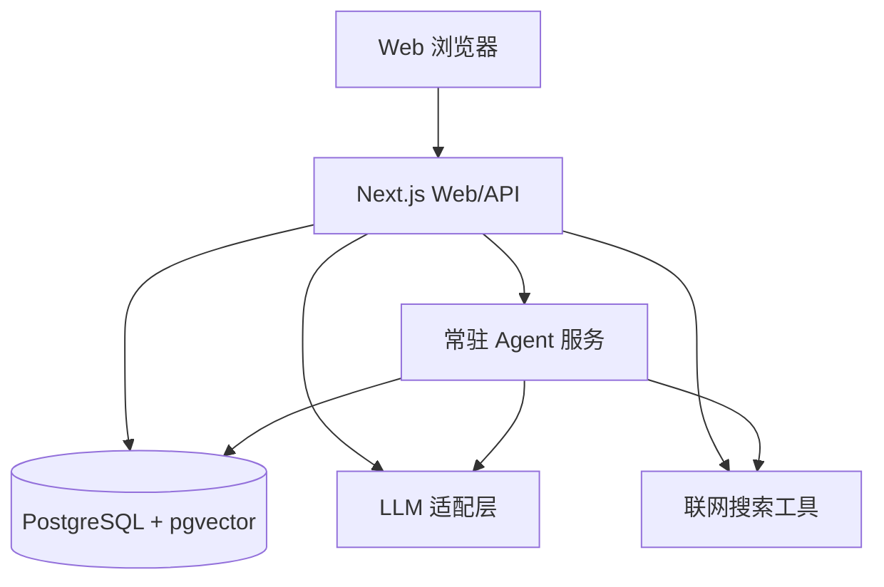

# DigitalMate P0 MVP 设计规格

## 目标

按 `docs/prd.md` 的 P0 范围交付一个可自部署的最小闭环：用户可以通过 Web 与 DigitalMate 对话，回复流式输出并保持人设；系统能保存会话、抽取和召回长期记忆、调用联网搜索、创建基础提醒，并提供最简管理后台查看和管理关键数据。

本规格只覆盖 P0，不实现 P1 的多渠道、群聊插话、自我反思、Skills 沉淀，也不实现 P2 的代码沙箱、表格处理、PPT 生成和移动端 App。数据表保留 `user_id`、`channel`、状态字段和 JSON 配置字段，方便后续阶段扩展。

## 范围映射

| PRD 编号 | P0 交付方式 |
|---|---|
| P0-1 Web Chatbot | Next.js App Router 实现聊天页，支持桌面和手机浏览器；使用单用户口令登录 |
| P0-2 流式对话 | `/api/chat` 返回 SSE 文本流；客户端逐段显示回复 |
| P0-3 长期记忆 | 对话后异步抽取记忆并入库；对话前按关键词和时间召回；后台可查看、删除 |
| P0-4 联网搜索 | Agent Harness 暴露 `web_search` 工具；工具结果只进入最终回答，不暴露调用过程 |
| P0-5 稳定人设 | 默认人设写入配置表，后台可编辑；系统提示由配置生成 |
| P0-6 拟人节奏 | Web 端使用流式输出和分段气泡；长回复按自然段拆分并淡入 |
| P0-7 基础主动消息 | 支持从对话中识别提醒意图并入库；常驻 Agent 进程轮询到期任务并写入 Web 会话 |
| P0-8 管理后台 | 后台查看会话日志、工具调用、记忆条目、提醒任务和人设/主动性配置 |

## 方案选择

采用「P0 端到端 MVP」方案：

- Next.js 负责 Web UI、登录、API 路由和后台页面。
- 独立 Node Agent 服务负责到期提醒、异步记忆抽取和后续 P1/P2 的常驻任务入口。
- 共享 TypeScript 包保存类型、配置、LLM 适配接口和 Agent Harness 核心逻辑。
- PostgreSQL 是唯一持久化存储，启用 pgvector 扩展，但 P0 的召回先使用关键词和时间权重，向量列保留为后续增强入口。

这个方案比纯前端原型更接近 M1 验收，也避免把 P1/P2 的复杂能力提前塞进 MVP。

## 系统架构

Next.js 和 Agent 服务共享同一个 Agent Harness。Web 对话请求在 Next.js API 中即时执行并流式返回；提醒和记忆抽取在 Agent 服务中异步处理。所有服务读取同一套环境变量和数据库连接。

## 关键模块

### Web 应用

- `src/app/(chat)/page.tsx`：聊天主界面，移动端单列，桌面端左侧会话列表 + 中间聊天列。
- `src/app/admin/*`：管理后台，包含会话、记忆、工具日志、提醒、设置 5 个页面。
- `src/components/chat/*`：聊天气泡、输入栏、打字中指示、会话列表。
- `src/components/admin/*`：后台表格、卡片、删除确认、设置表单。
- `src/app/api/chat/route.ts`：接收用户消息，写入数据库，调用 Agent Harness 并返回 SSE。
- `src/app/api/messages/route.ts`：客户端轮询新消息，用于提醒到期后的主动消息展示。
- `src/app/api/admin/*`：后台查询、删除、更新配置接口。

### Agent Harness

- `src/server/agent/run-agent.ts`：循环执行入口。构造系统提示、召回记忆、调用模型、执行工具，最终只返回用户可见文本。
- `src/server/agent/tools/web-search.ts`：联网搜索工具。记录查询、结果摘要和错误，不把内部细节暴露给用户。
- `src/server/agent/memory.ts`：召回、抽取、去重和写入记忆。
- `src/server/agent/reminders.ts`：识别提醒意图、创建任务、生成到期提醒消息。
- `src/server/agent/persona.ts`：从配置生成稳定人设提示和拟人节奏参数。
- `src/server/llm/*`：统一 LLM 适配层，支持 KIE.AI 的 Claude Messages API 和 Gemini OpenAI 兼容接口。

### 常驻 Agent 服务

- `src/agent-service/index.ts`：启动循环任务。
- 每 30 秒检查到期提醒，写入对应会话。
- 每 15 秒处理待抽取记忆的消息批次。
- 进程无 Web 入口；部署时由 Docker Compose 单独启动并自动重启。

### 数据层

核心表：

- `users`：当前只有一个用户，但所有业务数据关联 `user_id`。
- `conversations`：会话，含 `channel`，P0 固定为 `web`。
- `messages`：用户和助手消息，含 `visible_to_user`，内部工具过程不写入对话输出。
- `memory_entries`：长期记忆，含 `kind`、`content`、`confidence`、`source_message_id`、`expires_at`、`embedding`。
- `tool_call_logs`：工具调用审计，含工具名、输入摘要、输出摘要、耗时、状态。
- `proactive_tasks`：提醒和跟进任务，含触发时间、状态、频率控制字段。
- `settings`：人设、模型路由、主动性参数和拟人节奏配置。

所有删除操作使用软删除或状态字段，后台删除记忆时标记 `deleted_at`，后续召回排除。

## 数据流

### 对话流

1. 客户端提交用户消息。
2. API 校验登录态，获取默认用户和会话。
3. 写入用户消息。
4. 召回最近上下文和相关记忆。
5. 运行 Agent Harness。
6. Harness 可调用 `web_search`，工具调用只写入 `tool_call_logs`。
7. API 将最终回复按 SSE 流式传给客户端。
8. 回复完成后写入助手消息。
9. 将用户消息和助手消息加入记忆抽取队列。
10. 识别提醒意图，命中则创建 `proactive_tasks`。

### 记忆流

1. Agent 服务读取未处理的消息批次。
2. 使用轻量模型抽取结构化事实，失败时使用规则提取作为降级。
3. 过滤证件号、银行卡、密钥等敏感信息。
4. 对相似内容做文本去重。
5. 写入 `memory_entries`，默认 `kind` 为 `episodic` 或 `profile`。

### 提醒流

1. 对话中出现明确提醒意图时创建任务。
2. Agent 服务轮询 `scheduled_at <= now()` 且状态为 `pending` 的任务。
3. 检查静默时段和每日主动消息上限。
4. 写入一条助手消息，并将任务改为 `sent`。
5. Web 客户端轮询到新消息后展示。

## 登录与安全

P0 使用单用户口令登录。环境变量 `APP_PASSWORD` 存放明文口令，服务端使用 `scrypt` 派生比较值，登录成功后写入 httpOnly Cookie。若未配置 `APP_PASSWORD`，本地开发允许进入，但生产启动会打印明显警告。

后台接口和聊天接口都必须校验登录态。不要只依赖路由拦截；API 内部也要重复校验。

## 错误处理

- LLM 不可用：返回自然语言降级回复，提示暂时无法联网或调用模型，并记录错误日志。
- 搜索失败：回答中说明「我这边刚才没查到可靠结果」，不暴露异常栈。
- 数据库不可用：API 返回 503，UI 展示温和错误态。
- 记忆抽取失败：不影响对话主流程，记录日志后下次继续处理。
- 提醒解析不确定：不创建任务，正常对话回答中可以追问具体时间。

## UI 设计

严格遵守 `DESIGN.md`：

- 默认浅色暖白背景，聊天列最大宽度 720px。
- DigitalMate 气泡靠左，用户气泡靠右。
- 输入栏底部悬浮，发送按钮使用珊瑚橙。
- 聊天等待态使用三点打字指示，不用 spinner。
- 后台保持暖色系统，信息密度略高，但不使用冷色仪表盘风格。

## 测试策略

先覆盖纯逻辑，再覆盖 API 和 UI：

- 单元测试：提醒解析、敏感记忆过滤、记忆召回排序、分段输出、模型路由、登录校验。
- 集成测试：对话 API 写入消息并返回 SSE；工具调用写入日志；后台删除记忆后不再召回。
- 端到端测试：登录后发送消息、看到流式回复；创建提醒后轮询出现主动消息；后台查看并删除记忆。
- 构建验证：`npm run lint`、`npm run typecheck`、`npm test`、`npm run build`。

## 验收标准

P0 MVP 完成时必须满足：

- 能通过 Web 发送消息，并看到 DigitalMate 以配置人设回复。
- 回复按 SSE 流式输出，长回复在 UI 中分段呈现。
- 对话后能生成至少一条可在后台查看和删除的记忆。
- 后续对话能召回已保存的相关记忆。
- 能对实时信息问题触发联网搜索，并在后台看到工具调用日志。
- 能识别一个明确提醒并在到期后写入 Web 会话。
- 后台能查看会话、记忆、工具日志、提醒和设置。
- 所有对用户可见的回复不包含推理过程、工具调用 JSON、系统提示或内部日志。

## 当前约束

当前目录不是 Git 仓库，因此本规格无法按技能流程提交 commit。接下来的开发会保留可审查的文件改动，并在交付说明中明确无法 commit 的原因。
