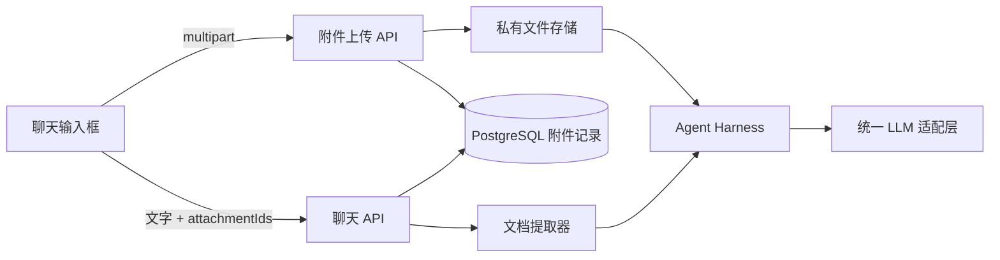

# DigitalMate 聊天滚动与附件设计规格

> 日期：2026-07-13  
> 状态：待用户审阅  
> 关联范围：P0 Web Chatbot / 流式对话；不扩展 P2 沙箱任务能力

## 1. 背景与目标

当前聊天页存在三类直接影响使用的问题：

1. 底部聊天框变高后可能覆盖最后几条消息，用户无法稳定阅读完整内容。
2. 每次收到新消息或流式文本片段时，页面都会自动滚到最新位置，打断正在阅读历史消息的用户。
3. 输入框没有附件入口，用户无法把图片和常见文档直接交给 DigitalMate 理解。

本次设计的目标是：

- 聊天框无论因多行文字、Skill 卡片还是附件预览增高，都不得遮挡消息。
- 用户掌握滚动位置；新内容到达时不抢走历史阅读位置。
- 通过输入框“+”入口上传图片或文件，并让配置的主对话模型真正接收和理解附件。
- 附件和消息一起持久化，重新打开会话后仍能查看和下载。

## 2. 非目标与边界

- 不实现 Office 文件、音频、视频、压缩包或任意二进制文件解析。
- 不实现 Excel 清洗、PDF 改写、代码沙箱处理或文件产物生成；这些仍属于冻结的 P2 任务能力。
- 不接入模型厂商托管的 Files API。附件保存在 DigitalMate 自有存储中，通过统一 LLM 适配层进入模型。
- 不做附件知识库、全文索引、OCR 管线或跨会话文件库。
- 不改变现有显式联网门控；上传附件不等于授权联网。

第一期文件范围固定为：

- 图片：JPEG、PNG、WebP。
- 文档：PDF、TXT、MD、JSON、CSV。

CSV 在本功能中只作为文本上下文交给模型理解，不触发 P2 表格处理。

## 3. 已确认的产品决策

### 3.1 附件方案

采用方案 A：DigitalMate 自有附件存储。

- 浏览器先上传附件，服务端创建用户私有的临时附件记录。
- 用户发送消息时，服务端在同一业务事务中校验并绑定附件与消息。
- 图片以多模态内容进入支持视觉的主对话模型。
- PDF/TXT/MD/JSON/CSV 在服务端提取为文本，以明确的数据边界进入模型上下文。
- 不依赖任一模型厂商的文件 ID，保持模型适配层可替换。

### 3.2 限额

- 每条消息最多 4 个附件。
- 单个附件最大 10 MB。
- 单条消息附件总大小最大 20 MB。
- 文档提取后的文本进入既有上下文预算；超出预算时在完整附件内按统一截断策略处理，并在模型上下文中标明已截断。

限制必须由服务端执行，客户端提示只用于改善体验，不能作为安全边界。

### 3.3 消息可见性

- 允许只发送附件，不强制同时输入文字。
- 附件原始内容和解析文本不拼进用户可见消息正文。
- 用户气泡展示附件卡片和可选文字；模型内部上下文与界面正文分离。
- 附件提取过程、存储路径、模型载荷和内部错误不得出现在对话正文中。

## 4. 界面与交互设计

### 4.1 聊天区域布局

聊天页改为稳定的三层结构：

1. 页面/会话外壳占满可用视口。
2. 消息列表是唯一的纵向滚动容器。
3. 输入框固定在会话外壳底部，消息列表按输入框的实时高度预留底部空间。

输入框高度通过 `ResizeObserver` 读取。消息列表的底部内边距至少等于输入框高度、输入框底部偏移、安全区和 24px 呼吸空间之和。输入框增高只向上扩展，不覆盖消息。

桌面端保留当前居中的 720px 聊天列；移动端遵守安全区，并保持最小 44×44px 触控目标。

### 4.2 滚动状态机

滚动行为由用户位置决定，不再简单依赖 `messages` 或 `isStreaming` 变化：

| 状态 | 判定 | 新内容到达时行为 |
|---|---|---|
| 跟随最新 | 距列表底部不超过阈值 | 保持在最新位置，流式内容自然跟随 |
| 阅读历史 | 距列表底部超过阈值 | 保持当前视口，不自动滚动 |
| 首次载入/切换会话 | 新会话消息首次完成加载 | 无动画定位到最新消息 |

建议阈值为 80px，作为实现常量并由单测固定。

用户处于“阅读历史”状态时：

- 新增完整消息后显示“↓ N 条新消息”。
- 同一条助手流式回复从开始到完成只计为 1 条，不按文本片段累加。
- 新消息按钮位于输入框上方，不覆盖消息或附件菜单。
- 点击按钮后平滑滚动到底部，计数清零并进入“跟随最新”。
- 用户手动滚回底部后，按钮自动消失并清零。

切换会话时必须重置滚动状态和未读计数，避免把上一会话状态带入下一会话。

### 4.3 “+”附件菜单

输入框工具栏增加一个“+”按钮。点击后显示两个选项：

- 上传文件：仅接受 PDF/TXT/MD/JSON/CSV。
- 上传图片：仅接受 JPEG/PNG/WebP。

菜单行为：

- 点击菜单外、按 Esc 或完成文件选择后关闭。
- 菜单不得与 Skill 选择面板同时占用同一浮层位置；打开一个时关闭另一个。
- 文件选择器使用对应的 `accept` 白名单，但最终仍以服务端检测结果为准。
- 支持从桌面拖放允许类型的文件到输入框；拖放与“+”菜单走同一上传流程。

### 4.4 附件预览与状态

选中的附件在输入框文字区上方显示：

- 图片：缩略图、文件名、大小和移除按钮。
- 文档：文件类型图标、文件名、大小和移除按钮。
- 上传中：显示克制的文字状态，不使用 spinner 或进度条。
- 上传失败：在附件卡片内显示原因，并提供重试和移除。

附件上传未完成时禁用发送按钮。发送失败时保留文字、Skill、搜索开关状态和附件，用户可以直接重试。

已发送附件在历史消息中显示为卡片。点击文件执行鉴权下载；图片可查看原图，但不暴露实际存储路径。

## 5. 系统架构

### 5.1 存储

新增私有附件根目录，生产环境通过 Docker volume 持久化。建议环境变量：

- `ATTACHMENT_STORAGE_DIR`：默认开发目录为 `data/attachments`。
- `ATTACHMENT_MAX_FILE_BYTES`：默认 10 MB。
- `ATTACHMENT_MAX_MESSAGE_BYTES`：默认 20 MB。

文件不放入 Next.js `public/`，下载必须经过鉴权 API。磁盘文件名使用服务端生成的随机 ID，原始文件名只作为元数据保存和显示。

### 5.2 数据模型

新增 `message_attachments`：

| 字段 | 说明 |
|---|---|
| `id` | UUID 主键，同时作为客户端引用 ID |
| `user_id` | 所属用户，所有查询都必须校验 |
| `message_id` | 可空；发送前为空，发送后绑定用户消息 |
| `kind` | `image` 或 `document` |
| `file_name` | 清洗后的用户可见原始文件名 |
| `mime_type` | 服务端检测并确认的 MIME |
| `size_bytes` | 文件大小 |
| `storage_key` | 私有存储键，不返回给客户端 |
| `extracted_text` | 文档提取文本；图片为空 |
| `status` | `pending`、`ready`、`failed`、`bound` |
| `error_code` | 可空、稳定的内部错误码 |
| `created_at` / `updated_at` | 生命周期时间 |

约束：

- `message_id` 只能绑定当前用户创建的 `user` 角色消息。
- 同一附件只能绑定一次，不能跨消息或跨用户复用。
- 删除会话时通过消息级联删除附件记录，并由存储清理逻辑删除磁盘文件。
- 未绑定临时附件超过 24 小时后由常驻 Agent 服务清理。

### 5.3 API

#### `POST /api/chat/attachments`

- 请求：单个 `multipart/form-data` 文件和用途 `image|document`。
- 响应：仅返回 `id`、`kind`、`fileName`、`mimeType`、`sizeBytes`、`status`。
- 处理：校验登录、读取上限、检测真实类型、保存私有文件、提取文档文本、更新状态。

#### `DELETE /api/chat/attachments/:id`

- 仅允许删除当前用户尚未绑定的临时附件。
- 删除数据库记录和磁盘文件；重复删除视为成功。

#### `GET /api/chat/attachments/:id/download`

- 校验当前用户对附件所属消息和会话的访问权。
- 使用安全的 `Content-Disposition` 返回文件，不暴露磁盘路径。

#### `POST /api/chat`

请求体增加 `attachmentIds: string[]`：

- 文字可为空，但文字与附件不能同时为空。
- 服务端重新校验数量、总大小、所有权、状态和是否已绑定。
- 创建用户消息后绑定附件；任一步失败都不能开始模型请求。
- SSE 行为保持不变，附件错误以稳定的用户可读错误返回。

消息列表接口返回附件展示元数据，不返回 `storage_key` 或 `extracted_text`。

## 6. 模型输入设计

### 6.1 统一类型

`LlmMessage` 增加可选的结构化附件内容，保持现有字符串 `content` 兼容：

- `image`：MIME 与受控的二进制读取入口。
- `document`：文件名、MIME、已提取文本和截断标记。

Agent Harness 负责把消息正文和附件组装为统一模型消息；具体厂商格式只在适配器中转换。

### 6.2 OpenAI 兼容适配器

用户消息转换为内容数组：文字片段加图片 `image_url` 数据 URI。文档使用带明确文件边界的文本片段。没有附件的消息继续使用原字符串格式，避免影响已有模型。

### 6.3 Anthropic 适配器

用户消息转换为 `text` 与 base64 `image` block。文档同样作为带边界的文本 block，不使用厂商 Files API。

### 6.4 上下文行为

- 当前用户消息的附件必须进入本轮主模型输入。
- 既有上下文窗口内的附件随其用户消息一并重建，使用户可以继续追问最近上传的内容。
- 上下文裁剪沿用现有最近消息策略，并额外执行附件总大小和文档字符预算；不得因附件而无限扩张请求。
- 文档内容被标记为“不可信用户数据”，不得把文档中的指令提升为系统指令或工具授权。
- 模型不支持图片输入时，本轮在调用前失败并给出可操作提示；禁止静默丢弃图片后继续回答。

## 7. 文件校验与安全

- 使用扩展名、声明 MIME 和文件签名/内容检测三者共同校验；不只相信浏览器 MIME。
- 拒绝双扩展名伪装、可执行文件、SVG、HTML、脚本和不在白名单中的内容。
- 文件名去除路径分隔符和控制字符，并限制长度。
- JSON/CSV/TXT/MD 使用受限编码读取；无法可靠解码时失败，不自动执行任何内容。
- PDF 只做文本提取，不执行嵌入脚本、附件或外部链接。
- 服务端读取和提取必须设置字节、页数/文本量与时间边界，避免压缩炸弹和资源耗尽。
- 日志只记录附件 ID、类型、大小、状态和错误码，不记录完整文件内容或提取文本。
- 上传是用户主动发送内容给配置模型的明确行为，不会触发联网，也不授权其他工具。

## 8. 错误处理

| 场景 | 用户体验 | 数据处理 |
|---|---|---|
| 类型不支持 | 附件卡片说明支持范围 | 不保留文件 |
| 超过大小/数量 | 就地提示具体限制 | 不创建或删除临时附件 |
| 文档解析失败 | 显示“无法读取此文件”，允许移除/重试 | 状态记为 `failed`，定时清理 |
| 上传中断 | 保留本地选择和重试入口 | 不完整临时文件立即删除 |
| 聊天发送失败 | 保留输入内容与附件 | 已上传附件保持 `ready`，允许重试 |
| 模型不支持图片 | 发送前明确提示更换支持视觉的模型或移除图片 | 不绑定消息、不发起模型请求 |
| 下载越权 | 返回 404，避免泄露附件是否存在 | 记录安全审计摘要 |
| 磁盘文件缺失 | 卡片显示文件暂不可用 | 记录错误，消息正文仍可读取 |

## 9. 代码范围

预计涉及：

- `src/components/chat/chat-shell.tsx`：滚动状态机、新消息计数、附件提交与失败恢复。
- `src/components/chat/chat-input.tsx`：加号菜单、文件选择、拖放、附件预览与上传状态。
- `src/components/chat/message-bubble.tsx`：已发送附件卡片。
- `src/app/globals.css`：独立滚动容器、动态底部空间、菜单/卡片/新消息按钮和响应式样式。
- `src/app/api/chat/route.ts`：接收并绑定 `attachmentIds`。
- `src/app/api/chat/attachments/*`：上传、删除、鉴权下载。
- `src/app/api/messages/route.ts` 与会话消息接口：返回附件元数据。
- `src/server/db/schema.sql`、仓储类型与方法：附件表和事务操作。
- `src/server/llm/types.ts`、OpenAI 兼容与 Anthropic 适配器：多模态输入。
- `src/server/agent/*`：把附件加入模型上下文。
- `src/agent-service/index.ts`：清理过期未绑定附件。
- `docs/prd.md`：新增 P0-10 并说明与 P2 文件处理的边界。
- `DESIGN.md`：把“始终自动滚到底部”修订为本规格的滚动状态机规则。

不修改 `AGENTS.md` 的产品定位；现有“PRD 是活文档”“P2 冻结”等约束继续生效。

## 10. 测试策略

实现遵循测试先行，至少覆盖：

### 10.1 单元测试

- 底部距离阈值和滚动状态转换。
- 流式同一消息只增加一次新消息计数。
- 会话切换清空未读计数。
- 附件扩展名/MIME/签名白名单校验。
- 数量、单文件大小、总大小校验。
- 文件名清洗和附件上下文截断。
- OpenAI 与 Anthropic 多模态载荷转换。

### 10.2 组件测试

- “+”菜单的打开、关闭、Esc、点击外部和两个选择入口。
- 上传状态、失败重试、移除与发送按钮禁用。
- 纯附件消息可以发送。
- 发送失败后文字和附件仍保留。
- 阅读历史时新内容不改变滚动位置并显示按钮。
- 点击新消息按钮滚到底部并清零。

### 10.3 API/仓储测试

- 未登录、越权、重复绑定和下载越权均被拒绝。
- 消息与附件绑定具有原子性。
- 列表接口只返回展示元数据。
- 删除草稿和 24 小时清理同时删除记录与磁盘文件。
- 文档解析失败不进入模型输入。

### 10.4 浏览器验收

桌面和移动视口分别验证：

- 六行输入、多个附件、Skill 卡片组合时不遮挡最后一条消息。
- 阅读中收到主动消息和流式回复时页面不跳动。
- 新消息按钮位置、计数和点击行为正确。
- 图片、PDF、TXT、MD、JSON、CSV 可以上传、发送、刷新后显示并下载。
- 不支持类型、超限文件和解析失败有清晰反馈。

最终执行 `npm run lint`、`npm run typecheck`、`npm test`、`npm run build`。

## 11. 验收标准

- 输入框在所有允许状态下不遮挡任何消息内容。
- 首次打开或切换会话时定位到最新消息；用户开始阅读历史后，新内容不再抢夺位置。
- 新消息按钮准确计数完整消息，点击后到达最新并清零。
- “+”菜单提供上传图片和上传文件两个入口，交互符合已确认原型。
- JPEG/PNG/WebP 作为视觉内容进入支持视觉的主模型。
- PDF/TXT/MD/JSON/CSV 的提取文本进入主模型，且不显示在聊天正文。
- 附件与消息持久化，刷新后可见，下载有用户鉴权。
- 不支持或不安全的内容不能落入模型输入。
- 附件功能不触发联网，不扩展冻结的 P2 沙箱任务范围。
- 对话输出不暴露存储路径、解析过程、模型载荷、工具过程或内部错误。

