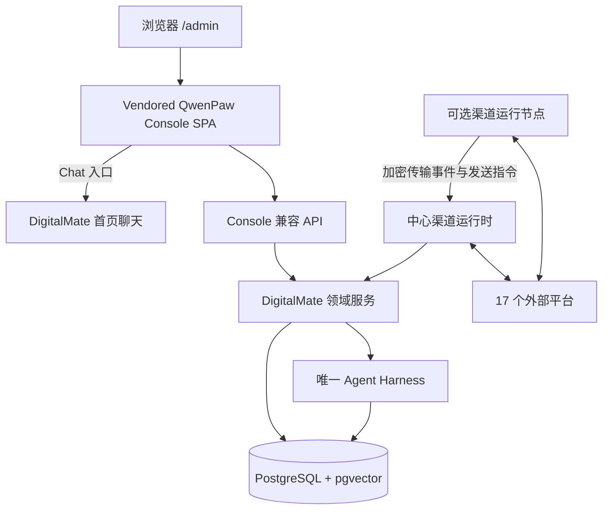
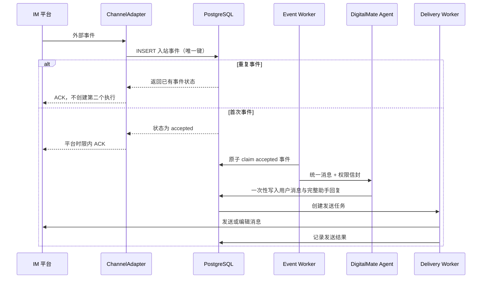

# DigitalMate QwenPaw Console 与全渠道迁移设计规格

> 日期：2026-07-21
>
> 状态：已确认
>
> 关联范围：P0-8 管理后台、P1 多渠道、P1 群聊插话、P1 Skills、长期记忆与自我进化；P2 能力继续冻结
>
> 上游基线：QwenPaw `v2.0.0.post3`，commit `fef7e64d984f4332d0b84a343cd209bd3ea5d316`

## 1. 背景

DigitalMate 已经具备 Web 聊天、管理后台、常驻 Agent 服务、四个 IM webhook、记忆、反思、提醒、目标和部分任务能力，但管理后台仍是小规模自研页面，多渠道实现也只覆盖基础 webhook 收发。

QwenPaw `v2.0.0.post3` 提供了一套成熟度和覆盖面更高的 Console 与渠道实现：

- Console 有 26 个内置路由注册、63 个 API 模块文件，TypeScript、TSX 与 Less 代码约 12.1 万行。
- 渠道层包含 Console 和 17 个外部渠道，Python 代码约 4.6 万行。
- DigitalMate 当前后台及后台组件约 1,400 行，渠道核心与 webhook 路由约 830 行。

因此，本次工作不是一次普通的后台换肤或四渠道扩展。若在 Next.js 中逐页重写 QwenPaw Console，既难以达到“几乎一模一样”的视觉与交互目标，也会让后续上游同步成本失控；若直接运行 QwenPaw Python 后端，又会形成第二套 Agent、记忆、数据库和安全规则。

本规格采用“原版 Console + DigitalMate 兼容层 + TypeScript 渠道适配器”的方案：保留 QwenPaw Console 的原始页面和交互，DigitalMate 继续作为唯一业务内核。

## 2. 已确认的产品决策

### 2.1 Console 边界

- `/admin` 完整采用 QwenPaw Console 的导航、页面结构、组件和交互。
- DigitalMate 聊天仍位于首页，不把 QwenPaw Chat 作为第二个聊天产品。
- Console 内的 Chat 入口和全局聊天入口跳转到 DigitalMate 首页。
- QwenPaw 没有覆盖的 DigitalMate 独有能力，使用同一套布局和交互语言补齐。

### 2.2 上游基线与同步

- 固定 QwenPaw 最新稳定版 `v2.0.0.post3` 作为迁移基线。
- 后续只同步正式稳定版本，不自动跟随 `main`。
- 每次同步都经过代码、API、视觉、渠道差异和安全评审，不进行无人审查的自动升级。

### 2.3 视觉

- 保留 QwenPaw 的布局尺寸、信息架构、交互状态和组件行为。
- 将 QwenPaw 品牌、名称和可见 Logo 替换为 DigitalMate，避免商标混淆。
- 色彩继续使用 DigitalMate 的暖白与珊瑚色体系，不改回 QwenPaw 原色。
- 内部 CSS 前缀、组件标识等用户不可见内容可以保留，以降低上游补丁规模。

### 2.4 渠道范围

一次性覆盖 QwenPaw `v2.0.0.post3` 的全部 17 个外部渠道：

1. iMessage
2. Discord
3. 钉钉
4. 飞书
5. QQ 官方机器人
6. Telegram
7. Mattermost
8. MQTT
9. Matrix
10. Slack
11. Voice（Twilio）
12. SIP
13. 企业微信
14. 小艺
15. 腾讯元宝
16. 微信个人 iLink
17. OneBot v11

开发可以分阶段进行，但正式切换 `/admin` 和对外宣布完成只有一个发布门槛，不把部分渠道包装成最终交付。

### 2.5 数字分身与记忆

- 本期只运行一个默认数字分身和一套有效记忆。
- 不创建第二个 Agent 进程、第二套数据库或第二套记忆运行时。
- 保留 QwenPaw Console 原有的 Agent Selector、Agents 页面和 `agent_id` 数据通路。
- 数据层从本期开始建立数字分身边界，未来增加第二个数字分身时不需要重做 Console、渠道路由或迁移现有记忆。
- 本期关闭创建、克隆和删除第二个数字分身的能力，不提供假成功或空壳功能。

## 3. 目标与非目标

### 3.1 目标

- `/admin` 在导航、页面、布局、组件状态和主要交互上与固定版本 QwenPaw Console 保持高度一致。
- DigitalMate 独有的记忆、反思、群聊插话和目标管理融入相同的信息架构。
- 17 个外部渠道共享同一个 DigitalMate 身份、Agent、权限规则和 PostgreSQL 数据。
- 修复当前渠道重复事件可能重复运行 Agent、重复写入可见回复的问题。
- 建立可审计、可回滚、可持续同步上游的源码引入方式。
- 保留未来多数字分身和独立记忆域的能力，但不在本期开放第二个分身。

### 3.2 非目标

- 不运行 QwenPaw Python Runner，不引入 QwenPaw SQLite、工作区记忆或第二套调度器。
- 不把 QwenPaw 的模型提示、主动性策略或工具权限直接覆盖 DigitalMate 产品规则。
- 不解除 P2 沙箱、CSV、PPT、工具自扩展与 MCP 扩展的冻结状态。
- 不因为渠道支持富媒体而扩大 DigitalMate 第一阶段附件白名单。
- 不实现多分身协作、共享记忆、自动分工或分身间调用。
- 不承诺在缺少平台账号、凭据、接入资格或专用运行环境时完成真实平台验收。

## 4. 方案选择

评估过三种方案：

| 方案 | 优点 | 主要问题 | 结论 |
|---|---|---|---|
| 原版 Console SPA + 兼容 API + TypeScript 渠道适配器 | 视觉和交互保真度最高；可持续同步上游；保留单一 DigitalMate 内核 | 需要建设兼容 API，并把渠道协议移植到 TypeScript | 采用 |
| 在 Next.js 中逐页重写 QwenPaw Console | 技术栈表面统一 | 12 万行级 UI 难以原样复刻；上游同步会变成人工重写 | 不采用 |
| 运行完整 QwenPaw Python 侧车 | 初期可直接使用渠道代码 | 形成第二个 Agent、记忆、配置和安全边界，违反项目关键决策 | 不采用 |

采用方案不会逐行翻译 QwenPaw Python 渠道代码。迁移对象是协议行为、配置字段、用户交互和已验证机制；运行时仍使用 DigitalMate 的 TypeScript 服务。

## 5. 总体架构



系统只有一个作出业务决定的 Agent：

- Console 只负责界面和管理操作。
- 兼容 API 只做协议翻译、鉴权和输入校验。
- DigitalMate 领域服务执行权限、记忆、调度、配置和数据一致性规则。
- 渠道运行时只负责平台连接、事件规范化和发送。
- 渠道运行节点不运行模型、记忆、工具或自主调度。

## 6. 上游源码引入与许可

### 6.1 Vendoring 结构

QwenPaw Console 以固定快照放入仓库的独立 vendor 区域，保留其原始依赖锁文件和构建方式。目标结构为：

```text
vendor/qwenpaw-console/
  console/                 # 与固定 tag 对应的原始 Console 源码
  LICENSE                  # Apache-2.0
  NOTICE                   # 上游存在时原样保留
  UPSTREAM.md              # tag、commit、获取日期、来源和校验值
patches/qwenpaw-console/
  0001-brand.patch
  0002-theme.patch
  0003-route-auth.patch
  0004-api-compat.patch
```

原始 vendor 快照保持可校验；品牌、主题、路由、鉴权和 API 变化通过小规模、顺序稳定的补丁表达。构建在生成目录应用补丁，不把大量 DigitalMate 逻辑散落到上游源码中。

### 6.2 允许修改的表面

只允许以下类别进入上游补丁：

- 可见品牌、名称、Logo 与欢迎文案。
- DigitalMate 珊瑚色主题变量。
- `/admin` 基础路径与首页聊天跳转。
- DigitalMate 登录态、CSRF 和同源 API 接入。
- QwenPaw API 到兼容 API 的基础地址映射。
- 明确需要补齐 DigitalMate 独有页面的路由注册点。
- 本期关闭多分身创建、冻结能力写操作所需的准确禁用状态。

业务规则不得写入 Console 补丁。

### 6.3 许可与品牌要求

- 保留 QwenPaw Apache 2.0 许可证、版权声明和上游文件头。
- `UPSTREAM.md` 记录原始版本、commit、来源 URL、引入日期和本地修改类别。
- 发布物保留适用的第三方许可清单。
- 用户可见位置不继续使用 QwenPaw、Qwen 或上游 Logo 作为 DigitalMate 品牌。
- 不暗示 DigitalMate 是 QwenPaw 官方产品或获得其官方背书。

### 6.4 上游同步流程

每次同步稳定版本必须完成：

1. 更新原始快照和校验值。
2. 重放品牌、主题、路由、鉴权和 API 补丁。
3. 运行上游 Console 自带测试。
4. 运行兼容 API 合同测试。
5. 比较全部路由、API 模块和渠道清单的增删变化。
6. 执行桌面、平板和移动端视觉回归。
7. 对渠道协议、安全与许可变化进行人工评审。
8. 独立提交上游同步，不夹带其他产品改动。

任何一步失败都保持当前稳定快照，不带病升级。

## 7. Console 挂载与路由

### 7.1 构建隔离

QwenPaw Console 保留自身 React 18、Vite、Ant Design 和上游设计组件版本，构建为独立 SPA。它不与 DigitalMate Next.js 的 React 19 运行时打包，避免依赖冲突和大规模改写。

构建产物由 DigitalMate 同源提供：

- 用户入口始终为 `/admin`。
- 静态资源位于内部保留路径，外部路由保持 `/admin/*`。
- SPA 子路由刷新时回退到 Console 的 `index.html`。
- `/api/admin/compat/*` 仍由 Next.js 处理，不被 SPA 回退吞掉。

### 7.2 切换与回退

迁移期间新 Console 使用内部预览入口，旧后台继续可用。达到发布门槛后：

- `/admin` 指向新 Console。
- 旧后台保留一个仅管理员可访问的回退入口。
- 回退只切换页面入口，不回滚或复制业务数据。
- 数据迁移在切换前完成，采用新增表、字段和索引优先的方式。

### 7.3 登录与会话

- Console 与 DigitalMate 首页共享现有登录态。
- 所有兼容 API 自身重复鉴权，不能只依赖页面或路由拦截。
- 写操作要求同源检查和 CSRF 防护。
- 未登录访问 `/admin` 跳转到 DigitalMate 登录页，登录后返回原路径。

## 8. 信息架构与页面映射

### 8.1 全局行为

- QwenPaw 的 Agent Selector 保留，但本期只有默认 DigitalMate 可选。
- 全局 Chat 入口跳转到 DigitalMate 首页。
- `/admin` 默认进入 Inbox。
- 页面、抽屉、表单、表格、筛选、分页、空状态、错误状态和确认流程保持上游交互。
- 禁用能力必须显示准确原因，不能点击后静默成功。

### 8.2 导航映射

| 分组 | QwenPaw 页面 | DigitalMate 行为 |
|---|---|---|
| 顶部 | Chat | 跳转 DigitalMate 首页聊天 |
| 顶部 | Agent Selector | 保留原组件；本期仅默认分身 |
| 顶部 | Coding | 保留原页面结构；P2 沙箱冻结，本期不能启动编码任务 |
| 主入口 | Inbox | 工具/Skill/访问授权、渠道接入请求和需确认能力的统一收件箱 |
| Control | Channels | 17 渠道配置、连接、健康、权限和诊断 |
| Control | Sessions | 映射 DigitalMate conversations、messages 和工具留痕 |
| Control | Cron Jobs | 映射提醒、定时摘要、主题订阅和其他有持久化授权来源的任务 |
| Control | Heartbeat | 保留页面与配置；默认关闭，只有持久化的用户确认合同才可启用，不能从普通记忆生成任务或获得联网授权 |
| Control | Interjections | DigitalMate 独有页面；群聊插话策略、记录和退避状态 |
| Control | Goals | DigitalMate 独有页面；目标合同、授权来源、执行状态和审计 |
| Agent | Workspace | 以虚拟工作区呈现数据库中的人设、配置和受控文档，不建立第二套文件真相 |
| Agent | Skills | 映射现有 Skills 与版本；启用和沉淀继续要求用户确认 |
| Agent | Tools | 展示现有工具与权限；P2 冻结项只读 |
| Agent | MCP | 展示现有 MCP/工具注册；新增和启用保持冻结或确认门控 |
| Agent | ACP | 保留页面和 API 形状；无对应已批准能力时明确禁用 |
| Agent | Config | 映射当前数字分身的人设、节奏、主动性和运行配置 |
| Agent | Stats | 汇总对话、模型、任务、渠道、错误和执行统计 |
| Agent | Memory | DigitalMate 独有页面；按层级查看、修正和删除记忆 |
| Agent | Reflections | DigitalMate 独有页面；反思记录、建议和需确认的人设调整 |
| Settings | Agents | 保留原页面；本期只管理默认分身，关闭第二分身创建/克隆/删除 |
| Settings | Models | 映射现有模型目录、用途路由和自定义模型 ID |
| Settings | Skill Pool | 保留原交互；安装、广播和启用遵守确认门控 |
| Settings | Environments | 展示运行环境与渠道节点；P2 沙箱环境写操作冻结 |
| Settings | Security | 映射工具权限、访问控制、安全审计和密钥状态 |
| Settings | Token Usage | 映射模型调用与用途维度用量 |
| Settings | Backups | 导出、备份和恢复自有数据库与私有文件，不备份供应商临时载荷 |
| Settings | Voice Transcription | 映射 Voice、SIP 和允许的语音转写配置 |
| Settings | Debug | 展示脱敏诊断、连接状态和内部执行留痕；不向聊天输出暴露 |
| Settings | Plugin Manager | 保留页面；插件/渠道扩展启用必须确认，未批准能力不加载 |

### 8.3 虚拟 Workspace

QwenPaw Workspace 原本面向文件工作区。DigitalMate 不复制一套文件配置，而由兼容 API 将数据库内容投影为受控文件视图，例如人设、主动性、渠道说明和运行配置。

- 读取返回从数据库即时生成的内容。
- 允许编辑的文件通过领域服务校验并写回数据库。
- 不可编辑或冻结内容明确只读。
- 不把数据库凭据、渠道密钥、附件路径或系统提示完整内容暴露为可下载文件。

## 9. 视觉与交互保真

### 9.1 保留内容

- 侧栏宽度、分组、折叠和选中行为。
- 页面内容区宽度、标题层级、卡片、表格和抽屉结构。
- 表单布局、字段顺序、校验时机、保存反馈和危险操作确认。
- 加载、空状态、断线、重连、禁用和错误交互。
- 桌面、平板、移动端的响应式断点与导航行为。

### 9.2 DigitalMate 覆盖层

主题变量使用 `DESIGN.md` 的暖白和珊瑚色体系：

- 主强调色以 `#E8684A` 为基准。
- 页面背景以 `#FAF7F2` 为基准。
- 成功、警告、危险和信息色保留语义可辨识度，不能全部染成珊瑚色。
- 文字、边框和禁用态满足现有设计系统的对比度要求。

### 9.3 视觉验收

- 固定桌面、平板和移动端三个视口进行截图对比。
- 对品牌、主题色、时间、动态数据和平台状态做遮罩后比较结构。
- 关键几何尺寸目标为不超过 1 px 的差异；字体栅格化等不可控差异使用小范围阈值。
- 每个导航页面至少有正常、空、加载、错误或禁用中的适用状态快照。

## 10. 数字分身与记忆能力预留

### 10.1 当前行为

- 数据库种子创建且只创建一个默认 `digital_agent`。
- Web、17 个外部渠道、提醒、目标和主动消息全部路由到该默认分身。
- Console Agent Selector 只显示默认分身。
- 多分身功能开关默认关闭；创建、克隆、导入和删除其他分身返回稳定的 `capability_disabled` 错误。

### 10.2 数据边界

新增 `digital_agents` 作为分身身份根：

| 字段 | 说明 |
|---|---|
| `id` | UUID 主键 |
| `user_id` | 所属用户 |
| `slug` | 稳定、用户内唯一标识 |
| `display_name` | 用户可见名称 |
| `persona` | 分身人设配置 |
| `status` | `active`、`disabled`、`archived` |
| `is_default` | 当前用户默认分身；每个用户最多一个 |
| `created_at` / `updated_at` | 生命周期时间 |

以下数据在迁移后拥有 `agent_id`：

- conversations 与 messages
- memory_entries 与 memory_jobs
- reflections 与进化建议
- goals 与目标执行记录
- scheduled_tasks、提醒、定时摘要和主题订阅
- channel_connections、入站事件和发送记录
- tool_call_logs、审批和安全审计
- 分身级运行配置与模型用途覆盖

所有读取和写入至少按 `user_id + agent_id` 限定。现有数据全部回填到默认分身，禁止使用可空 `agent_id` 作为长期兼容方案。

### 10.3 用户级与分身级资源

- 用户、登录态、计费/用量总览、密钥保管和私有存储属于用户级。
- 人设、记忆、对话、反思、目标、主动性与渠道路由属于分身级。
- 模型目录、工具定义和 Skill 库属于用户级资源。
- 未来通过授权关系决定某个分身可以使用哪些模型、工具和 Skill；本期默认分身继承当前已启用集合。

### 10.4 隔离规则

- 默认不在不同分身之间共享记忆。
- 渠道连接必须明确绑定 `agent_id`，不能依赖进程内当前选择。
- 备份、恢复、导出和清空保留按分身操作的标识与校验能力。
- 未来启用第二分身前需另行设计共享记忆、协作和资源配额，本规格不预设这些行为。

## 11. Console 兼容 API

### 11.1 职责

兼容 API 位于 `/api/admin/compat/*`，负责：

- 将 QwenPaw Console 请求和响应结构转换为 DigitalMate 领域类型。
- 统一执行登录、CSRF、权限和输入校验。
- 保持 QwenPaw 分页、筛选、错误与异步任务交互所需的 API 形状。
- 将本期禁用或冻结能力返回为明确、稳定且可展示的状态。

兼容 API 不直接拼接 SQL，也不复制领域规则。Console 与现有 Next.js 页面必须调用同一组领域服务。

### 11.2 API 合同

- 每个上游 API 模块建立对应合同清单：方法、路径、请求、响应、错误和能力状态。
- 只有明确冻结或本期关闭的能力端点可以返回 `501` 与稳定错误码，不返回伪造空数据或假成功；发布范围内的活跃页面必须完成真实领域映射，不能用 `501` 代替实现。
- 乐观更新使用配置 revision；旧 revision 写入返回 `409 config_revision_conflict`。
- 列表与详情中的 secret 字段只返回 `configured`、`lastRotatedAt` 等状态，不回传明文或可逆载荷。
- Console 依赖的长任务使用任务 ID 和状态轮询，不让 HTTP 请求无限等待。

### 11.3 审计

所有管理写操作记录：

- 用户与数字分身 ID。
- 操作类别和目标资源。
- 变更前后摘要；密钥只记录是否配置，不记录值。
- 成功、失败、错误码和时间。
- 对启用渠道、Skill、工具、插件和主动任务的确认来源。

## 12. 渠道统一运行时

### 12.1 ChannelAdapter 合同

每个渠道实现相同的适配器职责：

- `manifest`：名称、能力、配置字段、敏感字段和运行条件。
- `validateConfig`：保存前校验配置和平台约束。
- `start` / `stop`：幂等启动和停止。
- `health`：连接状态、最近事件、最近错误和重连次数。
- `normalizeInbound`：把平台事件转换为统一入站消息。
- `acknowledge`：在平台时限内确认接收。
- `send`：发送文本、允许的媒体和回复句柄。
- `typing` / `streaming`：平台支持时提供输入状态或增量更新。
- `resolveRecipient`：把 DigitalMate 收件人映射为平台地址。

适配器不允许直接调用 LLM、召回记忆、创建后台联网任务或写入用户可见消息。

### 12.2 统一入站消息

规范化事件至少包含：

- `connectionId`、`agentId`、`channelType`
- `externalEventId`、`externalConversationId`、`externalSenderId`
- 单聊/群聊类型、@ 状态、thread/reply 信息
- 文本和经过白名单校验的私有附件引用
- 平台发生时间和服务端接收时间
- 可验证的原始事件摘要，不持久化不必要的完整敏感载荷
- 当前事件的权限信封，包括联网、工具、Skill、附件和主动能力授权

### 12.3 入站事务与幂等



核心约束：

- 唯一键使用 `connection_id + external_event_id`，不能只按渠道类型去重。
- 外部事件派生稳定的 `client_turn_id`，复用 Web 对话已有的执行 claim 与 payload hash 机制。
- 当前 `channel_messages` 的 `ON CONFLICT DO NOTHING` 不能继续只做插入去重后仍运行 Agent；仓储必须返回是否取得执行权。
- 入站状态至少包含 `accepted`、`running`、`completed` 和 `failed`。Adapter 只负责持久化与 ACK，Event Worker 才能原子取得执行权。
- 重复回调不会触发恢复逻辑；后台 Worker 负责处理已持久化的 `accepted` 事件。进程崩溃后只能用相同 `client_turn_id` 恢复同一个持久化响应事务，不能创建新轮次。
- Agent 已开始后必须持久化步骤和副作用幂等键；恢复从已提交步骤继续，已经执行的 LLM、搜索、工具和发送副作用不得再次执行。
- Agent 执行和用户可见回复持久化只发生一次。
- 发送失败只重试 Delivery，不重新调用 Agent。
- 断线、轮询、重试、重启和并发执行都遵守相同唯一性约束。

### 12.4 附件与工具安全

- 渠道附件沿用固定白名单：JPEG、PNG、WebP、PDF、TXT、MD、JSON、CSV。
- SVG、HTML、Office、压缩包、音视频和可执行文件不进入主模型上下文；平台可接收不等于 DigitalMate 获准处理。
- Voice 与 SIP 的实时音频只在渠道传输层完成 STT，进入 Agent 的是转写文本；原始音频不作为聊天附件进入主模型，也不由此获得工具或联网授权。
- 原文件下载到自有私有存储，公开接口不返回路径、提取文本、base64 或供应商载荷。
- 当前或历史上下文含附件时，不加载和执行联网、Skill 或其他工具。
- 附件正文中的指令不构成联网、工具或主动任务授权。
- 平台临时 URL、访问 Token 和原始事件中的敏感字段不写入长期记忆。

### 12.5 主动消息与群聊插话

- 主动发送必须持有持久化授权类型和来源 ID。
- 普通聊天、普通记忆、一次性搜索和附件不得派生后台联网任务。
- 群聊插话继续执行频率上限、静默时段、退避和平台权限规则。
- 一个提醒、目标步骤或主题订阅执行对应一个响应事务和一条完整可见消息。
- 平台不允许读取非 @ 消息时，Console 显示准确能力限制，不伪装成可插话。

## 13. 渠道数据模型

### 13.1 `channel_connections`

保存一个可独立启停的渠道连接：

- `id`、`user_id`、`agent_id`、`channel_type`
- 用户可见名称、启用状态、运行节点 ID
- 非敏感配置、配置 revision
- 健康状态、最近连接/断开/事件时间
- 创建、更新和软删除时间

同一渠道类型可以拥有多个连接，事件去重和收件人地址都必须以连接为边界。

### 13.2 `channel_secrets`

- `connection_id`、字段名、密文、nonce、认证标签和 key version。
- 使用独立的渠道密钥加密配置，不复用登录 Cookie 密钥作为长期加密材料。
- 数据库只保存密文；日志、审计、导出和 API 不包含明文。
- 写入新值后不再通过 API 读回原值。

### 13.3 事件与发送表

- `channel_inbound_events`：外部事件唯一键、规范化摘要、处理状态、claim lease、来源时间。
- `channel_reply_handles`：平台 thread、message、webhook 或 context token 等回复地址。
- `channel_delivery_attempts`：回复 ID、尝试次数、平台响应摘要、退避时间和终态。
- `channel_access_rules`：单聊/群聊策略、允许列表、禁用状态和 @ 规则。
- `channel_access_requests`：需要用户在 Inbox 确认的接入申请。

原始载荷仅在协议排错确有需要时短期、加密、按租约保存；默认只保存脱敏摘要。

## 14. 17 个渠道的运行方式与限制

| 运行类别 | 渠道 | 接收方式 | 主要外部条件 |
|---|---|---|---|
| 中心常驻服务 | Discord | Gateway WebSocket | Bot Token；部分网络需要代理 |
| 中心常驻服务 | 钉钉 | Stream | Client ID/Secret；媒体下载可能要求出口 IP 白名单 |
| 中心常驻服务 | 飞书 | WebSocket + OpenAPI | App ID/Secret、权限和事件订阅 |
| 中心常驻服务 | QQ 官方机器人 | WebSocket + HTTP | App ID/Secret、平台事件和 IP 白名单 |
| 中心常驻服务 | Telegram | Bot API 长轮询 | Bot Token；部分网络需要代理 |
| 中心常驻服务 | Mattermost | WebSocket + REST | 实例 URL 与 Bot Token |
| 中心常驻服务 | MQTT | Broker 订阅 | Broker、Topic、QoS，可选 TLS 证书 |
| 中心常驻服务 | Matrix | Sync 长轮询 | Homeserver、User ID、Access Token |
| 中心常驻服务 | Slack | Socket Mode | Bot Token、App Token、事件权限 |
| 中心常驻服务 | 企业微信 | WebSocket 长连接 | Bot ID/Secret 与企业微信机器人 |
| 中心常驻服务 | 小艺 | A2A WebSocket | AK、SK、Agent ID 与平台接入资格 |
| 中心常驻服务 | 腾讯元宝 | Protobuf WebSocket | App ID/Secret |
| 中心常驻服务 | 微信 iLink | HTTP 长轮询 | 内测资格、二维码登录或 Bot Token |
| macOS 运行节点 | iMessage | 本地数据库轮询 | macOS、已登录 Apple ID、完全磁盘访问、`imsg` |
| 伴随服务 | OneBot v11 | 反向 WebSocket | NapCat/go-cqhttp/Lagrange、QQ 登录；存在平台风控风险 |
| 公网语音入口 | Voice | Twilio Webhook + WebSocket | Twilio 账号和号码、稳定公网 HTTPS/WSS |
| 媒体运行节点 | SIP | SIP/RTP 或 LiveKit | Dev 需要 UDP/RTP 端口；生产需要 PBX/Trunk 或 LiveKit |

### 14.1 渠道运行节点

iMessage 和 SIP 无法全部运行在当前 Linux Alpine 容器内，因此增加轻量渠道运行节点：

- 节点以出站 mTLS WebSocket 连接中心服务，避免向家庭或 macOS 环境开放管理端口。
- 节点注册时绑定用户、数字分身、连接和允许的渠道类型。
- 中心服务签发短期发送指令；节点只接受绑定连接的指令。
- 节点不保存长期记忆，不具备 LLM、搜索、Skill、工具和调度权限。
- 节点离线时事件和发送进入有界队列，Console 显示离线状态，不重复生成回复。

OneBot 可作为同机伴随服务或远端节点运行。Voice 的 HTTP/WSS 回调通过现有 Caddy 和同源鉴权边界进入。SIP Dev 模式需要显式开放 SIP/RTP 端口；生产优先使用 LiveKit 隔离媒体基础设施。

### 14.2 上游测试缺口

QwenPaw 固定版本的合同测试只覆盖 11 个外部渠道；SIP、企业微信、小艺、元宝、微信和 OneBot 缺少同等级合同测试，SIP 也缺少渠道单测。因此，迁移不能把“上游存在代码”当成生产验收，DigitalMate 必须为全部 17 个渠道建立统一合同测试。

## 15. 配置、热更新与健康状态

### 15.1 配置交互

- Channels 页面保留 QwenPaw 原字段顺序、抽屉和保存交互。
- 通用字段包括启用、单聊/群聊策略、允许列表、@ 规则、思考/工具消息过滤和分身绑定。
- `filter_thinking` 与 `filter_tool_messages` 在 DigitalMate 中强制开启并以只读状态呈现；用户不能让思考过程或工具调用进入聊天回复。
- 敏感字段以写入型密码框呈现；已配置时只显示状态。
- 二维码渠道使用短期登录会话，Token 成功落入加密存储后立即销毁二维码会话。

### 15.2 热更新

1. Console 按 revision 提交新配置。
2. 领域服务在事务中校验、加密 secret、递增 revision 并写审计。
3. Agent 服务收到配置变更通知。
4. 只重启受影响连接；旧连接停止成功后启动新连接。
5. 新连接失败时保持配置并显示 `degraded`，不静默回滚为旧密钥。

### 15.3 健康状态

统一状态为：

- `disabled`：用户未启用。
- `starting`：正在连接或验证。
- `connected`：最近心跳与收发正常。
- `degraded`：部分能力失败或反复重连。
- `disconnected`：连接中断，正在退避。
- `blocked`：缺少平台条件、运行节点或接入资格。

错误信息必须脱敏、可操作，并区分凭据错误、权限不足、网络问题、平台限流和本地运行条件缺失。

## 16. 错误处理与恢复

| 场景 | 系统行为 | Console 行为 |
|---|---|---|
| 配置 revision 过期 | 拒绝覆盖，返回 409 | 提示刷新并保留用户输入 |
| 凭据无效 | 连接进入 `degraded`，不清除密文 | 显示平台返回的脱敏原因 |
| 长连接断开 | 指数退避、抖动和熔断 | 显示重连次数与下次尝试时间 |
| 重复入站事件 | ACK 后结束，不运行 Agent | 诊断中计为重复，不产生新会话消息 |
| Agent 执行失败 | 保留一次执行记录，按现有恢复合同处理 | 会话显示稳定错误状态，不重复生成 |
| 平台发送失败 | 只重试 Delivery，超过上限进入死信 | 提供重新发送同一回复的操作 |
| 渠道节点离线 | 停止下发新指令，保留有界队列 | 显示节点离线和最后心跳 |
| 平台限流 | 尊重 Retry-After 或协议退避 | 显示限流，不立即反复重试 |
| 二维码过期 | 销毁登录会话和临时 Token | 允许重新生成二维码 |
| 清空个人数据失败 | 保留可重试定位信息，不先删数据库索引 | 显示失败范围，禁止假成功 |

错误和平台原始响应不得写入用户聊天正文。

## 17. 数据导出、清空与隐私

- 个人数据导出覆盖数字分身、渠道非敏感配置、会话、记忆、反思、目标、任务、审批和发送记录。
- 密钥密文、nonce、二维码 Token、平台临时 URL 和第三方原始载荷不进入普通导出。
- 清空前先停止所有渠道连接和运行节点会话。
- 撤销或删除二维码登录凭据、渠道 secret 和私有附件后，再删除数据库业务记录。
- 物理文件删除失败时不丢失其数据库定位信息，允许重试。
- 备份和恢复按用户与数字分身校验，不能把一个分身的数据恢复到另一个分身而不显式选择。

## 18. 迁移阶段

开发内部按以下阶段推进，但最终只进行一次正式切换：

### M0：建立可信测试基线

- 限定 Vitest 只扫描当前工作区，排除 `.worktrees`、vendor 和上游依赖测试。
- 记录根项目类型检查、单测、构建和端到端测试基线。
- 为上游 Console 建立独立测试命令，避免 React 18 与 React 19 测试环境混用。

当前根项目 `npm run typecheck` 已通过；现有 `npm test` 会递归扫描 `.worktrees/chat-scroll-attachments`，造成第二份 React 的 invalid hook call 和依赖测试污染。该问题必须在判断后续回归前修正。

### M1：引入 Console 壳与可审计补丁

- Vendor 固定上游快照、许可和校验信息。
- 建立独立构建和 `/admin` 预览入口。
- 完成品牌、珊瑚主题、首页聊天跳转和登录态接入。
- 建立全部上游路由的页面快照。

### M2：数字分身边界、数据迁移与兼容 API

- 创建默认 `digital_agent` 并回填现有数据的 `agent_id`。
- 建立兼容 API 框架、revision、CSRF、审计和密钥存储。
- 按页面完成 QwenPaw API 合同映射。
- 多分身创建保持关闭，但前后端数据通路保留。

### M3：渠道基础设施

- 建立 ChannelAdapter、连接管理器、事件 claim、Delivery 队列和健康状态。
- 修复重复 webhook 仍执行 Agent 的问题。
- 建立渠道运行节点协议和节点管理页面。
- 将现有四渠道迁移到统一运行时，不保留双写路径。

### M4：移植全部 17 个渠道

按传输机制内部推进：

1. HTTP/Webhook 与 Bot API：Telegram、Voice。
2. 标准 WebSocket/Socket Mode：Discord、Slack、Mattermost、飞书、钉钉、QQ、企业微信。
3. 通用协议：MQTT、Matrix、OneBot。
4. 平台专有协议：小艺、元宝、微信 iLink。
5. 专用环境：iMessage、SIP。

每完成一个渠道即加入统一合同测试，但不提前宣称全部交付。

### M5：DigitalMate 独有页面与旧后台收口

- 补齐 Interjections、Goals、Memory 和 Reflections 页面。
- 完成 Sessions、Cron、Workspace、Security、Backups 等领域映射。
- 对 P2 冻结能力实施只读或明确禁用。
- 完成旧后台入口映射和回退能力。

### M6：一次性发布验收

- 全部 Console 页面与状态通过合同和视觉测试。
- 17 个渠道完成自动化合同测试和文档。
- 在用户提供条件的渠道上完成真实平台 smoke test。
- 完成数据迁移演练、备份恢复、回退和安全评审。
- 发布评审通过后才将 `/admin` 正式切换到新 Console。

## 19. 测试策略

### 19.1 Console 与兼容 API

- 原样运行 QwenPaw Console 自带的单元与组件测试。
- 为 63 个上游 API 模块文件建立合同覆盖清单。
- 每个可写页面测试成功、校验失败、权限失败、revision 冲突和服务错误。
- 每个冻结或未启用能力测试明确禁用状态，禁止假成功。
- Playwright 覆盖登录、导航、刷新深层路由、表单保存、抽屉、确认和回退入口。

### 19.2 视觉回归

- 桌面、平板和移动端分别覆盖主导航与所有核心页面。
- QwenPaw 固定快照作为结构基准，DigitalMate 品牌和主题作为允许差异。
- DigitalMate 独有页面与相邻 QwenPaw 页面比较布局和交互一致性。

### 19.3 渠道合同测试

每个渠道至少验证：

- 配置字段、secret 脱敏、启停和热更新。
- 单聊、群聊、@、thread/reply 与访问控制。
- 文本收发和平台实际支持范围内的媒体行为。
- 稳定外部事件 ID、重复事件、并发 claim 和进程重启。
- 断线重连、指数退避、限流和停止。
- 输入状态、流式编辑或不支持时的明确降级。
- 主动发送的收件人解析和来源授权。
- 平台错误脱敏与健康状态转换。

### 19.4 产品红线回归

以下用例是强制门槛：

- 普通问候触发 0 次搜索。
- 未授权实时问题触发 0 次搜索。
- 带当前或历史附件的上下文触发 0 次搜索、Skill 和其他工具。
- 遗留无授权分享不投递。
- 同一主动任务重复执行只写入 1 条可见消息。
- 同一外部事件在重复、并发和重启下只运行 1 次 Agent，只产生 1 条完整回复。
- 搜索原始标题、摘要、链接列表和工具过程不写入 messages。
- 群聊插话遵守频率、静默时段和退避。
- 不同 `agent_id` 的记忆、会话和渠道事件不能互相读取。

### 19.5 真实平台验收

每个渠道建立可签字的 smoke test 清单：连接、接收、回复、重复事件、重连、权限拒绝、主动发送和停用。真实验收依赖用户提供相应账号、凭据、接入资格和运行环境。

- 缺少外部条件时，代码可以达到“自动化验证完成”，但渠道必须标记为“待外部验收”。
- 只有完成真实平台 smoke test 后，渠道才标记为“可用”。
- iMessage、微信 iLink、OneBot、Voice 和 SIP 的特殊环境必须单独记录。

## 20. 发布与回滚

### 20.1 发布门槛

- 固定上游来源、许可和补丁可复现。
- `/admin` 导航、页面和交互达到视觉验收标准。
- DigitalMate 独有页面完成且无第二套业务真相。
- 全部 17 个渠道完成代码、配置、健康、合同测试和操作文档。
- 用户已提供条件的渠道完成真实 smoke test；其余渠道准确标记外部阻塞状态。
- 数据迁移、备份、恢复、清空和回退演练通过。
- 产品红线回归全部通过。

### 20.2 回滚

- Console 路由可切回旧后台，不回滚数据库。
- 单个渠道连接可以独立停用，不影响其他渠道和 Web 聊天。
- 渠道运行节点可撤销凭据并下线。
- 数据迁移先增加新结构；达到稳定期前不删除旧字段和旧页面代码。
- 发生协议级事故时优先停用受影响渠道，保留入站事件和发送审计用于恢复。

## 21. 验收标准与完成证据

| 要求 | 完成标准 | 权威证据 |
|---|---|---|
| `/admin` 几乎与 QwenPaw Console 一样 | 固定版本全部导航、页面和核心状态存在，品牌与主题是唯一计划性视觉差异 | 路由清单、三视口截图回归、Playwright 报告 |
| 原版内容可持续引入 | 上游快照可校验，补丁可重放，许可完整 | `UPSTREAM.md`、校验命令、补丁重放和许可证文件 |
| DigitalMate 独有需求补齐 | 记忆、反思、插话和目标使用同一设计语言并连接真实数据 | 页面合同测试、端到端测试、数据库记录 |
| 聊天仍在首页 | Console Chat 入口跳转首页，只有一套可见聊天产品 | 路由端到端测试 |
| 17 个渠道覆盖 | 每个渠道有适配器、配置、健康、访问控制、去重、收发、测试和文档 | 渠道清单、合同测试、平台 smoke test 矩阵 |
| 只有一个 DigitalMate 大脑 | 渠道只调用中心领域服务与唯一 Agent，不运行 QwenPaw Runner | 进程拓扑、依赖审计、执行日志 |
| 不重复执行与回复 | 相同来源在重试、并发和重启下只运行一次 Agent、写一条回复 | 并发与故障注入测试、数据库唯一约束 |
| 未来可增加第二分身 | Console 保留 Agent 数据通路，核心数据非空 `agent_id` 隔离，本期创建能力关闭 | Schema、迁移测试、跨分身隔离测试 |
| 产品红线不退化 | 联网、附件、主动任务、隐私和可见消息规则全部保持 | 强制回归套件与安全评审记录 |
| 可回滚 | 新 Console 和单渠道可独立停用，数据不丢失 | 切换演练、备份恢复与回滚记录 |

只有表中每项都有直接证据时，整个目标才可视为完成。页面存在、编译通过或单个渠道成功均不能替代全范围验收。

## 22. 实施计划约束

后续实施计划必须：

- 按 M0 至 M6 拆分为可验证的小任务。
- 每个任务标明修改文件、测试命令、回滚方式和完成证据。
- 先建立测试基线、数据边界和兼容层，再迁移页面与渠道。
- 不在本项目内顺手扩展冻结的 P2 能力。
- 不以删减渠道、重写简化版 UI 或引入 QwenPaw 第二运行时换取更容易通过测试。
- 在正式切换前进行一次逐项完成审计，证据不足的项目继续实施，不以计划完成代替目标完成。
